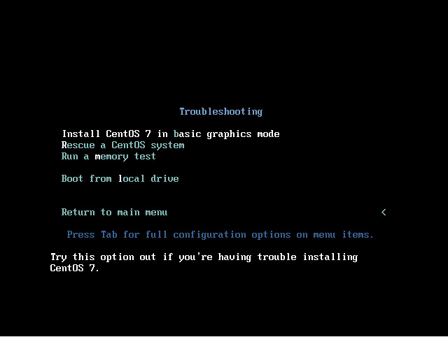

:experimental:
include::entities.adoc[]

[[chap-booting-installer-ppc]]
== Booting the Installation on IBM Power{nbsp}Systems

To boot an IBM Power{nbsp}Systems server from a DVD, you must specify the install boot device in the `System Management Services` (SMS) menu.

To enter the `System Management Services` GUI, press the kbd:[1] key during the boot process when you hear the chime sound. This brings up a graphical interface similar to the one described in this section.

On a text console, press kbd:[1] when the self test is displaying the banner along with the tested components:

[[figu-booting-sms-console]]
.The SMS Console

image::images/pseries/sms-console.png[SMS console screen]

Once in the SMS menu, select the option for `Select Boot Options`. In that menu, specify `Select Install or Boot a Device`. There, select `CD/DVD`, and then the bus type (in most cases SCSI). If you are uncertain, you can select to view all devices. This scans all available buses for boot devices, including network adapters and hard drives.

Finally, select the device containing the installation DVD. The boot menu will now load.

[IMPORTANT]
====

Because IBM Power{nbsp}Systems servers primarily use text consoles, [application]*Anaconda* will not automatically start a graphical installation. However, the graphical installation program offers more features and customization and is recommended if your system has a graphical display.

To start a graphical installation, pass the [option]`inst.vnc` boot option (see <<list-boot-options-vnc>>).

====

[[sect-boot-menu-ppc]]
=== The Boot Menu

Once your system has completed loading the boot media, a boot menu is displayed using [application]*GRUB2* ([application]*GRand Unified Bootloader*, version 2). The boot menu provides several options in addition to launching the installation program. If no key is pressed within 60 seconds, the default boot option (the one highlighted in white) will be run. To choose the default, either wait for the timer to run out or press kbd:[Enter].

.The Boot Screen

image::images/boot/boot_screen.png[The boot screen]

To select a different option than the default, use the arrow keys on your keyboard, and press kbd:[Enter] when the correct option is highlighted.

To customize the boot options for a particular menu entry, press the kbd:[e] key and add custom boot options to the command line. When ready press kbd:[Ctrl + X] to boot the modified option.

See <<chap-anaconda-boot-options>> for more information about additional boot options.

The boot menu options are:

Install {PRODUCT}{nbsp}7.0::
+
Choose this option to install {PRODUCT} onto your computer system using the graphical installation program.

Test this media & install {PRODUCT}{nbsp}7.0::
+
This option is the default. Prior to starting the installation program, a utility is launched to check the integrity of the installation media.

Troubleshooting `>`::
+
This item is a separate menu containing options that help resolve various installation issues. When highlighted, press kbd:[Enter] to display its contents.

.The Troubleshooting Menu

Install {PRODUCT}{nbsp}7.0 in basic graphics mode::
+
This option allows you to install {PRODUCT} in graphical mode even if the installation program is unable to load the correct driver for your video card. If your screen appears distorted or goes blank when using the `Install {PRODUCT}{nbsp}7.0` option, restart your computer and try this option instead.

Rescue a {PRODUCT} system::
+
Choose this option to repair a problem with your installed {PRODUCT} system that prevents you from booting normally. The rescue environment contains utility programs that allow you fix a wide variety of these problems.

Run a memory test::
+
This option runs a memory test on your system. For more information, see <<sect-boot-options-memtest>>.

Boot from local drive::
+
This option boots the system from the first installed disk. If you booted this disc accidentally, use this option to boot from the hard disk immediately without starting the installation program.

[[sect-installing-alternate-source-ppc]]
=== Installing from a Different Source

You can install {PRODUCT} from the ISO images stored on hard disk, or from a network using NFS, FTP, HTTP, or HTTPS methods. Experienced users frequently use one of these methods because it is often faster to read data from a hard disk or network server than from a DVD.

The following table summarizes the different boot methods and recommended installation methods to use with each:

.Boot Methods and Installation Sources

[options="header"]
|===
|Boot method|Installation source
|Full installation media (DVD)|The boot media itself
|Minimal boot media (CD or DVD)|Full installation DVD ISO image or the installation tree extracted from this image, placed in a network location or on a hard drive
|Network boot|Full installation DVD ISO image or the installation tree extracted from this image, placed in a network location
|===

[[sect-booting-from-pxe-ppc]]
=== Booting from the Network Using an Installation Server

For network boot, you need a properly configured server, and a network interface in your computer that can support an installation server. For information on how to configure an installation server, see <<sect-network-boot-setup-ppc-grub2>>.

Configure the computer to boot from the network interface by selecting [option]`Select Boot Options` in the SMS menu, then [option]`Select Boot/Install Device`. Finally, select your network device from the list of available devices.

Once you properly configure booting from an installation server, the computer can boot the {PRODUCT} installation system without any other media.

To boot a computer from a server:

[[proc-boot-starting-network]]
.How to Start the Installation Program from the Network
. Ensure that the network cable is attached. The link indicator light on the network socket should be lit, even if the computer is not switched on.

. Switch on the computer.

. Networking setup and diagnostic information usually appears before your computer connects to the server, although this depends on the hardware in use. Then you will see a menu with options specifying how the network boot server is setup. Press the number key that corresponds to the desired option. In case you are not sure which option you should select, ask your server administrator.

If your system does not boot from the network installation server, ensure that the SMS is configured to boot first from the correct network interface. See your hardware's documentation for more information.

[IMPORTANT]
====

Use the `vmlinuz` and `initrd.img` images to boot your system over a network. You cannot use the `ppc64.img` image to boot over a network; the file is too large for TFTP.

====
