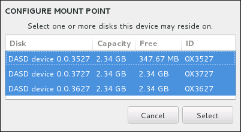

:experimental:
include::entities.adoc[]

[[sect-custom-partitioning-s390]]
==== Manual Partitioning

The `Manual Partitioning` screen is displayed when you click btn:[Done] from Installation Destination if you selected the `I will configure partitioning` option. On this screen you configure your disk partitions and mount points. This defines the file system that {PRODUCT} will be installed on.

[WARNING]
====

Red{nbsp}Hat recommends that you always back up any data that you have on your systems. For example, if you are upgrading or creating a dual-boot system, you should back up any data you want to keep on your storage devices. Unforeseen circumstances can result in loss of all your data.

====

.The Manual Partitioning Screen

image::images/diskpartitioning/ddmain.png[The Manual Partitioning Screen]

The `Manual Partitioning` screen initially features a single pane on the left for the mount points. The pane is either empty except for information about creating mount points, or it displays existing mount points that the installation program has detected. These mount points are organized by detected operating system installations. Therefore, some file systems might be displayed multiple times if a partition is shared among several installations. The total space and available space on selected storage devices are displayed beneath this pane.

If your system contains existing file systems, ensure that enough space will be available for the installation. Use the btn:[-] button to remove unneeded partitions.

[NOTE]
====

For recommendations and additional information about disk partitions, see <<appe-disk-partitions-overview>> and <<sect-recommended-partitioning-scheme-s390>>. At a bare minimum, you need an appropriately sized root partition, and usually a swap partition appropriate to the amount of RAM you have on your system.

====

Note which device is associated with `/boot`. The kernel files and boot loader sector will be associated with this device. The first DASD or SCSI LUN will be used, and the device number will be used when re-IPLing the post-installed system.

[[sect-partition-configuration-s390]]
===== Adding File Systems and Configuring Partitions

An installation of {PRODUCT} requires a minimum of one partition but Red{nbsp}Hat recommends using at least the following partitions or volumes: `/`, `/home`, `/boot`, and `swap`. You can also create additional partitions and volumes as you require. See <<sect-recommended-partitioning-scheme-s390>> for further details.

[NOTE]
====

If you have any specific requirements for some partitions (for example, requiring that a particular partition be on a specific disk) and less specific requirements for other partitions, create the partitions first which have more specific requirements.

====

Adding a file system is a two-step process. You first create a mount point in a certain partitioning scheme. The mount point appears in the left pane. Next, you can customize it using the options in the right pane, where you can change the mount point, capacity, the device type, file system type, label, and whether to encrypt or reformat the corresponding partition.

If you have no existing file systems and want the installation program to create the required file systems and their mount points for you, select your preferred partitioning scheme from the drop-down menu in the left pane (default for {PRODUCT} is LVM), then click the link on top of the pane for creating mount points automatically. This will generate a `/boot` partition, a `/` (root) volume, and a swap volume proportionate to the size of the available storage. These are the recommended file systems for a typical installation, but you can add additional file systems and mount points if you need to.

Alternatively, create individual mount points using the btn:[+] button at the bottom of the pane. The `Add a New Mount Point` dialog then opens. Either select one of the preset paths from the `Mount Point` drop-down menu or type your own; for example, select `/` for the root partition or `/boot` for the boot partition. Then enter the size of the file system in the `Desired Capacity` text field; for example, `2GiB`. If you leave the field empty or if you specify a size bigger than available space, all remaining free space is used instead. After entering these details, click the btn:[Add mount point] button to create the partition.

[NOTE]
====

To avoid problems with space allocation, first create small partitions with known fixed sizes, such as `/boot`, and then create the rest of the partitions, letting the installation program allocate the remaining capacity to them.

Similarly, if you have multiple disks that the system is to reside on, they differ in size, and a particular partition must be created on the first disk detected by BIOS, be sure to start by creating such a partition.

====

For each new mount point you create manually, you can set its partitioning scheme from the drop-down menu located in the left pane. The available options are `Standard Partition`, `BTRFS`, `LVM`, and `LVM Thin Provisioning`. Note that the `/boot` partition will always be located on a standard partition, regardless of the value selected in this menu.

To change on which devices a single non-LVM mount point should be located, select the mount point and click the `Modify...` button in the right pane to open the `Configure Mount Point` dialog. Select one or more devices and click btn:[Select]. After the dialog closes, note that you also need to confirm this setting by clicking the btn:[Update Settings] button on the right side of the `Manual Partitioning` screen.

[[figu-disk-partitioning-mount-points-s390]]
.Configuring Mount Points

To refresh information about all local disks and partitions on them, click the btn:[Rescan] button (with the circular arrow icon on it) in the toolbar. You only need to do this action after performing advanced partition configuration outside the installation program. Note that if you click the btn:[Rescan Disks] button, all configuration changes you previously made in the installation program will be lost.

[[figu-disk-partitioning-rescan-s390]]
.Rescanning Disks

image::images/diskpartitioning/ddmain-rescan.png[Rescan disks dialog.]

At the bottom of the screen, a link states how many storage devices have been selected in `Installation Destination` (see <<sect-disk-partitioning-setup-s390>>). Clicking on this link opens the `Selected Disks` dialog, where you review the information about the disks.

To customize a partition or a volume, select its mount point in the left pane and the following customizable features then appear to the right:

[[figu-disk-partitioning-customizing-s390]]
.Customizing Partitions

image::images/diskpartitioning/ddmain-custom.png[Customizing partitions.]

* `Mount Point` - enter the file system's mount point. For example, if a file system should be the root file system, enter `/`pass:attributes[{blank}]; enter `/boot` for the `/boot` file system, and so on. For a swap file system, the mount point should not be set - setting the file system type to `swap` is sufficient.

* `Desired Capacity` - enter the desired size of the file system. You can use common size units such as KiB or GiB. The default is MiB if no other unit is specified.

* `Device type` - choose one of these types: `Standard Partition`, `LVM`, `RAID`, `LVM Thin Provisioning`, or `BTRFS`. Check the adjacent `Encrypt` box to encrypt the partition or volume. You will be prompted to set a password later. `RAID` is only available if two or more disks are selected for partitioning, and if you choose this type, you can also set the `RAID Level`. Similarly, if you select `LVM`, you can specify the `Volume Group`.

* `File system` - in the drop-down menu, select the appropriate file system type for this partition or volume. Check the adjacent `Reformat` box to format an existing partition, or leave it unchecked to retain your data. Note that newly created partitions and volumes must be reformatted, and the check box cannot be unchecked in this case.

* `Label` - assign a label to the partition. Labels are used for you to easily recognize and address individual partitions.

* `Name` - assign a name to an LVM or Btrfs volume. Note that standard partitions are named automatically when they are created and their name cannot be edited, such as `/home` being assigned the name `sda1`.

See <<sect-file-system-types-s390>> for more information about file system and device types.

Click the btn:[Update Settings] button to save your changes and select another partition to customize. Note that the changes will not be applied until you actually start the installation from the Installation summary page. Click the btn:[Reset All] button to discard all changes to all partitions and start over.

When all file systems and mount points have been created and customized, click the btn:[Done] button. If you chose to encrypt any file system, you will now be prompted to create a passphrase. Then, a dialog appears, showing a summary of all actions related to storage that the installation program will take. This includes creating, resizing, or deleting partitions and file systems. You can review all the changes and click btn:[Cancel & Return to Custom Partitioning] to go back. To confirm your changes, click btn:[Accept Changes] to return to the Installation Summary page. To partition additional devices, select them in the `Installation Destination` screen, return to the `Manual Partitioning` screen, repeat the steps outlined in this section for the additional devices.

[IMPORTANT]
====

If `/usr` or `/var` is partitioned separately from the rest of the root volume, the boot process becomes much more complex because these directories contain components critical to it. In some situations, such as when these directories are placed on an iSCSI drive or an FCoE location, the system can either be unable to boot, or hang with a `Device is busy` error when powering off or rebooting.

This limitation only applies to `/usr` or `/var`, not to directories below them. For example, a separate partition for `/var/www` will work without issues.

====

[[sect-file-system-types-s390]]
====== File System Types

{PRODUCT} allows you to create different device types and file systems. The following is a brief description of the different device types and file systems available, and how they can be used.

.Device Types

* `standard partition` - A standard partition can contain a file system or swap space, or it can provide a container for software RAID or an LVM physical volume.

* `logical volume (LVM)` - Creating an LVM partition automatically generates an LVM logical volume. LVM can improve performance when using physical disks. For information on how to create a logical volume, see <<sect-create-lvm-s390>>. For more information regarding LVM, see the link:++https://access.redhat.com/site/documentation/en-US/Red_Hat_Enterprise_Linux/7/html/Logical_Volume_Manager_Administration/index.html++[Red{nbsp}Hat Enterprise{nbsp}Linux{nbsp}7 Logical Volume Manager Administration] guide.

* `LVM thin provisioning` - Using thin provisioning, you can manage a storage pool of free space, known as a thin pool, which can be allocated to an arbitrary number of devices when needed by applications. The thin pool can be expanded dynamically when needed for cost-effective allocation of storage space. For more information regarding LVM, see the link:++https://access.redhat.com/site/documentation/en-US/Red_Hat_Enterprise_Linux/7/html/Logical_Volume_Manager_Administration/index.html++[Red{nbsp}Hat Enterprise{nbsp}Linux{nbsp}7 Logical Volume Manager Administration] guide.
+
[NOTE]
====

The installer will automatically reserve 20% of any requested space for an LVM thin pool logical volume in the volume group containing it. This is a safety measure to ensure that you can extend either the metadata volume or the data volume of your thinly provisioned logical volume.

====

* `software RAID` - Creating two or more software RAID partitions allows you to create a RAID device. One RAID partition is assigned to each disk on the system. To create a RAID device, see <<sect-create-software-raid-s390>>. For more information regarding RAID, see the link:++https://access.redhat.com/site/documentation/en-US/Red_Hat_Enterprise_Linux/7/html/Storage_Administration_Guide/index.html++[Red{nbsp}Hat Enterprise{nbsp}Linux{nbsp}7 Storage Administration Guide].

.File Systems

* `xfs` - XFS is a highly scalable, high-performance file system that supports file systems up to 16 EiB (approximately 16 billion GiB), files up to 8 EiB (approximately 8 billion GiB), and directory structures containing tens of millions of entries. XFS supports metadata journaling, which facilitates quicker crash recovery. The XFS file system can also be defragmented and resized while mounted and active. This file system is selected by default and is highly recommended. For information on how to translate common commands from previously used ext4 file system to XFS, see <<appe-ext4-to-xfs-command-reference>>.
+
The maximum supported size of an XFS file system in {PRODUCT} is currently _500 TiB_.

* `ext4` - The ext4 file system is based on the ext3 file system and features a number of improvements. These include support for larger file systems and larger files, faster and more efficient allocation of disk space, no limit on the number of subdirectories within a directory, faster file system checking, and more robust journaling.
+
The maximum supported size of an ext4 file system in {PRODUCT} is currently _50 TiB_.

* `ext3` - The ext3 file system is based on the ext2 file system and has one main advantage - journaling. Using a journaling file system reduces time spent recovering a file system after a crash as there is no need to check the file system for metadata consistency by running the `fsck` utility every time a crash occurs.

* `ext2` - An ext2 file system supports standard Unix file types, including regular files, directories, or symbolic links. It provides the ability to assign long file names, up to 255 characters.

* `vfat` - The VFAT file system is a Linux file system that is compatible with Microsoft Windows long file names on the FAT file system.

* `swap` - Swap partitions are used to support virtual memory. In other words, data is written to a swap partition when there is not enough RAM to store the data your system is processing.

Each file system has different size limits for the file system itself as well as individual files contained within. For a list of maximum supported file and file system sizes, see the Red{nbsp}Hat Enterprise{nbsp}Linux technology capabilities and limits page, available on the Customer Portal at link:++https://access.redhat.com/site/articles/rhel-limits++[].

[[sect-create-software-raid-s390]]
===== Create Software RAID

[NOTE]
====

On System{nbsp}z, the storage subsystem uses RAID transparently. There is no need to set up a software RAID manually.

====

_Redundant arrays of independent disks_ (RAIDs) are constructed from multiple storage devices that are arranged to provide increased performance and, in some configurations, greater fault tolerance. See below for a description of different kinds of RAIDs.

A RAID device is created in one step and disks are added or removed as necessary. One RAID partition per physical disk is allowed for each device, so the number of disks available to the installation program determines which levels of RAID device are available to you. For example, if your system has two hard drives, the installation program will not allow you to create a RAID10 device, which requires 4 separate partitions.

.Creating a Software RAID Partition - the `Device Type` Menu Expanded

image::images/diskpartitioning/software-raid.png[Configuring a software RAID device in the Manual Partitioning section]

RAID configuration options are only visible if you have selected two or more disks for installation. At least two disks are required to create a RAID device.

To create a RAID device:

. Create a mount point as described in <<sect-partition-configuration-s390>>. By configuring this mount point, you configure the RAID device.

. Keeping the partition selected in the left pane, select the configuration button below the pane to open the `Configure Mount Point` dialog. Select which disks will be included in the RAID device and click btn:[Select].

. Click the `Device Type` drop-down menu and select `RAID`.

. Click the `File System` drop-down menu and select your preferred file system type (see <<sect-file-system-types-x86>>.

. Click the `RAID Level` drop-down menu and select your preferred level of RAID.
+
The available RAID levels are:
+
RAID0 - `Optimized performance (stripe)`::
+
Distributes data across multiple disks. Level 0 RAIDs offer increased performance over standard partitions, and can be used to pool the storage of multiple disks into one large virtual device. Note that Level 0 RAIDs offer no redundancy, and that the failure of one device in the array destroys data in the entire array. RAID 0 requires at least two RAID partitions.
+
RAID1 - `Redundancy (mirror)`::
+
Mirrors all data on one disk onto one or more other disks. Additional devices in the array provide increasing levels of redundancy. RAID 1 requires at least two RAID partitions.
+
RAID4 - `Error detection (parity)`::
+
Distributes data across multiple disks, and uses one disk in the array to store parity information that safeguards the array in case any disk within the array fails. Because all parity information is stored on one disk, access to this disk creates a bottleneck in the performance of the array. RAID 4 requires at least three RAID partitions.
+
RAID5 - `Distributed error detection`::
+
Distributes data _and_ parity information across multiple disks. Level 5 RAIDs therefore offer the performance advantages of distributing data across multiple disks, but do not share the performance bottleneck of level 4 RAIDs because the parity information is also distributed through the array. RAID 5 requires at least three RAID partitions.
+
RAID6 - `Redundant`::
+
Level 6 RAIDs are similar to level 5 RAIDs, but instead of storing only one set of parity data, they store two sets. RAID 6 requires at least four RAID partitions.
+
RAID10 - `Redundancy (mirror)` and `Optimized performance (stripe)`::
+
Level 10 RAIDs are _nested RAIDs_ or _hybrid RAIDs_. They are constructed by distributing data over mirrored sets of disks. For example, a level 10 RAID array constructed from four RAID partitions consists of two mirrored pairs of striped partitions. RAID 10 requires at least four RAID partitions.

. Click btn:[Update Settings] to save your changes, and either continue with another partition or click btn:[Done] to return to the `Installation Summary` screen.

If fewer disks are included than the specified RAID level requires, a message will be displayed at the bottom of the window, informing you how many disks are actually required for your selected configuration.

[[sect-create-lvm-s390]]
===== Create LVM Logical Volume

_Logical Volume Management_ (LVM) presents a simple logical view of underlying physical storage space, such as hard drives or LUNs. Partitions on physical storage are represented as _physical volumes_ that can be grouped together into _volume groups_. Each volume group can be divided into multiple _logical volumes_, each of which is analogous to a standard disk partition. Therefore, LVM logical volumes function as partitions that can span multiple physical disks.

To learn more about LVM, see <<appe-lvm-overview>> or read the link:++https://access.redhat.com/site/documentation/en-US/Red_Hat_Enterprise_Linux/7/html/Logical_Volume_Manager_Administration/index.html++[Red{nbsp}Hat Enterprise{nbsp}Linux{nbsp}7 Logical Volume Manager Administration] guide. Note that LVM configuration is only available in the graphical installation program.

[IMPORTANT]
====

During text-mode installation, LVM configuration is not available. If you need to create an LVM configuration from scratch, press kbd:[Ctrl + Alt + F2] to use a different virtual console, and run the [command]`lvm` command. To return to the text-mode installation, press kbd:[Ctrl + Alt + F1].

====

.Configuring a Logical Volume

image::images/diskpartitioning/lvm-pv.png[Configuring a Logical Volume.]

To create a logical volume and add it to a new or existing volume group:

. Create a mount point for the LVM volume as described in <<sect-partition-configuration-s390>>.

. Click the `Device Type` drop-down menu and select `LVM`. The `Volume Group` drop-down menu appears and displays the newly-created volume group name.

. Optionally, either click the menu and select `Create a new volume group` or click btn:[Modify] to configure the newly-created volume group, if you need to. Both the `Create a new volume group` option and the btn:[Modify] button lead to the `Configure Volume Group` dialog, where you can rename the logical volume group and select which disks will be included.
+
[NOTE]
====

The configuration dialog does not allow you to specify the size of the volume group's physical extents. The size will always be set to the default value of 4 MiB. If you want to create a volume group with different physical extents, create it manually by switching to an interactive shell and using the [command]`vgcreate` command, or use a Kickstart file with the [command]`volgroup --pesize=pass:attributes[{blank}]_size_pass:attributes[{blank}]` command.

====
+
.Customizing an LVM Volume Group
+
image::images/diskpartitioning/lvm-volume-s390.png[Customizing an LVM Volume Group.]
+
The available RAID levels are the same as with actual RAID devices. See <<sect-create-software-raid-s390>> for more information. You can also mark the volume group for encryption and set the size policy for it. The available policy options are:
+
** `Automatic` - the size of the volume group is set automatically so that it is just large enough to contain the configured logical volumes. This is optimal if you do not need free space within the volume group.
+
** `As large as possible` - the volume group is created with maximum size, regardless of the size of the configured logical volumes it contains. This is optimal if you plan to keep most of your data on LVM and later need to increase the size of some existing logical volumes, or if you need to create additional logical volumes within this group.
+
** `Fixed` - with this option, you can set an exact size of the volume group. Any configured logical volumes must then fit within this fixed size. This is useful if you know exactly how large you would like the volume group to be.
+
Click btn:[Save] when the group is configured.

. Click btn:[Update Settings] to save your changes, and either continue with another partition or click btn:[Done] to return to the `Installation Summary` screen.

[WARNING]
====

Placing the `/boot` partition on an LVM volume is not supported.

====

[[sect-recommended-partitioning-scheme-s390]]
===== Recommended Partitioning Scheme

Configuring efficient swap space for Linux on System{nbsp}z is a complex task. It very much depends on the specific environment and should be tuned to the actual system load.

Consult the following resources for more information and to guide your decision:

* 'Chapter 7. Linux Swapping' in the IBM Redbooks publication [citetitle]_Linux on IBM System{nbsp}z: Performance Measurement and Tuning_ _IBM Form Number SG24-6926-01_, _ISBN 0738485586_, available from link:++http://www.redbooks.ibm.com/abstracts/sg246926.html++[]

* [citetitle]_Linux Performance when running under VM_, available from link:++http://www.vm.ibm.com/perf/tips/linuxper.html++[]