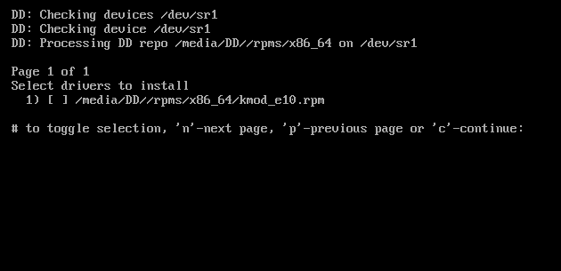
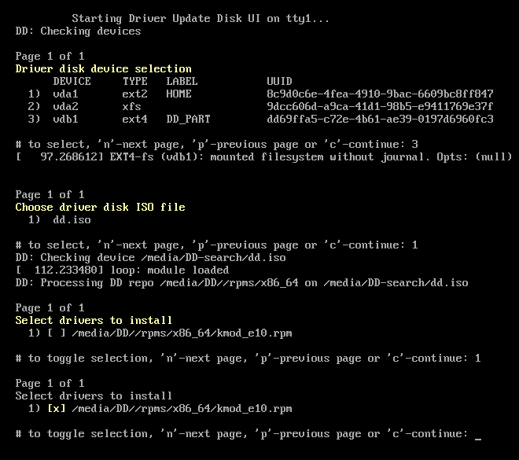
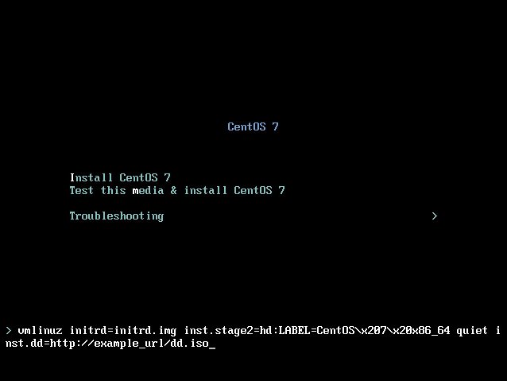

:experimental:
include::entities.adoc[]

[[chap-driver-updates-x86]]
== Updating Drivers During Installation on AMD64 and Intel{nbsp}64 Systems

In most cases, {PRODUCT} already includes drivers for the devices that make up your system. However, if your system contains hardware that has been released very recently, drivers for this hardware might not yet be included. Sometimes, a driver update that provides support for a new device might be available from {PRODUCT} or your hardware vendor on a _driver disc_ that contains _RPM packages_. Typically, the driver disc is available for download as an _ISO image file_.

[IMPORTANT]
====

Driver updates should only be performed if a missing driver prevents you to complete the installation successfully. The drivers included in the kernel should always be preferred over drivers provided by other means.

====

Often, you do not need the new hardware during the installation process. For example, if you use a DVD to install to a local hard drive, the installation will succeed even if drivers for your network card are not available. In such a situation, complete the installation and add support for the new hardware afterward - see link:++https://access.redhat.com/site/documentation/en-US/Red_Hat_Enterprise_Linux/7/html/System_Administrators_Guide/index.html++[Red{nbsp}Hat Enterprise{nbsp}Linux{nbsp}7 System Administrator's Guide] for details of adding this support.

In other situations, you might want to add drivers for a device during the installation process to support a particular configuration. For example, you might want to install drivers for a network device or a storage adapter card to give the installation program access to the storage devices that your system uses. You can use a driver disc to add this support during installation in one of two ways:

. place the ISO image file of the driver disc in a location accessible to the installation program, on a local hard drive, on a USB flash drive, or on a CD or DVD.

. create a driver disc by extracting the image file onto a CD or a DVD, or a USB flash drive. See the instructions for making installation discs in <<sect-making-cd-dvd-media>> for more information on burning ISO image files to a CD or DVD, and <<sect-making-usb-media>> for instructions on writing ISO images to USB drives.

If {PRODUCT}, your hardware vendor, or a trusted third party told you that you will require a driver update during the installation process, choose a method to supply the update from the methods described in this chapter and test it before beginning the installation. Conversely, do not perform a driver update during installation unless you are certain that your system requires it. The presence of a driver on a system for which it was not intended can complicate support.

[WARNING]
====

Driver update disks sometimes disable conflicting kernel drivers, where necessary. In rare cases, unloading a kernel module in this way can cause installation errors.

====

[[sect-driver-updates-limitations-x86]]
=== Limitations of Driver Updates During Installation

On UEFI systems with the Secure Boot technology enabled, all drivers being loaded must be signed with a valid certificate, otherwise the system will refuse them. All drivers provided by {PRODUCT} are signed by one of {PRODUCT}'s private keys and authenticated by the corresponding public key in the kernel. If you load any other drivers (ones not provided on the {PRODUCT} installation DVD), you must make sure that they are signed as well.

More information about signing custom drivers can be found in the Working with Kernel Modules chapter in the link:++https://access.redhat.com/site/documentation/en-US/Red_Hat_Enterprise_Linux/7/html/System_Administrators_Guide/index.html++[Red{nbsp}Hat Enterprise{nbsp}Linux{nbsp}7 System Administrator's Guide].

[[sect-driver-updates-during-installation-preparing-x86]]
=== Preparing for a Driver Update During Installation

If a driver update is necessary and available for your hardware, {PRODUCT}, your hardware vendor, or another trusted third party will typically provide it in the form of an image file in ISO format. Once you obtain the ISO image, you must decide on the method you want to use to perform the driver update.

The available methods are:

Automatic driver update::
+
When starting the installation, the [application]*Anaconda* installation program will attempt to detect all attached storage devices. If there is a storage device labeled `OEMDRV` present when the installation begins, [application]*Anaconda* will always treat it like a driver update disc and attempt to load drivers present on it.

Assisted driver update::
+
You can specify the [option]`inst.dd` boot option when starting the installation. If you use this option without any parameters, [application]*Anaconda* will display a list of all storage devices connected to the system, and it will prompt you to select a device which contains a driver update.

Manual driver update::
+
You can specify the [option]`inst.dd=pass:attributes[{blank}]_location_pass:attributes[{blank}]` boot option when starting the installation, where _location_ is the path to a driver update disc or ISO image. When you specify this option, [application]*Anaconda* will attempt to load any driver updates it finds at the specified location. With manual driver updates, you can specify either locally available storage devices, or a network location (an `HTTP`, `HTTPS` or `FTP` server).

[NOTE]
====

You can also use both [option]`inst.dd=pass:attributes[{blank}]_location_pass:attributes[{blank}]` and [option]`inst.dd` at the same time. However, what [application]*Anaconda* does in this case depends on the type of _location_ that you use. If it is a device, [application]*Anaconda* prompts you to select drivers to update from the specified device and then it offers you additional devices. If _location_ is a network location, [application]*Anaconda* first prompts you to select a device containing a driver update and then it lets you update drivers from the specified network location.

====

If you want to use the automatic driver update method, you must create a storage device labeled `OEMDRV`, and it must be physically connected to the installation system. To use the assisted method, you can use any local storage device any label other than `OEMDRV`. To use the manual method, you can use any local storage with a different label, or a network location accessible from the installation system.

[IMPORTANT]
====

Make sure to initialize the network using the [option]`ip=` option when loading a driver update from a network location. See <<sect-boot-options-installer>> for details.

====

[[sect-driver-updates-image-preparing-x86]]
==== Preparing to Use a Driver Update Image File on Local Storage

If you use a local storage device to provide the ISO file, such as a hard drive or USB flash drive, you can make the installation program to recognize it automatically by properly labeling the device. Only if it is not possible, install the update manually as described below.

* In order for the installation program to automatically recognize the driver disk, the volume label of the storage device must be `OEMDRV`. Also, you will need to extract the contents of the ISO image file to the root directory of the storage device rather than copy the ISO image itself. See <<sect-driver-updates-automatic-x86>>. Note that installation of a driver from a device labeled `OEMDRV` is always recommended and preferable to the manual installation.

* For manual installation, simply copy the ISO image, as a single file, onto the storage device. You can rename the file if you find it helpful but you must not change the file name extension, which must remain `.iso`, for example `dd.iso`. See <<sect-driver-updates-manual-x86>> to learn how to select the driver update manually during installation.

[[sect-driver-updates-preparing-x86]]
==== Preparing a Driver Disc

You can create a driver update disc on a CD or DVD. See <<sect-making-cd-dvd-media>> to learn more about burning discs from image files.

After you burn a driver update disc CD or DVD, verify that the disc was created successfully by inserting it into your system and browsing to it using the file manager. You should see a single file named `rhdd3`, which is a signature file that contains the driver disc's description, and a directory named `rpms`, which contains the RPM packages with the actual drivers for various architectures.

If you see only a single file ending in `.iso`, then you have not created the disc correctly and should try again. Ensure that you choose an option similar to `Burn from Image` if you use a Linux desktop other than [application]*GNOME*, or if you use a different operating system.

[[sect-driver-updates-performing-x86]]
=== Performing a Driver Update During Installation

At the very beginning of the installation process, you can perform a driver update in the following ways:

* let the installation program automatically find and offer a driver update for installation,

* let the installation program prompt you to locate a driver update,

* manually specify a path to a driver update image or an RPM package.

[IMPORTANT]
====

Always make sure to put your driver update discs on a standard disk partition. Advanced storage, such as RAID or LVM volumes, might not be accessible during the early stage of the installation when you perform driver updates.

====

[[sect-driver-updates-automatic-x86]]
==== Automatic Driver Update

To have the installation program automatically recognize a driver update disc, connect a block device with the `OEMDRV` volume label to your computer before starting the installation process.

[NOTE]
====

Starting with {PRODUCT}{nbsp}7.2, you can also use the `OEMDRV` block device to automatically load a Kickstart file. This file must be named `ks.cfg` and placed in the root of the device to be loaded. See <<chap-kickstart-installations>> for more information about Kickstart installations.

====

When the installation begins, the installation program detects all available storage connected to the system. If it finds a storage device labeled `OEMDRV`, it will treat it as a driver update disc and attempt to load driver updates from this device. You will be prompted to select which drivers to load:

.Selecting a Driver

Use number keys to toggle selection on individual drivers. When ready, press kbd:[c] to install the selected drivers and proceed to the [application]*Anaconda* graphical user interface.

[[sect-driver-updates-assited-x86]]
==== Assisted Driver Update

It is always recommended to have a block device with the `OEMDRV` volume label available to install a driver during installation. However, if no such device is detected and the [option]`inst.dd` option was specified at the boot command line, the installation program lets you find the driver disk in interactive mode. In the first step, select a local disk partition from the list for [application]*Anaconda* to scan for ISO files. Then, select one of the detected ISO files. Finally, select one or more available drivers. The image below demonstrates the process in the text user interface with individual steps highlighted.

.Selecting a Driver Interactively

[NOTE]
====

If you extracted your ISO image file and burned it on a CD or DVD but the media does not have the `OEMDRV` volume label, either use the [option]`inst.dd` option with no arguments and use the menu to select the device, or use the following boot option for the installation program to scan the media for drivers:

[literal,subs="+quotes,verbatim"]
....
inst.dd=/dev/sr0
....

====

Hit number keys to toggle selection on individual drivers. When ready, press kbd:[c] to install the selected drivers and proceed to the [application]*Anaconda* graphical user interface.

[[sect-driver-updates-manual-x86]]
==== Manual Driver Update

For manual driver installation, prepare an ISO image file containing your drivers to an accessible location, such a USB flash drive or a web server, and connect it to your computer. At the welcome screen, hit kbd:[Tab] to display the boot command line and append the [option]`inst.dd=pass:attributes[{blank}]_location_pass:attributes[{blank}]` to it, where _location_ is a path to the driver update disc:

.Specifying a Path to a Driver Update

Typically, the image file is located on a web server (for example, _http://server.example.com/dd.iso_) or on a USB flash drive (for example, _/dev/sdb1_). It is also possible to specify an RPM package containing the driver update (for example _http://server.example.com/dd.rpm_).

When ready, hit kbd:[Enter] to execute the boot command. Then, your selected drivers will be loaded and the installation process will proceed normally.

[[sect-blacklisting-a-driver-x86]]
==== Blacklisting a Driver

A malfunctioning driver can prevent a system from booting normally during installation. When this happens, you can disable (or blacklist) the driver by customizing the boot command line. At the boot menu, display the boot command line by hitting the kbd:[Tab] key. Then, append the [option]`modprobe.blacklist=pass:attributes[{blank}]_driver_name_pass:attributes[{blank}]` option to it. Replace _driver_name_ with names of a driver or drivers you want to disable, for example:

[literal,subs="+quotes,verbatim"]
....
modprobe.blacklist=ahci
....

Note that the drivers blacklisted during installation using the [option]`modprobe.blacklist=` boot option will remain disabled on the installed system and appear in the `/etc/modprobe.d/anaconda-blacklist.conf` file. See <<chap-anaconda-boot-options>> for more information about blacklisting drivers and other boot options.
