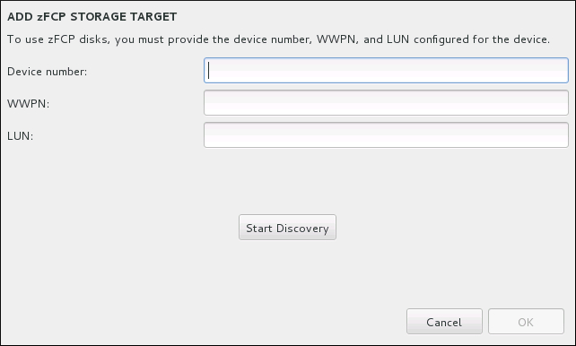

:experimental:
include::entities.adoc[]

[[sect-storage-devices-s390]]
=== Storage Devices

You can install {PRODUCT} on a large variety of storage devices. You can see basic, locally accessible, storage devices in the `Installation Destination` page, as described in <<sect-disk-partitioning-setup-s390>>. To add a specialized storage device, click the btn:[Add a disk] button in the `Specialized & Network Disks` section of the screen.

Basic storage devices directly connected to the local system, such as hard disk drives and solid-state drives, are seen in the `Local Standard Disks` section of the screen. On System{nbsp}z, this contains activated _Direct Access Storage Devices_ (DASDs).

[WARNING]
====

A known issue prevents DASDs configured as HyperPAV aliases to be automatically attached to the system after the installation finishes. These storage devices will be available on this screen during the installation, but will not be immediately accessible after you finish installing and reboot. To attach HyperPAV alias devices, add them manually to the system's `/etc/dasd.conf` configuration file as described in <<sect-post-installation-dasds-setting-online-persistently-s390>>.

====

.Storage Space Overview

image::images/diskpartsetup/disk-setup-s390.png[Storage Space Overview.]

[[sect-storage-device-selection-s390]]
==== The Storage Devices Selection Screen

The storage device selection screen displays all storage devices to which the [application]*Anaconda* installation program has access.

The devices are grouped under the following tabs:

Multipath Devices::
+
Storage devices accessible through more than one path, such as through multiple SCSI controllers or Fiber Channel ports on the same system.
+
[IMPORTANT]
====

The installation program only detects multipath storage devices with serial numbers that are 16 or 32 characters long.

====

Other SAN Devices::
+
Any other devices available on a Storage Area Network (SAN) such as FCP LUNs attached over one single path.

Firmware RAID::
+
Storage devices attached to a firmware RAID controller. This tab does not apply to System{nbsp}z.

System z Devices::
+
This tab contains storage devices, or Logical Units (LUNs), attached through the zSeries Linux FCP (Fiber Channel Protocol) driver.

.Tabbed Overview of Specialized Storage Devices

image::images/s390/s390_selectstoragedevices.png[Tabbed Overview of Specialized Storage Devices]

A set of buttons is available in the bottom right corner of the screen. Use these buttons to add additional storage devices. The available buttons are:

* btn:[Add ZFCP LUN] - press this button to add a zFCP storage device, and continue with <<sect-advanced-storage-fcp-s390>>

* btn:[Add DASD] - press this to add additional DASD devices, and continue with <<sect-advanced-storage-dasd-s390>>

* btn:[Add iSCSI Target] - use to attach iSCSI devices; continue with <<sect-advanced-storage-iscsi-s390>>

* btn:[Add FCoE SAN] - use to configure a Fibre Channel Over Internet storage device; continue with <<sect-advanced-storage-fcoe-s390>>

The overview page also contains the `Search` tab that allows you to filter storage devices either by their _World Wide Identifier_ (WWID) or by the port, target, or _logical unit number_ (LUN) at which they are accessed.

.The Storage Devices Search Tab

image::images/s390/s390_searchstoragedevices2.png[The Storage Devices Search Tab]

The Search tab contains the `Search By` drop-down menu to select searching by port, target, LUN, or WWID. Searching by WWID or LUN requires additional values in the corresponding input text fields. Click the btn:[Find] button to start the search.

Each device is presented on a separate row, with a check box to its left. Click the check box to make the device available during the installation process. Later in the installation process, you can choose to install {PRODUCT} onto any of the devices selected here, and can choose to automatically mount any of the other devices selected here as part of the installed system.

Note that the devices that you select here are not automatically erased by the installation process. Selecting a device on this screen does not, in itself, place data stored on the device at risk. Also note that any devices that you do not select here to form part of the installed system can be added to the system after installation by modifying the `/etc/fstab` file.

When you have selected the storage devices to make available during installation, click btn:[Done] to return to the Installation Destination screen.

[[sect-storage-device-selection-dasd-formatting-s390]]
===== DASD Low-level Formatting

For installation on a DASD, formatting on a low level in the Compatible Disk Layout (CDL) format is recommended. However, it is also possible to use a FBA DASD formatted in the CMS format.
When you select DASDs in the `Installation Destination` screen and click btn:[Done], the installation program detects any unformatted or incompatibly formatted disks, and the following dialog appears:

.Dialog for Formatting DASD Devices

In the dialog, you can click btn:[Cancel] to return to the `Installation Destination` screen and edit disk selection. If the selection is correct, click the btn:[Format with dasdfmt] button to launch the [application]*dasdfmt* utility on all unformatted DASDs.

When the formatting process is complete, clicking the btn:[OK] button brings you back to the `Installation Destination` screen where the list of DASDs will be refreshed. You then need to re-select your disks for the installation to proceed.

To automatically allow low-level formatting of unformatted online DASDs, specify the Kickstart command [command]`zerombr`. See <<sect-kickstart-commands-zerombr>> for more details.

When installing {PRODUCT} on IBM System{nbsp}z
with the FBA DASD CMS disk layout as the target, only three partitions are allowed. The installer first creates an `msdos` partition table on the target DASD.
The table does not allow more than three partitions on one DASD device. You can create the partitions manually or use
the [option]`autopart --nohome` Kickstart option, which ensures that the installer does not create a separate `/home/` partition. The absence of the `home` directory keeps the number of partitions at three.

[[sect-advanced-storage-options-s390]]
===== Advanced Storage Options

To use an advanced storage device, you can configure an _iSCSI_ (SCSI over TCP/IP) target or _zFCP_ (zSeries Fibre Channel Protocol) _LUN_ (logical unit) by clicking the appropriate button in the lower right corner of the Installation Destination screen. See <<appe-iscsi-disks>> for an introduction to iSCSI.

.Advanced Storage Options

image::images/s390/s390_searchstoragedevices.png[Advanced Storage Options.]

[[sect-advanced-storage-iscsi-s390]]
====== Configuring iSCSI Parameters

When you have clicked the `Add iSCSI target...` button, the `Add iSCSI Storage Target` dialog appears.

.The iSCSI Discovery Details Dialog

image::images/diskpartadvanced/iscsi-discovery-reverse-pair.png[The iSCSI Discovery Details dialog.]

To use iSCSI storage devices for the installation, [application]*Anaconda* must be able to _discover_ them as iSCSI targets and be able to create an iSCSI _session_ to access them. Each of these steps might require a user name and password for _CHAP_ (Challenge Handshake Authentication Protocol) authentication. Additionally, you can configure an iSCSI target to authenticate the iSCSI initiator on the system to which the target is attached (_reverse CHAP_), both for discovery and for the session. Used together, CHAP and reverse CHAP are called _mutual CHAP_ or _two-way CHAP_. Mutual CHAP provides the greatest level of security for iSCSI connections, particularly if the user name and password are different for CHAP authentication and reverse CHAP authentication.

[NOTE]
====

Repeat the iSCSI discovery and iSCSI login steps as many times as necessary to add all required iSCSI storage. However, you cannot change the name of the iSCSI initiator after you attempt discovery for the first time. To change the iSCSI initiator name, you must restart the installation.

====

.iSCSI Discovery and Starting an iSCSI Session
Use the `Add iSCSI Storage Target` dialog to provide [application]*Anaconda* with the information necessary to discover the iSCSI target.

. Enter the IP address of the iSCSI target in the `Target IP Address` field.

. Provide a name in the `iSCSI Initiator Name` field for the iSCSI initiator in _iSCSI qualified name_ (IQN) format. A valid IQN entry contains:
+
** the string `iqn.` (note the period)
+
** a date code that specifies the year and month in which your organization's Internet domain or subdomain name was registered, represented as four digits for the year, a dash, and two digits for the month, followed by a period. For example, represent September 2010 as `2010-09.`
+
** your organization's Internet domain or subdomain name, presented in reverse order with the top-level domain first. For example, represent the subdomain `storage.example.com` as `com.example.storage`
+
** a colon followed by a string that uniquely identifies this particular iSCSI initiator within your domain or subdomain. For example, `:diskarrays-sn-a8675309`
+
A complete IQN can therefore look as follows: `iqn.2010-09.storage.example.com:diskarrays-sn-a8675309` . [application]*Anaconda* prepopulates the `iSCSI Initiator Name` field with a name in this format to help you with the structure.
+
For more information on IQNs , see [citetitle]_3.2.6. iSCSI Names_ in [citetitle]_RFC 3720 - Internet Small Computer Systems Interface (iSCSI)_ available from link:++http://tools.ietf.org/html/rfc3720#section-3.2.6++[] and [citetitle]_1. iSCSI Names and Addresses_ in [citetitle]_RFC 3721 - Internet Small Computer Systems Interface (iSCSI) Naming and Discovery_ available from link:++http://tools.ietf.org/html/rfc3721#section-1++[].

. Use the `Discovery Authentication Type` drop-down menu to specify the type of authentication to use for iSCSI discovery. The following options are available:
+
** no credentials
+
** CHAP pair
+
** CHAP pair and a reverse pair

. {blank}
+
.. If you selected `CHAP pair` as the authentication type, provide the user name and password for the iSCSI target in the `CHAP Username` and `CHAP Password` fields.
+
.. If you selected `CHAP pair and a reverse pair` as the authentication type, provide the user name and password for the iSCSI target in the `CHAP Username` and `CHAP Password` field and the user name and password for the iSCSI initiator in the `Reverse CHAP Username` and `Reverse CHAP Password` fields.

. Optionally check the box labeled `Bind targets to network interfaces`.

. Click the btn:[Start Discovery] button. [application]*Anaconda* attempts to discover an iSCSI target based on the information that you provided. If discovery succeeds, the dialog displays a list of all iSCSI nodes discovered on the target.

. Each node is presented with a check box beside it. Click the check boxes to select the nodes to use for installation.
+
.The Dialog of Discovered iSCSI Nodes
+
image::images/diskpartadvanced/iscsi-discovered-nodes.png[The Dialog of Discovered iSCSI Nodes]

. The `Node login authentication type` menu provides the same options as the `Discovery Authentication Type` menu described in step 3. However, if you needed credentials for discovery authentication, it is typical to use the same credentials to log into a discovered node. To do that, use the additional `Use the credentials from discovery` option from the menu. When the proper credentials have been provided, the btn:[Log In] button becomes available.

. Click btn:[Log In] to initiate an iSCSI session.

[[sect-advanced-storage-dasd-s390]]
====== DASD storage devices

After clicking the btn:[Add DASD] button at the `Installation Destination` screen, a dialog appears for you to add a DASD (Direct Access Storage Device) storage device. This dialog allows you to attach additional DASDs which were not detected when the installation started.

.Add DASD Storage Target

The `Add DASD Storage Target` dialog prompts you to specify a device number, such as `0.0.0204`. Enter the device number of the DASD you want to attach, and click btn:[Start Discovery].

If a DASD with the specified device number is found, and if it is not already attached, the dialog window will close and the newly discovered drives will appear in the list of drives in <<sect-storage-device-selection-s390>>. There, you can use the check boxes on the left side of the screen to select which of the drives should be made available; after you do so, press btn:[Done] in the top left corner to return to <<sect-disk-partitioning-setup-s390>>. The new DASDs will then be available for selection (marked as `DASD device 0.0._xxxx_pass:attributes[{blank}]`) in the `Local Standard Disks` section of the screen.

If you entered an invalid device number, or if the DASD with the specified device number is already attached to the system, an error message will appear within the dialog window, explaining the error and prompting you to try again with a different device number.

[[sect-advanced-storage-fcp-s390]]
====== FCP Devices

When you have clicked the `Add ZFCP LUN` button, a dialog appears for you to add a FCP (Fibre Channel Protocol) storage device.

FCP devices enable IBM System{nbsp}z to use SCSI devices rather than, or in addition to, Direct Access Storage Device (DASD) devices. FCP devices provide a switched fabric topology that enables System{nbsp}z systems to use SCSI LUNs as disk devices in addition to traditional DASD devices.

IBM System{nbsp}z requires that any FCP device is entered manually for the installation program to activate FCP LUNs. This can be done either in [application]*Anaconda* interactively, or specified as a unique parameter entry in the parameter or CMS configuration file. The values entered here are unique to each site in which they are set up.

.Notes

* Interactive creation of an FCP device is only possible in graphical mode. It is not possible to interactively configure an FCP device in a text mode installation.

* Use only lower-case letters in hex values. If you enter an incorrect value and hit the btn:[Start discovery] button, the installation program will display a warning and allow you to edit the configuration information and retry the discovery attempt.

* For more information on these values, consult the hardware documentation and check with the system administrator who set up the network for this system.

To configure a Fiber Channel Protocol SCSI device, fill in the 16-bit device number, 64-bit World Wide Port Number (WWPN), and 64-bit FCP LUN identifier. Click the btn:[Start Discovery] button to connect to the FCP device using this information.

.Add FCP Device

The newly added devices are displayed in the `System z Devices` tab of the Installation Destination screen.

[IMPORTANT]
====

For a SCSI-only installation, remove the [option]`DASD=` from the parameter or CMS configuration file to indicate no DASD is present.

====

[[sect-advanced-storage-fcoe-s390]]
====== Configure FCoE Parameters

When you have clicked the `Add FCoE SAN...` button, a dialog appears for you to configure network interfaces for discovering FCoE storage devices.

First, select a network interface that is connected to a FCoE switch in the `NIC` drop-down menu and click the btn:[Add FCoE disk(s)] button to scan the network for SAN devices.

.Configure FCoE Parameters

image::images/diskpartadvanced/fcoe-config.png[Configure FCoE Parameters]

There are check boxes with additional options to consider:

Use DCB::
+
_Data Center Bridging_ (DCB) is a set of enhancements to the Ethernet protocols designed to increase the efficiency of Ethernet connections in storage networks and clusters. Enable or disable the installation program's awareness of DCB with the check box in this dialog. This option should only be enabled for network interfaces that require a host-based DCBX client. Configurations on interfaces that implement a hardware DCBX client should leave this check box empty.

Use auto vlan::
+
_Auto VLAN_ indicates whether VLAN discovery should be performed. If this box is checked, then the FIP (FCoE Initiation Protocol) VLAN discovery protocol will run on the Ethernet interface once the link configuration has been validated. If they are not already configured, network interfaces for any discovered FCoE VLANs will be automatically created and FCoE instances will be created on the VLAN interfaces. This option is enabled by default.

Discovered FCoE devices will be displayed under the `Other SAN Devices` tab in the Installation Destination screen.