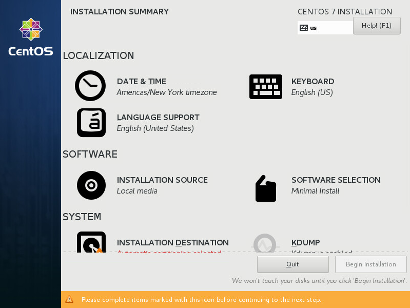

:experimental:
include::entities.adoc[]

[[chap-installing-using-anaconda-ppc]]
== Installing Using Anaconda

This chapter provides step-by-step instructions for installing {PRODUCT} using the [application]*Anaconda* installer. The bulk of this chapter describes installation using the graphical user interface. A text mode is also available for systems with no graphical display, but this mode is limited in certain aspects (for example, custom partitioning is not possible in text mode).

If your system does not have the ability to use the graphical mode, you can:

* Use Kickstart to automate the installation as described in <<chap-kickstart-installations>>

* Perform the graphical installation remotely by connecting to the installation system from another computer with a graphical display using the _VNC_ (Virtual Network Computing) protocol - see <<chap-vnc-installations>>

[[sect-installation-new-users-ppc]]
=== Introduction to Anaconda

The {PRODUCT} installer, [application]*Anaconda*, is different from most other operating system installation programs due to its parallel nature. Most installers follow a fixed path: you must choose your language first, then you configure network, then installation type, then partitioning, and so on. There is usually only one way to proceed at any given time.

In [application]*Anaconda* you are only required to select your language and locale first, and then you are presented with a central screen, where you can configure most aspects of the installation in any order you like. This does not apply to all parts of the installation process, however - for example, when installing from a network location, you must configure the network before you can select which packages to install.

Some screens will be automatically configured depending on your hardware and the type of media you used to start the installation. You can still change the detected settings in any screen. Screens which have not been automatically configured, and therefore require your attention before you begin the installation, are marked by an exclamation mark. You cannot start the actual installation process before you finish configuring these settings.

Additional differences appear in certain screens; notably the custom partitioning process is very different from other Linux distributions. These differences are described in each screen's subsection.

[[sect-consoles-logs-during-installation-ppc]]
=== Consoles and Logging During the Installation

The following sections describe how to access logs and an interactive shell during the installation. This is useful when troubleshooting problems, but should not be necessary in most cases.

[[sect-installation-consoles-ppc]]
==== Accessing Consoles

The {PRODUCT} installer uses the [application]*tmux* terminal multiplexer to display and control several windows you can use in addition to the main interface. Each of these windows serves a different purpose - they display several different logs, which can be used to troubleshoot any issues during the installation, and one of the windows provides an interactive shell prompt with `root` privileges, unless this prompt was specifically disabled using a boot option or a Kickstart command.

[NOTE]
====

In general, there is no reason to leave the default graphical installation environment unless you need to diagnose an installation problem.

====

The terminal multiplexer is running in virtual console 1. To switch from the graphical installation environment to [application]*tmux*, press kbd:[Ctrl + Alt + F1]. To go back to the main installation interface which runs in virtual console 6, press kbd:[Ctrl + Alt + F6].

[NOTE]
====

If you choose text mode installation, you will start in virtual console 1 ([application]*tmux*), and switching to console 6 will open a shell prompt instead of a graphical interface.

====

The console running [application]*tmux* has 5 available windows; their contents are described in the table below, along with keyboard shortcuts used to access them. Note that the keyboard shortcuts are two-part: first press kbd:[Ctrl + b], then release both keys, and press the number key for the window you want to use.

You can also use kbd:[Ctrl + b] kbd:[n] and kbd:[Ctrl + b] kbd:[p] to switch to the next or previous [application]*tmux* window, respectively.

[[tabl-tmux-windows-ppc]]
.Available tmux Windows

[options="header"]
|===
|Shortcut|Contents
|kbd:[Ctrl + b] kbd:[1]|Main installation program window. Contains text-based prompts (during text mode installation or if you use VNC Direct Mode), and also some debugging information.
|kbd:[Ctrl + b] kbd:[2]|Interactive shell prompt with `root` privileges.
|kbd:[Ctrl + b] kbd:[3]|Installation log; displays messages stored in `/tmp/anaconda.log`.
|kbd:[Ctrl + b] kbd:[4]|Storage log; displays messages related storage devices from kernel and system services, stored in `/tmp/storage.log`.
|kbd:[Ctrl + b] kbd:[5]|Program log; displays messages from other system utilities, stored in `/tmp/program.log`.
|===

In addition to displaying diagnostic information in [application]*tmux* windows, [application]*Anaconda* also generates several log files, which can be transferred from the installation system. These log files are described in <<tabl-installation-log-files-ppc>>, and directions for transferring them from the installation system are available in <<chap-troubleshooting-ppc>>.

[[sect-installation-screenshots-ppc]]
==== Saving Screenshots

You can press kbd:[Shift + Print Screen] at any time during the graphical installation to capture the current screen. These screenshots are saved to `/tmp/anaconda-screenshots/`.

Additionally, you can use the [command]`autostep --autoscreenshot` command in a Kickstart file to capture and save each step of the installation automatically. See <<sect-kickstart-commands>> for details.

[[sect-installation-text-mode-ppc]]
=== Installing in Text Mode

Text mode installation offers an interactive, non-graphical interface for installing {PRODUCT}. This can be useful on systems with no graphical capabilities; however, you should always consider the available alternatives before starting a text-based installation. Text mode is limited in the amount of choices you can make during the installation.

[IMPORTANT]
====

Installations using the graphical interface are preferred. If you are installing {PRODUCT} on a system that lacks a graphical display, consider performing the installation over a VNC connection - see <<chap-vnc-installations>>. The text mode installation program will prompt you to confirm the use of text mode if it detects that a VNC-based installation is possible.

If your system has a graphical display, but graphical installation fails, try booting with the [command]`inst.xdriver=vesa` option - see <<chap-anaconda-boot-options>>.

Alternatively, consider a Kickstart installation. See <<chap-kickstart-installations>> for more information.

====

.Text Mode Installation

Installation in text mode follows a pattern similar to the graphical installation: There is no single fixed progression; you can configure many settings in any order you want using the main status screen. Screens which have already been configured, either automatically or by you, are marked as `[x]`, and screens which require your attention before the installation can begin are marked with `[!]`. Available commands are displayed below the list of available options.

[NOTE]
====

When related background tasks are being run, certain menu items can be temporarily unavailable or display the `Processing...` label. To refresh to the current status of text menu items, use the kbd:[r] option at the text mode prompt.

====

At the bottom of the screen in text mode, a green bar is displayed showing five menu options. These options represent different screens in the [application]*tmux* terminal multiplexer; by default you start in screen 1, and you can use keyboard shortcuts to switch to other screens which contain logs and an interactive command prompt. For information about available screens and shortcuts to switch to them, see <<sect-installation-consoles-ppc>>.

Limits of interactive text mode installation include:

* The installer will always use the English language and the US English keyboard layout. You can configure your language and keyboard settings, but these settings will only apply to the installed system, not to the installation.

* You cannot configure any advanced storage methods (LVM, software RAID, FCoE, zFCP and iSCSI).

* It is not possible to configure custom partitioning; you must use one of the automatic partitioning settings. You also cannot configure where the boot loader will be installed.

* You cannot select any package add-ons to be installed; they must be added after the installation finishes using the [application]*Yum* package manager.

To start a text mode installation, boot the installation with the [option]`inst.text` boot option used either at the boot command line in the boot menu, or in your PXE server configuration. See <<chap-booting-installer-ppc>> for information about booting and using boot options.

[[sect-using-hmc-vterm-ppc]]
=== Using the HMC vterm

The HMC vterm is the console for any partitioned IBM Power system. Open the console by right-clicking on the partition on the HMC, and then selecting `Open Terminal Window`. Only a single vterm can be connected to the console at a time and there is no console access for partitioned system besides the vterm. This often is referred to as a _virtual console_, but is different from the virtual consoles in <<sect-installation-consoles-ppc>>.

[[sect-installation-graphical-mode-ppc]]
=== Installing in the Graphical User Interface

The graphical installation interface is the preferred method of manually installing {PRODUCT}. It allows you full control over all available settings, including custom partitioning and advanced storage configuration, and it is also localized to many languages other than English, allowing you to perform the entire installation in a different language. The graphical mode is used by default when you boot the system from local media (a CD, DVD or a USB flash drive).

.The `Installation Summary` Screen

The sections below discuss each screen available in the installation process. Note that due to the installer's parallel nature, most of the screens do not have to be completed in the order in which they are described here.

Each screen in the graphical interface contains a `Help` button. This button opens the [application]*Yelp* help browser displaying the section of the [citetitle]_{PRODUCT} Installation Guide_ relevant to the current screen.

You can also control the graphical installer with your keyboard. Following table shows you the shortcuts you can use.

[[tabl-graphical-installer-shortcuts]]
.Graphical installer keyboard shortcuts

[options="header"]
|===
|Shortcut keys|Usage
|kbd:[Tab] and kbd:[Shift + Tab]|Cycle through active control elements (buttons, check boxes, and so on.) on the current screen
|kbd:[Up] and kbd:[Down]|Scroll through lists
|kbd:[Left] and kbd:[Right]|Scroll through horizontal toolbars and table entries
|kbd:[Space] and kbd:[Enter]|Select or remove a highlighted item from selection and expand and collapse drop-down menus
|===

Additionally, elements in each screen can be toggled using their respective shortcuts. These shortcuts are highlighted (underlined) when you hold down the kbd:[Alt] key; to toggle that element, press kbd:[Alt + _X_pass:attributes[{blank}]], where _X_ is the highlighted letter.

Your current keyboard layout is displayed in the top right hand corner. Only one layout is configured by default; if you configure more than layout in the `Keyboard Layout` screen (<<sect-keyboard-configuration-ppc>>), you can switch between them by clicking the layout indicator.

include::WelcomeSpoke-ppc64.adoc[]

include::SummaryHub-ppc64.adoc[]

include::DateTimeSpoke-ppc64.adoc[]

include::LangSupportSpoke-ppc64.adoc[]

include::KeyboardSpoke-ppc64.adoc[]

include::SecurityPolicySpoke-ppc64.adoc[]

include::SourceSpoke-ppc64.adoc[]

include::NetworkSpoke-ppc64.adoc[]

include::SoftwareSpoke-ppc64.adoc[]

include::StorageSpoke-ppc64.adoc[]

include::FilterSpoke-ppc64.adoc[]

include::KdumpSpoke-ppc64.adoc[]

include::Write_changes_to_disk_ppc.adoc[]

include::ProgressHub-ppc64.adoc[]

include::Complete-ppc.adoc[]
