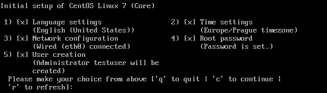

:experimental:
include::entities.adoc[]

[[sect-initial-setup-text]]
=== Text Mode

If you installed {PRODUCT} without the [application]*X Window System*, the [application]*Initial Setup* starts in text mode:

.[application]*Initial Setup* in text mode

To configure an entry, enter the menu number and press kbd:[Enter]. Additionally, you can press the following keys:

* kbd:[q] to close the application. Until you accepted the license agreement, closing the application causes the system to reboot.

* kbd:[c] to continue. Pressing this key in a submenu returns you to the main menu. In the main menu, pressing the kbd:[c] key stores the settings and closes the application. Note that you cannot continue without accepting the license agreement.

* kbd:[r] to refresh the menu.

Menu entries can have different statuses:

* [option]`[x]`: This setting is already configured. However, you can change the setting.

* [option]`[!]`: This setting is mandatory but not yet set.

* [option]`[{nbsp}]`: This setting is optional and not yet set.

To start the [application]*Initial Setup* again, see <<starting_initial_setup_manually>>.