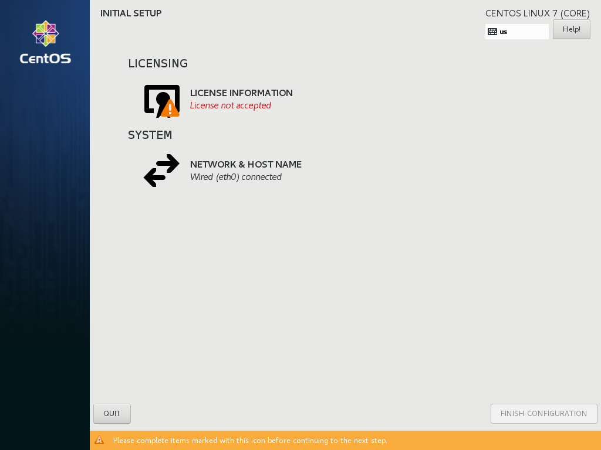
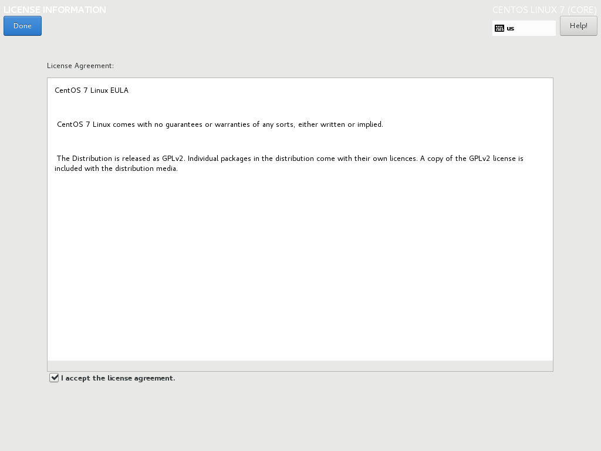

:experimental:
include::entities.adoc[]

[[chap-initial-setup]]
== Initial Setup

After you started a new {PRODUCT} system the first time, the [application]*Initial Setup* application launches, if you installed the server:

* Using the `Server with GUI` base environment in the {PRODUCT} setup.

* Using a Kickstart file that contains one of the following entries in the `%packages` section:
+
** the [package]*initial-setup-gui* package for graphical mode
+
** the [package]*initial-setup* package for text mode
+
** the [package]*x11* group
+
** the [package]*gnome-desktop* group
+
** the [package]*kde-desktop* group

[discrete]
=== Options in the Initial Setup
The [application]*Initial Setup* application can display the following options:

[options="header"]
|===
|Option|Graphical User Interface|Text User Interface
|License agreement
						footnote:[This option is only displayed if you did not previously agreed to the license.]|Yes|Yes
|Language settings
						footnote:[This option is only displayed if you did not previously set it.]|No|Yes
|Date & time|Yes|Yes
						footnote:[This option is only available if you run [application]*Initial Setup* in reconfiguration mode]
|Subscription Manager|Yes|No
|Network & host name|Yes|No
|Root password|Yes|Yes
|User creation|Yes|Yes
|===

[IMPORTANT]
====

Options set during the setup are not displayed in the [application]*Initial Setup*. To display all options in [application]*Initial Setup*, you must install {PRODUCT} using a Kickstart file that contains the following command:

[literal,subs="+quotes,verbatim"]
....
firstboot --enable --reconfig
....

The [option]`--reconfig` option specifies that all options should be displayed. For further details about Kickstart installations, see <<chap-kickstart-installations>>.

====

[[initial-setup_GUI]]
=== Graphical Mode

In graphical mode, the [application]*Initial Setup* displays the following screen:

.Main Initial Setup Screen

The `License Agreement` screen displays the overall licensing terms for {PRODUCT}.

.License Information Screen

In order to continue with the configuration process, the license agreement must be accepted. Exiting [application]*Initial Setup* without completing this step will cause the system to restart, and once the system finishes rebooting, you will be prompted to accept the agreement again.

Review the license agreement. Then, select `I accept the license agreement.` and click btn:[Done] to continue.

The `User Creation` screen is the same as the one used when creating an account during the installation. See <<sect-account-configuration-user-x86>> for detailed information.

Similarly, the `Network & Host Name` screen is the same as the one used when setting up network. See <<sect-network-hostname-configuration-x86>> for information.

The `Subscription Manager` screen allows you to register your system with Red{nbsp}Hat to receive updates and install additional packages from repositories provided by Red{nbsp}Hat. For information about how to register your system, see <<sect-initial-setup-subsciption-manager>>.

Once ready, click the btn:[FINISH CONFIGURATION] button to register your system, before completing the [application]*Initial Setup* configuration process.

To start the [application]*Initial Setup* again, see <<starting_initial_setup_manually>>.

include::SubscriptionManagerSpoke-common.adoc[]

include::InitialSetup-text.adoc[]

[[starting_initial_setup_manually]]
=== Starting Initial Setup Manually

Once you once finished the [application]*Initial Setup*, the application does not start again when you boot the system. To manually start the [application]*Initial Setup* on system boot:

. Enable the service:
+
[literal,subs="+quotes,verbatim"]
....
# systemctl enable initial-setup.service
....

. Optionally, to display all menu options, including the ones previously set, create an empty `/.unconfigured` file to start [application]*Initial Setup* in reconfiguration mode:
+
[literal,subs="+quotes,verbatim"]
....
# touch /.unconfigured
....
+
Note that, regardless of this setting, the license agreement entry is not displayed again if you previously accepted it.

. Reboot the system.

[NOTE]
====

The [package]*initial-setup-gui* (graphical mode) or [package]*initial-setup* (text mode) packages must be installed for to run [application]*Initial Setup*.

====