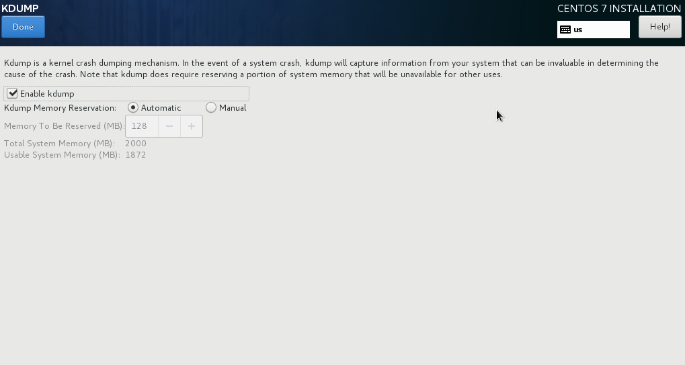

:experimental:

[[sect-kdump-ppc]]
=== Kdump

Use this screen to select whether or not to use [application]*Kdump* on this system. [application]*Kdump* is a kernel crash dumping mechanism which, in the event of a system crash, captures information that can be invaluable in determining the cause of the crash.

Note that if you enable [application]*Kdump*, you must reserve a certain amount of system memory for it. As a result, less memory is available for your processes.

IBM Power System LPARs support firmware-assisted dump ([application]*fadump*), an alternate dump capture mechanism to [application]*Kdump*. With [application]*fadump*, dump capture takes place from a fully reset system that is loaded with a fresh copy of the kernel. In particular, PCI and I/O devices are reinitialized and are in a clean, consistent state making it a reliable alternative to [application]*Kdump*. Note that although [application]*fadump* is an alternative to [application]*Kdump*, [application]*fadump* requires [application]*Kdump* to be enabled. You can enable [application]*fadump* on this screen.

If you do not want to use [application]*Kdump* on this system, uncheck btn:[Enable kdump]. Otherwise, set the amount of memory to reserve for [application]*Kdump*. You can let the installer reserve a reasonable amount automatically, or you can set any amount manually. When your are satisfied with the settings, click btn:[Done] to save the configuration and return to the previous screen.

.Kdump Enablement and Configuration

