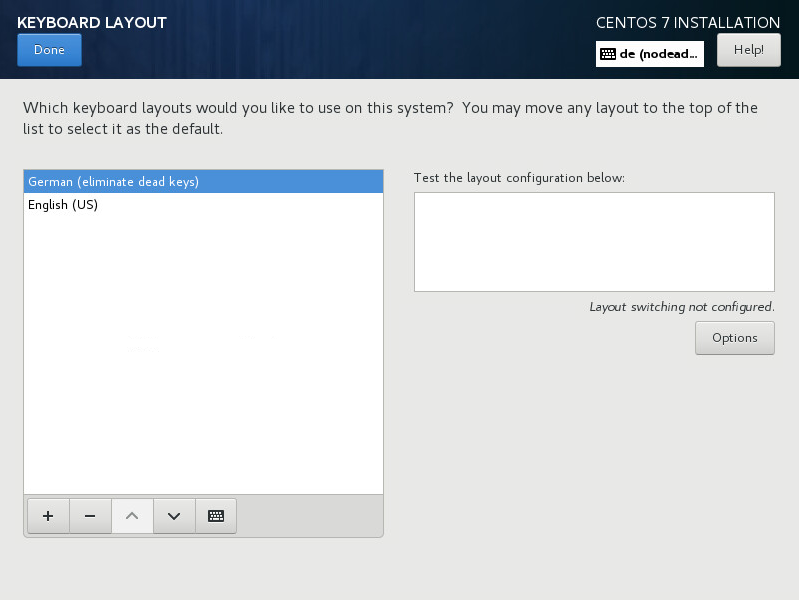

:experimental:
include::entities.adoc[]

[[sect-keyboard-configuration-x86]]
=== Keyboard Configuration

To add multiple keyboard layouts to your system, select `Keyboard` from the `Installation Summary` screen. Upon saving, the keyboard layouts are immediately available in the installation program and you can switch between them by using the keyboard icon located at all times in the upper right corner of the screen.

Initially, only the language you selected in the welcome screen is listed as the keyboard layout in the left pane. You can either replace the initial layout or add more layouts. However, if your language does not use ASCII characters, you might need to add a keyboard layout that does, to be able to properly set a password for an encrypted disk partition or the root user, among other things.

.Keyboard Configuration

To add an additional layout, click the btn:[+] button, select it from the list, and click btn:[Add]. To delete a layout, select it and click the btn:[-] button. Use the arrow buttons to arrange the layouts in order of preference. For a visual preview of the keyboard layout, select it and click the keyboard button.

To test a layout, use the mouse to click inside the text box on the right. Type some text to confirm that your selection functions correctly.

To test additional layouts, you can click the language selector at the top on the screen to switch them. However, it is recommended to set up a keyboard combination for switching layout. Click the btn:[Options] button at the right to open the `Layout Switching Options` dialog and choose a combination from the list by selecting its check box. The combination will then be displayed above the btn:[Options] button. This combination applies both during the installation and on the installed system, so you must configure a combination here in order to use one after installation. You can also select more than one combination to switch between layouts.

[IMPORTANT]
====

If you use a layout that cannot accept Latin characters, such as `Russian`, Red{nbsp}Hat recommends additionally adding the `English (United States)` layout and configuring a keyboard combination to switch between the two layouts. If you only select a layout without Latin characters, you might be unable to enter a valid root password and user credentials later in the installation process. This can prevent you from completing the installation.

====

Once you have made your selection, click btn:[Done] to return to the `Installation Summary` screen.

[NOTE]
====

To change your keyboard configuration after you have completed the installation, visit the [application]*Keyboard* section of the [application]*Settings* dialogue window.

====