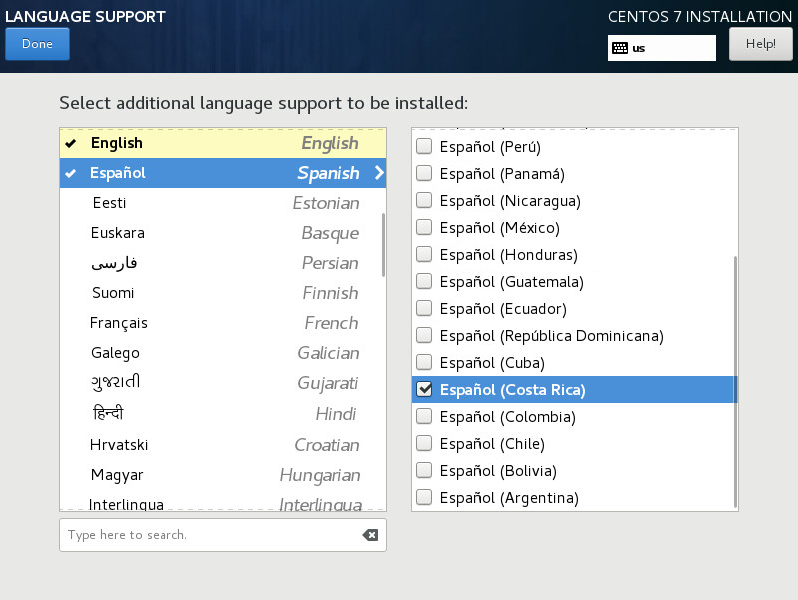

:experimental:

[[sect-language-support-x86]]
=== Language Support

To install support for additional locales and language dialects, select `Language Support` from the `Installation Summary` screen.

Use your mouse to select the language for which you would like to install support. In the left panel, select your language of choice, for example `Español`. Then you can select a locale specific to your region in the right panel, for example `Español (Costa Rica)`. You can select multiple languages and multiple locales. The selected languages are highlighted in bold in the left panel.

.Configuring Language Support

Once you have made your selections, click btn:[Done] to return to the `Installation Summary` screen.

[NOTE]
====

To change your language support configuration after you have completed the installation, visit the [application]*Region & Language* section of the [application]*Settings* dialog window.

====