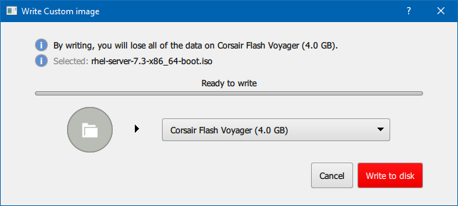

:experimental:
include::entities.adoc[]

[[chap-making-media]]
== Making Media

This chapter describes how to use ISO image files obtained by following the steps in <<chap-download>> to create bootable physical media, such as a DVD or a USB flash drive. You can then use these media to boot the installation program and start the installation. These steps only apply if you plan to install {PRODUCT} on a 64-bit AMD, Intel, or ARM system, or an IBM Power{nbsp}Systems server using physical boot media. For instructions on how to set up a _Preboot Execution Environment_ (PXE) server to perform a PXE-based installation over a network, see <<chap-installation-server-setup>>.

[NOTE]
====

By default, the [option]`inst.stage2=` boot option is used on the installation media and set to a specific label (for example, [option]`inst.stage2=hd:LABEL={PRODUCT}\x20Server.x86_64`). If you modify the default label of the file system containing the runtime image, or if using a customized procedure to boot the installation system, you must ensure this option is set to the correct value. See <<list-boot-options-sources>> for details.

====

[[sect-making-cd-dvd-media]]
=== Making an Installation CD or DVD

You can make an installation CD or DVD using burning software on your computer and a CD/DVD burner. The exact series of steps that produces an optical disc from an ISO image file varies greatly from computer to computer, depending on the operating system and disc burning software installed. Consult your burning software's documentation for the exact steps needed to burn a CD or DVD from an ISO image file.

[NOTE]
====

It is possible to use optical discs (CDs and DVDs) to create both minimal boot media and full installation media. However, it is important to note that due to the large size of the full installation ISO image (between 4 and 4.5{nbsp}GB), only a DVD can be used to create a full installation disc. Minimal boot ISO is roughly 300{nbsp}MB, allowing it to be burned to either a CD or a DVD.

====

Make sure that your disc burning software is capable of burning discs from image files. Although this is true of most disc burning software, exceptions exist. In particular, note that the disc burning feature built into Windows XP and Windows Vista cannot burn DVDs; and that earlier Windows operating systems did not have any disc burning capability installed by default at all. Therefore, if your computer has a Windows operating system prior to Windows{nbsp}7 installed on it, you need a separate piece of software for this task. Examples of popular disc burning software for Windows that you might already have on your computer include [application]*Nero Burning ROM* and [application]*Roxio Creator*. Most widely used disc burning software for Linux, such as [application]*Brasero* and [application]*K3b*, also has the built-in ability to burn discs from ISO image files.

On some computers, the option to burn a disc from an ISO file is integrated into a context menu in the file browser. For example, when you right-click an ISO file on a computer with a Linux or UNIX operating system which runs the [application]*GNOME* desktop, the [application]*Nautilus* file browser presents you with the option to `Write to disk`.

[[sect-making-usb-media]]
=== Making Installation USB Media

You can use a USB drive or an SD card instead of a CD or DVD to create bootable media for installing {PRODUCT} on 64-bit AMD, Intel, or ARM systems. The exact procedure varies depending on whether you want to perform it on a Linux or Windows system. You can create minimal boot media and full installation media using the same procedure; the only limitation is the capacity of the USB drive - it must have enough space to fit the entire image, which means roughly 450{nbsp}MB for minimal boot media and 4.8{nbsp}GB for full installation media.

[[sect-making-usb-media-linux]]
==== Making Installation USB Media on Linux

The following procedure assumes you are using a Linux system and that you have downloaded an appropriate ISO image as described in <<chap-download>>. On most Linux distributions, it will work without the need for installing any additional packages.

[WARNING]
====

This procedure is destructive. Any data on the USB flash drive will be destroyed with no warning. Make sure that you specify the correct drive, and make sure that this drive does not contain any data you want to preserve.

====

Many Linux distributions provide their own tools for creating live USB media, for example, [package]*usb-creator* on Ubuntu. Describing these tools is beyond the scope of this book; the following procedure will work on most Linux systems.

[[proc-making-usb-media-linux]]
.Making USB Media on Linux
. Connect a USB flash drive to the system and execute the [command]`dmesg` command. A log detailing all recent events will be displayed. At the bottom of this log, you will see a set of messages caused by the USB flash drive you just connected. It will look like a set of lines similar to the following:
+
[literal,subs="+quotes,verbatim,macros"]
....
`[  170.171135] sd 5:0:0:0: [sdb] Attached SCSI removable disk`
....
+
Note the name of the connected device - in the above example, it is `sdb`.

. Log in as `root`:
+
[literal,subs="+quotes,verbatim,macros"]
....
`$` [command]`su -`
....
+
Provide your root password when prompted.

. Make sure that the device is not mounted. First, use the [command]`findmnt _device_` command and the device name you found in the earlier steps. For example, if the device name is `sdb`, use the following command:
+
[literal,subs="+quotes,verbatim,macros"]
....
`# findmnt /dev/sdb`
....
+
If the command displays no output, you can proceed with the next step. However, if the command does provide output, it means that the device was automatically mounted and you must unmount it before proceeding. A sample output will look similar to the following:
+
[literal,subs="+quotes,verbatim,macros"]
....

`# findmnt /dev/sdb`
TARGET   SOURCE   FSTYPE  OPTIONS
/mnt/iso /dev/sdb iso9660 ro,relatime

....
+
Note the `TARGET` column. Next, use the [command]`umount _target_` command to unmount the device:
+
[literal,subs="+quotes,verbatim,macros"]
....
`# umount /mnt/iso`
....

. Use the [command]`dd` command to write the installation ISO image directly to the USB device:
+
[literal,subs="+quotes,verbatim,macros"]
....
`# dd if=/image_directory/image.iso of=/dev/device bs=blocksize`
....
+
Replace _/image_directory/image.iso_ with the full path to the ISO image file you downloaded, _device_ with the device name as reported by the [command]`dmesg` command earlier, and _blocksize_ with a reasonable block size (for example, `512k`) to speed up the writing process. The [option]`bs` parameter is optional, but it can speed up the process considerably.
+
[IMPORTANT]
====

Make sure to specify the output as the device name (for example, `/dev/sda`), not as a name of a _partition_ on the device (for example, `/dev/sda1`).

====
+
For example, if the ISO image is located in `/home/testuser/Downloads/{PRODUCT}-server-x86_64-boot.iso` and the detected device name is `sdb`, the command will look like the following:
+
[literal,subs="+quotes,attributes,verbatim,macros"]
....
`# dd if=/home/testuser/Downloads/{PRODUCT}-server-x86_64-boot.iso of=/dev/sdb bs=512k`
....

. Wait for [command]`dd` to finish writing the image to the device. Note that no progress bar is displayed; the data transfer is finished when the `#` prompt appears again. After the prompt is displayed, log out from the `root` account and unplug the USB drive.

The USB drive is now ready to be used as a boot device. You can continue with <<chap-booting-installer-x86>> on AMD, Intel, and ARM systems, or <<chap-booting-installer-ppc>> on IBM Power{nbsp}Systems servers.

[NOTE]
====

Non-virtualized installations (known as "bare metal" installations) on IBM Power Systems servers require that the [option]`inst.stage2=` boot option is specified. Refer to <<sect-boot-options-installer>> for information about the [option]`inst.stage2=` boot option.

====

[[sect-making-usb-media-windows]]
==== Making Installation USB Media on Windows

The procedure of creating bootable USB media on Windows depends on which tool you use. There are many different utilities which allow you to write an ISO image to a USB drive. {PRODUCT} recommends using the [application]*Fedora Media Writer*, available for download at link:++https://github.com/MartinBriza/MediaWriter/releases++[].

[IMPORTANT]
====

Transferring the ISO image file to the USB drive using Windows Explorer or a similar file manager will not work - you will not be able to boot from the device.

====

[[proc-making-usb-media-windows]]
.Making USB Media on Windows
. Download and install [application]*Fedora Media Writer*.

. Download the {PRODUCT} ISO image you want to use to create the media. (See <<chap-download>> for instructions on obtaining ISO images.)

. Plug in the USB drive you will be using to create bootable media.

. Open [application]*Fedora Media Writer*.

. In the main window, click `Custom Image` and select the downloaded {PRODUCT} ISO image.

. From the drop-down menu, select the drive you want to use. If the drive does not appear, verify that the USB drive is connected and restart [application]*Fedora Media Writer*.

. Click `Write to disk`. The boot media creation process will begin. Do not unplug the drive until the operation completes. Depending on the size of the ISO image and the write speed of the USB drive, writing the image can take several minutes.
+
[[fedora-liveusb-creator]]
.Fedora Media Writer
+

. When the creation process finishes and the `Complete!` message appears, unmount the USB drive using the `Safely remove hardware` icon in the system's notification area.

The USB drive is now ready to be used as a boot device. You can continue with <<chap-booting-installer-x86>> on AMD, Intel, and ARM systems, or <<chap-booting-installer-ppc>> on IBM Power{nbsp}Systems servers.

[[sect-making-usb-media-macosx]]
==== Making Installation USB Media on Mac OS X

This procedure involves using the [command]`dd` command line tool to write the installation image to a USB flash drive. Note that some steps involve use of the [command]`sudo` command, which is only available when logged in with an administrator account that requires a password.

[WARNING]
====

All data on the USB flash drive will be deleted by this procedure.

====

[[proc-making-usb-media-macosx]]
.Making USB Media on Mac OS X
. Connect a USB flash drive to the system and identify the device path with the [command]`diskutil list` command. The device path has the format of `/dev/diskpass:attributes[{blank}]_number_`, where _number_ is the number of the disk. The disks are numbered starting at zero (0). Disk 0 is likely to be the OS X recovery disk, and Disk 1 is likely to be your main OS X installation. In the following example, it is `disk2`:
+
[literal,subs="+quotes,verbatim"]
....
$ diskutil list
/dev/disk0
#:                       TYPE NAME                    SIZE       IDENTIFIER
0:      GUID_partition_scheme                        *500.3 GB   disk0
1:                        EFI EFI                     209.7 MB   disk0s1
2:          Apple_CoreStorage                         400.0 GB   disk0s2
3:                 Apple_Boot Recovery HD             650.0 MB   disk0s3
4:          Apple_CoreStorage                         98.8 GB    disk0s4
5:                 Apple_Boot Recovery HD             650.0 MB   disk0s5
/dev/disk1
#:                       TYPE NAME                    SIZE       IDENTIFIER
0:                  Apple_HFS YosemiteHD             *399.6 GB   disk1
Logical Volume on disk0s1
8A142795-8036-48DF-9FC5-84506DFBB7B2
Unlocked Encrypted
/dev/disk2
#:                       TYPE NAME                    SIZE       IDENTIFIER
0:     FDisk_partition_scheme                        *8.0 GB     disk2
1:               Windows_NTFS SanDisk USB             8.0 GB     disk2s1
....
+
To identify your USB flash drive, compare the `NAME`, `TYPE` and `SIZE` columns to what you know about your flash drive. For example, the `NAME` should be the same as the title of the flash drive icon in the [application]*Finder*. You can also compare these values to those in the flash drive's information panel; right-click on the drive icon and select `Get Info`.

. Use the [command]`diskutil unmountDisk` command to unmount the flash drive's filesystem volumes:
+
[literal,subs="+quotes,verbatim,macros"]
....
`$` [command]`diskutil unmountDisk /dev/diskpass:attributes[{blank}]_number_pass:attributes[{blank}]`
Unmount of all volumes on diskpass:attributes[{blank}]_number_ was successful
....
+
When you do this, the icon for the flash drive disappears from your desktop. If it does not, you might have identified the wrong disk. If you attempt to unmount the system disk accidentally, you get a `failed to unmount` error.

. Use the [command]`dd` command as a parameter of the [command]`sudo` command to write the ISO image to the flash drive:
+
[literal,subs="+quotes,verbatim,macros"]
....
$ [command]`sudo dd if=pass:attributes[{blank}]_/path/to/image.iso_ of=/dev/rdiskpass:attributes[{blank}]_number_ bs=1m>`
....
+
[NOTE]
====

Mac OS X provides both a block (`/dev/disk*`) and character device (`/dev/rdisk*`) file for each storage device. Writing an image to the `/dev/rdiskpass:attributes[{blank}]_number_pass:attributes[{blank}]` character device is faster than to the `/dev/diskpass:attributes[{blank}]_number_pass:attributes[{blank}]` block device.

====
+
.Writing an ISO Image to a Disk
====

To write the `/Users/pass:attributes[{blank}]_user_name_pass:attributes[{blank}]/Downloads/{PRODUCT}-server-x86_64-boot.iso` file to the `/dev/rdisk2` device:

[literal,subs="+quotes,attributes,verbatim"]
....
$ sudo dd if=/Users/user_name/Downloads/{PRODUCT}-server-x86_64-boot.iso of=/dev/rdisk2
....

====

. Wait for the command to finish. Note that no progress bar is displayed; however, to check the status of the operation while it is still running, press kbd:[Ctrl + t] in the terminal:
+
[literal,subs="+quotes,verbatim"]
....
load: 1.02  cmd: dd 3668 uninterruptible 0.00u 1.91s
112+0 records in
111+0 records out
116391936 bytes transferred in 114.834860 secs (1013559 bytes/sec)
....

. The speed of the data transfer depends on the speed of your USB ports and the flash drive. After the prompt is displayed again, the data transfer is finished. You can then unplug the flash drive.

The flash drive is now ready to be used as a boot device. You can continue with <<chap-booting-installer-x86>> on AMD64 and Intel{nbsp}64 systems or <<chap-booting-installer-ppc>> on IBM Power{nbsp}Systems servers.

[[sect-making-media-additional-sources]]
=== Preparing Installation Sources

As explained in <<chap-download>>, two basic types of media are available for {PRODUCT}: a minimal boot image and a full installation image (also known as a binary DVD). If you downloaded the binary DVD and created a boot DVD-ROM or USB drive from it, you can proceed with the installation immediately, as this image contains everything you need to install the system.

However, if you use the minimal boot image, you must also configure an additional source of the installation. This is because the minimal boot image only contains the installation program itself and tools needed to boot your system and start the installation; it does not include the software packages to be installed on your system.

The full installation DVD ISO image can be used as the source for the installation. If your system will require additional software not provided by Red{nbsp}Hat, you should configure additional repositories and install these packages _after_ the installation is finished. For information about configuring additional [application]*Yum* repositories on an installed system, see the link:++https://access.redhat.com/site/documentation/en-US/Red_Hat_Enterprise_Linux/7/html/System_Administrators_Guide/index.html++[Red{nbsp}Hat Enterprise{nbsp}Linux{nbsp}7 System Administrator's Guide].

The installation source can be any of the following:

* `DVD`: You can burn the binary DVD ISO image onto a DVD and configure the installation program to install packages from this disk.

* `Hard drive`: You can place the binary DVD ISO image on a hard drive and install packages from it.

* `Network location`: You can copy the binary DVD ISO image or the _installation tree_ (extracted contents of the binary DVD ISO image) to a network location accessible from the installation system and perform the installation over the network using the following protocols:
+
** `NFS`: The binary DVD ISO image is placed into a _Network File System_ (NFS) share.
+
** `HTTPS`, `HTTP` or `FTP`: The installation tree is placed on a network location accessible over `HTTP`, `HTTPS`, or `FTP`.

When booting the installation from minimal boot media, you must always configure an additional installation source. When booting the installation from the full binary DVD, it is also possible to configure another installation source, but it is not necessary - the binary DVD ISO image itself contains all packages you need to install the system, and the installation program will automatically configure the binary DVD as the source.

You can specify an installation source in any of the following ways:

* In the installation program's graphical interface: After the graphical installation begins and you select your preferred language, the `Installation Summary` screen will appear. Navigate to the `Installation Source` screen and select the source you want to configure. For details, see:
+
** <<sect-installation-source-x86>> for 64-bit AMD, Intel, and ARM systems
+
** <<sect-installation-source-ppc>> for IBM Power{nbsp}Systems servers

* Using a boot option: You can specify custom boot options to configure the installation program before it starts. One of these options allows you to specify the installation source to be used. See the [option]`inst.repo=` option in <<sect-boot-options-installer>> for details.

* Using a Kickstart file: You can use the [command]`install` command in a Kickstart file and specify an installation source. See <<sect-kickstart-commands>> for details on the [command]`install` Kickstart command, and <<chap-kickstart-installations>> for information about Kickstart installations in general.

[[sect-making-media-sources-dvd]]
==== Installation Source on a DVD

You can burn the binary DVD ISO image onto a DVD and configure the installation program to install packages from this disk while booting the installation from another drive (for example, a minimal boot ISO on a USB flash drive). This procedure is the same as creating bootable optical media - see <<sect-making-cd-dvd-media>> for more information.

When using a DVD as an installation source, make sure the DVD is in the drive when the installation begins. The [application]*Anaconda* installation program is not able to detect media inserted after the installation begins.

[[sect-making-media-sources-hdd]]
==== Installation Source on a Hard Drive

Hard drive installations use an ISO image of the binary installation DVD. To use a hard drive as the installation source, transfer the binary DVD ISO image to the drive and connect it to the installation system. Then, boot the [application]*Anaconda* installation program.

You can use any type of hard drive accessible to the installation program, including USB flash drives. The binary ISO image can be in any directory of the hard drive, and it can have any name; however, if the ISO image is not in the top-level directory of the drive, or if there is more than one image in the top-level directory of the drive, you will be required to specify the image to be used. This can be done using a boot option, an entry in a Kickstart file, or manually in the `Installation Source` screen during a graphical installation.

A limitation of using a hard drive as the installation source is that the binary DVD ISO image on the hard drive must be on a partition with a file system which [application]*Anaconda* can mount. These file systems are `xfs`, `ext2`, `ext3`, `ext4`, and `vfat` (`FAT32`). Note that on Microsoft Windows systems, the default file system used when formatting hard drives is `NTFS`, and the `exFAT` file system is also available; however, neither of these file systems can be mounted during the installation. If you are creating a hard drive or a USB drive to be used as an installation source on Microsoft Windows, make sure to format the drive as `FAT32`.

[IMPORTANT]
====

The `FAT32` file system does not support files larger than 4 GiB. Some {PRODUCT}{nbsp}7 installation media can be larger than that, which means you cannot copy them to a drive with this file system.

====

When using a hard drive or a USB flash drive as an installation source, make sure it is connected to the system when the installation begins. The installation program is not able to detect media inserted after the installation begins.

[[sect-making-media-sources-network]]
==== Installation Source on a Network

Placing the installation source on a network has the advantage of allowing you to install multiple systems from a single source, without having to connect and disconnect any physical media. Network-based installations can be especially useful when used together with a TFTP server, which allows you to boot the installation program from the network as well. This approach completely eliminates the need for creating physical media, allowing easy deployment of {PRODUCT} on multiple systems at the same time. For further information about setting up a TFTP server, see <<chap-installation-server-setup>>.

[[sect-making-media-sources-nfs]]
===== Installation Source on an NFS Server

The `NFS` installation method uses an ISO image of the {PRODUCT} binary DVD placed in a `Network File System` server's _exported directory_, which the installation system must be able to read. To perform an NFS-based installation, you will need another running system which will act as the NFS host.

For more information about NFS servers, see the link:++https://access.redhat.com/site/documentation/en-US/Red_Hat_Enterprise_Linux/7/html/Storage_Administration_Guide/index.html++[Red{nbsp}Hat Enterprise{nbsp}Linux{nbsp}7 Storage Administration Guide].

The following procedure is only meant as a basic outline of the process. The precise steps you must take to set up an NFS server will vary based on the system's architecture, operating system, package manager, service manager, and other factors. On {PRODUCT}{nbsp}7 systems, the procedure can be followed exactly as documented. For procedures describing the installation source creation process on earlier releases of {PRODUCT}, see the appropriate [citetitle]_Installation Guide_ for that release.

[[proc-installation-server-setup-nfs]]
.Preparing for Installation Using NFS
. Install the [package]*nfs-utils* package by running the following command as `root`:
+
[literal,subs="+quotes,verbatim,macros"]
....
pass:quotes[`#`] yum install nfs-utils
....

. Copy the full {PRODUCT}{nbsp}7 binary DVD ISO image to a suitable directory on the NFS server. For example, you can create directory `/{PRODUCT}-install/` for this purpose and save the ISO image here.

. Open the `/etc/exports` file using a text editor and add a line with the following syntax:
+
[literal,subs="+quotes,verbatim,macros"]
....
pass:quotes[_/exported_directory/_] pass:quotes[_clients_]
....
+
Replace _/exported_directory/_ with the full path to the directory holding the ISO image. Instead of _clients_, use the host name or IP address of the computer which is to be installed from this NFS server, the subnetwork from which all computers are to have access the ISO image, or the asterisk sign (`*`) if you want to allow any computer with network access to the NFS server to use the ISO image. See the `exports(5)` man page for detailed information about the format of this field.
+
The following is a basic configuration which makes the `/{PRODUCT}-install/` directory available as read-only to all clients:
+
[literal,subs="+quotes,attributes,verbatim"]
....
/{PRODUCT}-install *
....

. Save the `/etc/exports` file after finishing the configuration and exit the text editor.

. Start the `nfs` service:
+
[literal,subs="+quotes,verbatim,macros"]
....
`#` [command]`systemctl start nfs.service`
....
+
If the service was already running before you changed the `/etc/exports` file, enter the following command instead, in order for the running NFS server to reload its configuration:
+
[literal,subs="+quotes,verbatim,macros"]
....
`#` [command]`systemctl reload nfs.service`
....

After completing the procedure above, the ISO image is accessible over `NFS` and ready to be used as an installation source.

When configuring the installation source before or during the installation, use `nfs:` as the protocol, the server's host name or IP address, the colon sign (`:`), and the directory holding the ISO image. For example, if the server's host name is `myserver.example.com` and you have saved the ISO image in `/{PRODUCT}-install/`, specify `nfs:myserver.example.com:/{PRODUCT}-install/` as the installation source.

[[sect-making-media-sources-http-ftp]]
===== Installation Source on an HTTP, HTTPS or FTP Server

This installation method allows for a network-based installation using an installation tree, which is a directory containing extracted contents of the binary DVD ISO image and a valid `.treeinfo` file. The installation source is accessed over `HTTP`, `HTTPS`, or `FTP`.

For more information about HTTP and FTP servers, see the link:++https://access.redhat.com/site/documentation/en-US/Red_Hat_Enterprise_Linux/7/html/System_Administrators_Guide/index.html++[{PRODUCT}{nbsp}7 System Administrator's Guide].

The following procedure is only meant as a basic outline of the process. The precise steps you must take to set up an FTP server will vary based on the system's architecture, operating system, package manager, service manager, and other factors. On {PRODUCT}{nbsp}7 systems, the procedure can be followed exactly as documented. For procedures describing the installation source creation process on earlier releases of {PRODUCT}, see the appropriate [citetitle]_Installation Guide_ for that release.

[[proc-installation-server-setup-http]]
.Preparing Installation Using HTTP or HTTPS
. Install the [package]*httpd* package by running the following command as `root`:
+
[literal,subs="+quotes,verbatim,macros"]
....
`#` [command]`yum install httpd`
....
+
An `HTTPS` server needs additional configuration. For detailed information, see section link:++https://access.redhat.com/documentation/en-US/Red_Hat_Enterprise_Linux/7/html/System_Administrators_Guide/ch-Web_Servers.html#s2-apache-mod_ssl++[Setting Up an SSL Server] in the Red{nbsp}Hat Enterprise{nbsp}Linux{nbsp}7 System Administrator's Guide. However, `HTTPS` is not necessary in most cases, because no sensitive data is sent between the installation source and the installer, and `HTTP` is sufficient.
+
[WARNING]
====

If your [application]*Apache* web server configuration enables SSL security, make sure to only enable the `TLSv1` protocol, and disable `SSLv2` and `SSLv3`. This is due to the POODLE SSL vulnerability (CVE-2014-3566). See link:++https://access.redhat.com/solutions/1232413++[] for details.

====
+
[IMPORTANT]
====

If you decide to use `HTTPS` and the server is using a self-signed certificate, you must boot the installer with the [option]`noverifyssl` option.

====

. Copy the full {PRODUCT}{nbsp}7 binary DVD ISO image to the HTTP(S) server.

. Mount the binary DVD ISO image, using the [command]`mount` command, to a suitable directory:
+
[literal,subs="+quotes,verbatim,macros"]
....
`#` [command]`mount -o loop,ro -t iso9660 /image_directory/image.iso /mount_point/`
....
+
Replace _/image_directory/image.iso_ with the path to the binary DVD ISO image, and _/mount_point/_ with the path to the directory in which you want the content of the ISO image to appear. For example, you can create directory `/mnt/{PRODUCT}-install/` for this purpose and use that as the parameter of the [command]`mount` command.

. Copy the files from the mounted image to the HTTP server root.
+
[literal,subs="+quotes,attributes,verbatim,macros"]
....
`#` [command]`cp -r /mnt/{PRODUCT}-install/ /var/www/html/`
....
+
This command creates the `/var/www/html/{PRODUCT}-install/` directory with the content of the image.

. Start the `httpd` service:
+
[literal,subs="+quotes,verbatim,macros"]
....
`#` [command]`systemctl start httpd.service`
....

After completing the procedure above, the installation tree is accessible and ready to be used as the installation source.

When configuring the installation source before or during the installation, use `http://` or `https://` as the protocol, the server's host name or IP address, and the directory in which you have stored the files from the ISO image, relative to the HTTP server root. For example, if you are using `HTTP`, the server's host name is `myserver.example.com`, and you have copied the files from the image to `/var/www/html/{PRODUCT}-install/`, specify `http://myserver.example.com/{PRODUCT}-install/` as the installation source.

[[proc-installation-server-setup-ftp]]
.Preparing for Installation Using FTP
. Install the [package]*vsftpd* package by running the following command as `root`:
+
[literal,subs="+quotes,verbatim,macros"]
....
`#` [command]`yum install vsftpd`
....

. Optionally, open the `/etc/vsftpd/vsftpd.conf` configuration file in a text editor, and edit any options you want to change. For available options, see the `vsftpd.conf(5)` man page. The rest of this procedure assumes that default options are used; notably, to follow the rest of the procedure, anonymous users of the FTP server must be permitted to download files.
+
[WARNING]
====

If you configured SSL/TLS security in your `vsftpd.conf` file, make sure to only enable the `TLSv1` protocol, and disable `SSLv2` and `SSLv3`. This is due to the POODLE SSL vulnerability (CVE-2014-3566). See link:++https://access.redhat.com/solutions/1234773++[] for details.

====

. Copy the full {PRODUCT}{nbsp}7 binary DVD ISO image to the FTP server.

. Mount the binary DVD ISO image, using the [command]`mount` command, to a suitable directory:
+
[literal,subs="+quotes,verbatim,macros"]
....
`#` [command]`mount -o loop,ro -t iso9660 /image_directory/image.iso /mount_point`
....
+
Replace _/image_directory/image.iso_ with the path to the binary DVD ISO image, and _/mount_point_ with the path to the directory in which you want the content of the ISO image to appear. For example, you can create directory `/mnt/{PRODUCT}-install/` for this purpose and use that as the parameter of the [command]`mount` command.

. Copy the files from the mounted image to the FTP server root:
+
[literal,subs="+quotes,attributes,verbatim,macros"]
....
`#` [command]`cp -r /mnt/{PRODUCT}-install/ /var/ftp/`
....
+
This command creates the `/var/ftp/{PRODUCT}-install/` directory with the content of the image.

. Start the `vsftpd` service:
+
[literal,subs="+quotes,verbatim,macros"]
....
`#` [command]`systemctl start vsftpd.service`
....
+
If the service was already running before you changed the `/etc/vsftpd/vsftpd.conf` file, restart it to ensure the edited file is loaded. To restart, execute the following command:
+
[literal,subs="+quotes,verbatim,macros"]
....
`#` [command]`systemctl restart vsftpd.service`
....

After completing the procedure above, the installation tree is accessible and ready to be used as the installation source.

When configuring the installation source before or during the installation, use `ftp://` as the protocol, the server's host name or IP address, and the directory in which you have stored the files from the ISO image, relative to the FTP server root. For example, if the server's host name is `myserver.example.com` and you have copied the files from the image to `/var/ftp/{PRODUCT}-install/`, specify `ftp://myserver.example.com/{PRODUCT}-install/` as the installation source.

[[sect-making-media-sources-firewall]]
===== Firewall Considerations for Network-based Installations

When using a network-based installation source, make sure that your firewall allows the server you are installing to access the remote installation source. The following table shows which ports must be open for each type of network-based installation

[[tabl-making-media-sources-firewall-ports]]
.Ports Used by Network Protocols

[options="header"]
|===
|Protocol used|Ports to open
|`FTP`|`21`
|`HTTP`|`80`
|`HTTPS`|`443`
|`NFS`|`2049`, `111`, `20048`
|`TFTP`|`69`
|===

For information about opening specific firewall ports, see the link:++https://access.redhat.com/site/documentation/en-US/Red_Hat_Enterprise_Linux/7/html/Security_Guide/index.html++[Red{nbsp}Hat Enterprise{nbsp}Linux{nbsp}7 Security Guide].
