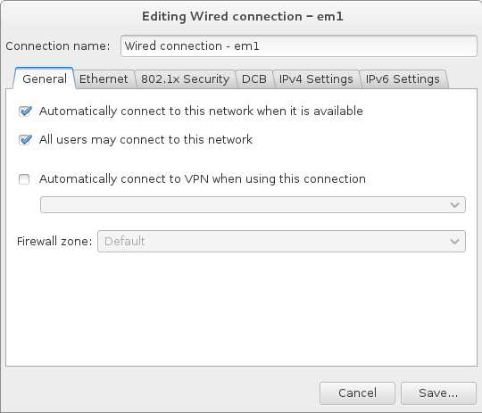
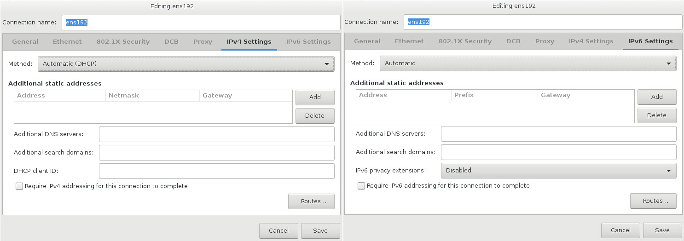

:experimental:
include::entities.adoc[]

[[sect-network-hostname-configuration-x86]]
=== Network & Hostname

To configure essential networking features for your system, select `Network & Hostname` at the `Installation Summary` screen.

[IMPORTANT]
====

When the installation finishes and the system boots for the first time, any network interfaces which you configured during the installation will be activated. However, the installation does not prompt you to configure network interfaces on some common installation paths - for example, when you install {PRODUCT} from a DVD to a local hard drive.

When you install {PRODUCT} from a local installation source to a local storage device, be sure to configure at least one network interface manually if you require network access when the system boots for the first time. You will also need to set the connection to connect automatically after boot when editing the configuration.

====

Locally accessible interfaces are automatically detected by the installation program and cannot be manually added or deleted. The detected interfaces are listed in the left pane. Click an interface in the list to display more details about in on the right. To activate or deactivate a network interface, move the switch in the top right corner of the screen to either `ON` or `OFF`.

[NOTE]
====

There are several types of network device naming standards used to identify network devices with persistent names such as `em1` or `wl3sp0`. For information about these standards, see the link:++https://access.redhat.com/documentation/en-US/Red_Hat_Enterprise_Linux/7/html/Networking_Guide/ch-Consistent_Network_Device_Naming.html++[Red{nbsp}Hat Enterprise{nbsp}Linux{nbsp}7 Networking Guide].

====

.Network & Hostname Configuration Screen

image::images/netconfig/networkconfig.png[Network & Hostname Configuration Screen]

Below the list of connections, enter a host name for this computer in the `Hostname` input field. The host name can be either a _fully-qualified domain name_ (FQDN) in the format _hostname_._domainname_ or a _short host name_ in the format _hostname_. Many networks have a _Dynamic Host Configuration Protocol_ (DHCP) service that automatically supplies connected systems with a domain name. To allow the DHCP service to assign the domain name to this machine, only specify the short host name. The value `localhost.localdomain` means that no specific static host name for target system is configured, and the actual host name of installed system will be configured during process of network configuration (for example, by NetworkManager using DHCP or DNS).

[IMPORTANT]
====

If you want to manually assign the host name, make sure you do not use a domain name that is not delegated to you, as this can result in network resources becoming unavailable. For more information, see the recommended naming practices in the link:++https://access.redhat.com/site/documentation/en-US/Red_Hat_Enterprise_Linux/7/html/Networking_Guide/index.html++[Red{nbsp}Hat Enterprise{nbsp}Linux{nbsp}7 Networking Guide].

====

[NOTE]
====

You can use the [application]*Network* section of the system `Settings` dialog to change your network configuration after you have completed the installation.

====

Once you have finished network configuration, click btn:[Done] to return to the `Installation Summary` screen.

[[sect-edit-network-connections-x86]]
==== Edit Network Connections

This section only details the most important settings for a typical wired connection used during installation. Many of the available options do not have to be changed in most installation scenarios and are not carried over to the installed system. Configuration of other types of network is broadly similar, although the specific configuration parameters are necessarily different. To learn more about network configuration after installation, see the link:++https://access.redhat.com/site/documentation/en-US/Red_Hat_Enterprise_Linux/7/html/Networking_Guide/index.html++[Red{nbsp}Hat Enterprise{nbsp}Linux{nbsp}7 Networking Guide].

To configure a network connection manually, click the btn:[Configure] button in the lower right corner of the screen. A dialog appears that allows you to configure the selected connection. The configuration options presented depends on whether the connection is wired, wireless, mobile broadband, VPN, or DSL. If required, see the [citetitle]_Networking Guide_ for more detailed information on network settings.

The most useful network configuration options to consider during installation are:

* Mark the `Automatically connect to this network when it is available` check box if you want to use the connection every time the system boots. You can use more than one connection that will connect automatically. This setting will carry over to the installed system.
+
.Network Auto-Connection Feature
+

* By default, IPv4 parameters are configured automatically by the DHCP service on the network. At the same time, the IPv6 configuration is set to the `Automatic` method. This combination is suitable for most installation scenarios and usually does not require any changes.
+
.IP Protocol Settings
+

When you have finished editing network settings, click btn:[Save] to save the new configuration. If you reconfigured a device that was already active during installation, you must restart the device in order to use the new configuration in the installation environment. Use the btn:[ON/OFF] switch on the `Network & Host Name` screen to restart the device.

[[sect-adv-network-connections-x86]]
==== Advanced Network Interfaces

Advanced network interfaces are also available for installation. This includes virtual local area networks (*VLAN*pass:attributes[{blank}]s) and three methods to use aggregated links. Detailed description of these interfaces is beyond the scope of this document; read the link:++https://access.redhat.com/site/documentation/en-US/Red_Hat_Enterprise_Linux/7/html/Networking_Guide/index.html++[Red{nbsp}Hat Enterprise{nbsp}Linux{nbsp}7 Networking Guide] for more information.

To create an advanced network interface, click the btn:[+] button in the lower left corner of the `Network & Hostname` screen.

.Network & Hostname Configuration Screen

image::images/netconfig/networkconfig.png[Network & Hostname Configuration Screen]

A dialog appears with a drop-down menu with the following options:

* `Bond` - represents NIC (_Network Interface Controller_) Bonding, a method to bind multiple network interfaces together into a single, bonded, channel.

* `Bridge` - represents NIC Bridging, a method to connect multiple separate network into one aggregate network.

* `Team` - represents NIC Teaming, a new implementation to aggregate links, designed to provide a small kernel driver to implement the fast handling of packet flows, and various applications to do everything else in user space.

* `VLAN` - represents a method to create multiple distinct broadcast domains, which are mutually isolated.

.Advanced Network Interface Dialog

image::images/netconfig/network-adv-interfaces-dialog.png[Advanced Network Interface Dialog]

[NOTE]
====

Note that locally accessible interfaces, wired or wireless, are automatically detected by the installation program and cannot be manually added or deleted by using these controls.

====

Once you have selected an option and clicked the btn:[Add] button, another dialog appears for you to configure the new interface. See the respective chapters in the link:++https://access.redhat.com/site/documentation/en-US/Red_Hat_Enterprise_Linux/7/html/Networking_Guide/++[Red{nbsp}Hat Enterprise{nbsp}Linux{nbsp}7 Networking Guide] for detailed instructions. To edit configuration on an existing advanced interface, click the btn:[Configure] button in the lower right corner of the screen. You can also remove a manually-added interface by clicking the btn:[-] button.