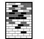
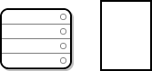
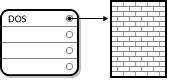
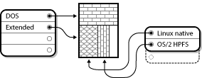
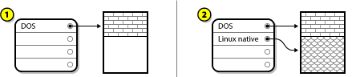
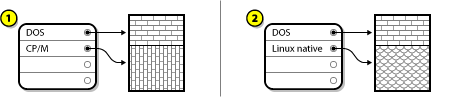
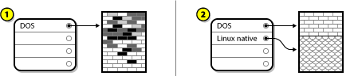
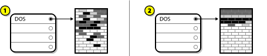
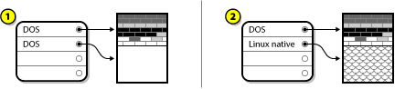

:experimental:
include::entities.adoc[]

[[appe-disk-partitions-overview]]
== An Introduction to Disk Partitions

[NOTE]
====

This appendix is not necessarily applicable to architectures other than AMD64 and Intel{nbsp}64. However, the general concepts mentioned here might apply.

====

This section discusses basic disk concepts, disk repartitioning strategies, the partition naming scheme used by Linux systems, and related topics.

If you are comfortable with disk partitions, you can skip ahead to <<sect-disk-partitions-making-room>> for more information on the process of freeing up disk space to prepare for a {PRODUCT} installation.

[[sect-disk-partitions-basic-concepts]]
=== Hard Disk Basic Concepts

Hard disks perform a very simple function - they store data and reliably retrieve it on command.

When discussing issues such as disk partitioning, it is important to have a understanding of the underlying hardware; however, since the theory is very complicated and expansive, only the basic concepts will be explained here. This appendix uses a set of simplified diagrams of a disk drive to help explain what is the process and theory behind partitions.

<<figu-partitions-unused-drive>>, shows a brand-new, unused disk drive.

[[figu-partitions-unused-drive]]
.An Unused Disk Drive

[[sect-disk-partitions-file-systems]]
==== File Systems

To store data on a disk drive, it is necessary to _format_ the disk drive first. Formatting (usually known as "making a _file system_pass:attributes[{blank}]") writes information to the drive, creating order out of the empty space in an unformatted drive.

[[figu-partitions-formatted-drive]]
.Disk Drive with a File System

image::images/partitions/formatted-drive.png[Image of a formatted disk drive.]

As the previous diagram implies, the order imposed by a file system involves some trade-offs:

* A small percentage of the driver's available space is used to store file system-related data and can be considered as overhead.

* A file system splits the remaining space into small, consistently-sized segments. For Linux, these segments are known as _blocks_.
footnote:[Blocks really _are_ consistently sized, unlike our illustrations. Keep in mind, also, that an average disk drive contains thousands of blocks. The picture is simplified for the purposes of this discussion.]

Note that there is no single, universal file system. As the following diagram shows, a disk drive can have one of many different file systems written on it. Different file systems tend to be incompatible; that is, an operating system that supports one file system (or a handful of related file system types) might not support another. However, for example, {PRODUCT} supports a wide variety of file systems (including many commonly used by other operating systems), making data interchange between different file systems easy.

[[figu-partitions-different-file-system]]
.Disk Drive with a Different File System

image::images/partitions/other-formatted-drive.png[Image of a disk drive with a different file system.]

Writing a file system to disk is only the first step. The goal of this process is to actually _store_ and _retrieve_ data. The figure below shows a drive disk after some data have been written to it:

[[figu-partitions-drive-with-data]]
.Disk Drive with Data Written to It

As the previous diagram shows, some of the previously empty blocks are now holding data. However, by just looking at this picture, we cannot determine exactly how many files reside on this drive. There might only be one file or many, as all files use at least one block and some files use multiple blocks. Another important point to note is that the used blocks do not have to form a contiguous region; used and unused blocks can be interspersed. This is known as _fragmentation_. Fragmentation can play a part when attempting to resize an existing partition.

As with most computer-related technologies, disk drives changed over time after their introduction. In particular, they got bigger. Not larger in physical size, but bigger in their capacity to store information. And, this additional capacity drove a fundamental change in the way disk drives were used.

[[sect-disk-partitions-basics]]
==== Partitions: Turning One Drive Into Many

Disk drives can be divided into _partitions_. Each partition can be accessed as if it was a separate disk. This is done through the addition of a _partition table_.

There are several reasons for allocating disk space into separate disk partitions, for example:

* Logical separation of the operating system data from the user data

* Ability to use different file systems

* Ability to run multiple operating systems on one machine

There are currently two partitioning layout standards for physical hard disks: Master Boot Record (*MBR*) and GUID Partition Table (*GPT*). *MBR* is an older method of disk partitioning used with BIOS-based computers. *GPT* is a newer partitioning layout that is a part of the Unified Extensible Firmware Interface (*UEFI*). This section and <<sect-disk-partitions-extended>> mainly describe the _Master Boot Record_ (*MBR*) disk partitioning scheme. For information about the _GUID Partition Table_ (*GPT*) partitioning layout, see <<sect-disk-partitioning-guid-partition-table>>.

[NOTE]
====

While the diagrams in this chapter show the partition table as being separate from the actual disk drive, this is not entirely accurate. In reality, the partition table is stored at the very start of the disk, before any file system or user data. But for clarity, they are separate in our diagrams.

====

[[figu-partitions-partition-table]]
.Disk Drive with Partition Table

As the previous diagram shows, the partition table is divided into four sections or four _primary_ partitions. A primary partition is a partition on a hard drive that can contain only one logical drive (or section). Each section can hold the information necessary to define a single partition, meaning that the partition table can define no more than four partitions.

Each partition table entry contains several important characteristics of the partition:

* The points on the disk where the partition starts and ends

* Whether the partition is "active"

* The partition's type

The starting and ending points define the partition's size and location on the disk. The "active" flag is used by some operating systems' boot loaders. In other words, the operating system in the partition that is marked "active" is booted.

The type is a number that identifies the partition's anticipated usage. Some operating systems use the partition type to denote a specific file system type, to flag the partition as being associated with a particular operating system, to indicate that the partition contains a bootable operating system, or some combination of the three.

The following shows an example of a disk drive with single partition:

[[figu-partitions-single-part]]
.Disk Drive With Single Partition

The single partition in this example is labeled as `DOS`. This label shows the _partition type_, with `DOS` being one of the most common ones. The table below shows a list of some of the commonly used partition types and hexadecimal numbers used to represent them.

[[tabl-partition-types]]
.Partition Types

[options="header"]
|===
|Partition Type|Value|Partition Type|Value
|Empty|00|Novell Netware 386|65
|DOS 12-bit FAT|01|PIC/IX|75
|XENIX root|02|Old MINIX|80
|XENIX usr|03|Linux/MINUX|81
|DOS 16-bit <=32M|04|Linux swap|82
|Extended|05|Linux native|83
|DOS 16-bit >=32|06|Linux extended|85
|OS/2 HPFS|07|Amoeba|93
|AIX|08|Amoeba BBT|94
|AIX bootable|09|BSD/386|a5
|OS/2 Boot Manager|0a|OpenBSD|a6
|Win95 FAT32|0b|NEXTSTEP|a7
|Win95 FAT32 (LBA)|0c|BSDI fs|b7
|Win95 FAT16 (LBA)|0e|BSDI swap|b8
|Win95 Extended (LBA)|0f|Syrinx|c7
|Venix 80286|40|CP/M|db
|Novell|51|DOS access|e1
|PReP Boot|41|DOS R/O|e3
|GNU HURD|63|DOS secondary|f2
|Novell Netware 286|64|BBT|ff
|===

[[sect-disk-partitions-extended]]
==== Partitions Within Partitions - An Overview of Extended Partitions

In case four partitions are insufficient for your needs, you can use _extended partitions_ to create up additional partitions. You do this by setting the type of a partition to "Extended".

An extended partition is like a disk drive in its own right - it has its own partition table which points to one or more partitions (now called _logical partitions_, as opposed to the four _primary partitions_) contained entirely within the extended partition itself. The following diagram shows a disk drive with one primary partition and one extended partition containing two logical partitions (along with some unpartitioned free space):

[[figu-partitions-extended]]
.Disk Drive With Extended Partition

As this figure implies, there is a difference between primary and logical partitions - there can only be four primary partitions, but there is no fixed limit to the number of logical partitions that can exist. However, due to the way in which partitions are accessed in Linux, no more than 12 logical partitions should be defined on a single disk drive.

[[sect-disk-partitioning-guid-partition-table]]
==== GUID Partition Table (GPT)

GUID Partition Table (*GPT*) is a newer partitioning scheme based on using Globally Unique Identifiers (*GUID*). *GPT* was developed to cope with limitations of the *MBR* partition table, especially with the limited maximum addressable storage space of a disk. Unlike *MBR*, which is unable to address storage space larger than 2 TiB (equivalent to approximately 2.2 TB), *GPT* can be used with hard disks larger than this; the maximum addressable disk size is 2.2 ZiB. In addition *GPT*, by default, supports creating up to 128 primary partitions. This number could be extended by allocating more space to the partition table.

*GPT* disks use logical block addressing (LBA) and the partition layout is as follows:

* To preserve backward compatibility with MBR disks, the first sector (*LBA* 0) of *GPT* is reserved for *MBR* data and it is called "protective MBR".

* The _primary *GPT* header_ begins on the second logical block (*LBA* 1) of the device. The header contains the disk GUID, the location of the primary partition table, the location of the secondary GPT header, and CRC32 checksums of itself and the primary partition table. It also specifies the number of partition entries of the table.

* The _primary *GPT* table_ includes, by default, 128 partition entries, each with an entry size 128 bytes, its partition type GUID and unique partition GUID.

* The _secondary *GPT* table_ is identical to the primary *GPT* table. It is used mainly as a backup table for recovery in case the primary partition table is corrupted.

* The _secondary *GPT* header_ is located on the last logical sector of the disk and it can be used to recover *GPT* information in case the primary header is corrupted. It contains the disk GUID, the location of the secondary partition table and the primary *GPT* header, CRC32 checksums of itself and the secondary partition table, and the number of possible partition entries.

[IMPORTANT]
====

There must be a BIOS boot partition for the boot loader to be installed successfully onto a disk that contains a GPT (GUID Partition Table). This includes disks initialized by [application]*Anaconda*. If the disk already contains a BIOS boot partition, it can be reused.

====

[[sect-disk-partitions-making-room]]
=== Strategies for Disk Repartitioning

There are several different ways that a disk can be repartitioned. This section discusses the following possible approaches:

* Unpartitioned free space is available

* An unused partition is available

* Free space in an actively used partition is available

Note that this section discusses the aforementioned concepts only theoretically and it does not include any procedures showing how to perform disk repartitioning step-by-step. Such detailed information are beyond the scope of this document.

[NOTE]
====

Keep in mind that the following illustrations are simplified in the interest of clarity and do not reflect the exact partition layout that you encounter when actually installing {PRODUCT}.

====

[[sect-disk-partitions-using-free-space]]
==== Using Unpartitioned Free Space

In this situation, the partitions already defined do not span the entire hard disk, leaving unallocated space that is not part of any defined partition. The following diagram shows what this might look like:

[[figu-partitions-unused-space]]
.Disk Drive with Unpartitioned Free Space

In the above example, `1` represents an undefined partition with unallocated space and `2` represents a defined partition with allocated space.

An unused hard disk also falls into this category. The only difference is that _all_ the space is not part of any defined partition.

In any case, you can create the necessary partitions from the unused space. Unfortunately, this scenario, although very simple, is not very likely (unless you have just purchased a new disk just for {PRODUCT}). Most pre-installed operating systems are configured to take up all available space on a disk drive (see <<sect-disk-partitions-active-partition>>).

[[sect-disk-partitions-unused-partition]]
==== Using Space from an Unused Partition

In this case, maybe you have one or more partitions that you do not use any longer. The following diagram illustrates such a situation.

[[figu-partitions-unused-partition]]
.Disk Drive with an Unused Partition

In the above example, `1` represents an unused partition and `2` represents reallocating an unused partition for Linux.

In this situation, you can use the space allocated to the unused partition. You first must delete the partition and then create the appropriate Linux partition(s) in its place. You can delete the unused partition and manually create new partitions during the installation process.

[[sect-disk-partitions-active-partition]]
==== Using Free Space from an Active Partition

This is the most common situation. It is also, unfortunately, the hardest to handle. The main problem is that, even if you have enough free space, it is presently allocated to a partition that is already in use. If you purchased a computer with pre-installed software, the hard disk most likely has one massive partition holding the operating system and data.

Aside from adding a new hard drive to your system, you have two choices:

_Destructive Repartitioning_::
+
In this case, the single large partition is deleted and several smaller ones are created instead. Any data held in the original partition is destroyed. This means that making a complete backup is necessary. It is highly recommended to make two backups, use verification (if available in your backup software), and try to read data from the backup _before_ deleting the partition.
+
[WARNING]
====

If an operating system was installed on that partition, it must be reinstalled if you want to use that system as well. Be aware that some computers sold with pre-installed operating systems might not include the installation media to reinstall the original operating system. You should check whether this applies to your system is _before_ you destroy your original partition and its operating system installation.

====
+
After creating a smaller partition for your existing operating system, you can reinstall software, restore your data, and start your {PRODUCT} installation.
+
[[figu-partitions-destructive-repartitioning]]
.Disk Drive Being Destructively Repartitioned
+

+
In the above example, `1` represents before and `2` represents after.
+
[WARNING]
====

Any data previously present in the original partition is lost.

====

_Non-Destructive Repartitioning_::
+
With non-destructive repartitioning you execute a program that makes a big partition smaller without losing any of the files stored in that partition. This method is usually reliable, but can be very time-consuming on large drives.
+
While the process of non-destructive repartitioning is rather straightforward, there are three steps involved:
+
.. Compress and backup existing data
+
.. Resize the existing partition
+
.. Create new partition(s)

Each step is described further in more detail.

[[sect-disk-partitions-compress-data]]
===== Compress Existing Data

As the following figure shows, the first step is to compress the data in your existing partition. The reason for doing this is to rearrange the data such that it maximizes the available free space at the "end" of the partition.

[[figu-partitions-compress-data]]
.Disk Drive Being Compressed

In the above example, `1` represents before and `2` represents after.

This step is crucial. Without it, the location of the data could prevent the partition from being resized to the extent desired. Note also that, for one reason or another, some data cannot be moved. If this is the case (and it severely restricts the size of your new partitions), you might be forced to destructively repartition your disk.

[[sect-disk-partitions-resize-existing]]
===== Resize the Existing Partition

<<figu-partitions-resize-existing>> shows the actual resizing process. While the actual result of the resizing operation varies depending on the software used, in most cases the newly freed space is used to create an unformatted partition of the same type as the original partition.

[[figu-partitions-resize-existing]]
.Disk Drive with Partition Resized

image::images/partitions/part-resize.png[Image of a disk drive with a resized partition, where 1 represents before and 2 represents after.]

In the above example, `1` represents before and `2` represents after.

It is important to understand what the resizing software you use does with the newly freed space, so that you can take the appropriate steps. In the case illustrated here, it would be best to delete the new DOS partition and create the appropriate Linux partition(s).

[[sect-disk-partitions-create-new]]
===== Create new partitions

As the previous step implied, it might or might not be necessary to create new partitions. However, unless your resizing software supports systems with Linux installed, it is likely that you must delete the partition that was created during the resizing process.

[[figu-partitions-final-configuration]]
.Disk Drive with Final Partition Configuration

In the above example, `1` represents before and `2` represents after.

[[sect-partitioning-naming-schemes-and-mount-points]]
=== Partition Naming Schemes and Mount Points

A common source of confusion for users unfamiliar with Linux is the matter of how partitions are used and accessed by the Linux operating system. In DOS/Windows, it is relatively simple: Each partition gets a "drive letter." You then use the correct drive letter to refer to files and directories on its corresponding partition. This is entirely different from how Linux deals with partitions and, for that matter, with disk storage in general. This section describes the main principles of partition naming scheme and the way how partitions are accessed in {PRODUCT}.

[[sect-disk-partitions-naming-scheme]]
==== Partition Naming Scheme

{PRODUCT} uses a naming scheme that is file-based, with file names in the form of `/dev/pass:attributes[{blank}]_xxyN_pass:attributes[{blank}]`.

Device and partition names consist of the following:

`/dev/`::
+
This is the name of the directory in which all device files reside. Because partitions reside on hard disks, and hard disks are devices, the files representing all possible partitions reside in `/dev/`.

`pass:attributes[{blank}]_xx_pass:attributes[{blank}]`::
+
The first two letters of the partition name indicate the type of device on which the partition resides, usually `sd`.

`pass:attributes[{blank}]_y_pass:attributes[{blank}]`::
+
This letter indicates which device the partition is on. For example, `/dev/sda` for the first hard disk, `/dev/sdb` for the second, and so on.

`pass:attributes[{blank}]_N_pass:attributes[{blank}]`::
+
The final number denotes the partition. The first four (primary or extended) partitions are numbered `1` through `4`. Logical partitions start at `5`. So, for example, `/dev/sda3` is the third primary or extended partition on the first hard disk, and `/dev/sdb6` is the second logical partition on the second hard disk.

[NOTE]
====

Even if {PRODUCT} can identify and refer to _all_ types of disk partitions, it might not be able to read the file system and therefore access stored data on every partition type. However, in many cases, it is possible to successfully access data on a partition dedicated to another operating system.

====

[[sect-disk-partitions-mount-points]]
==== Disk Partitions and Mount Points

In {PRODUCT} each partition is used to form part of the storage necessary to support a single set of files and directories. This is done by associating a partition with a directory through a process known as _mounting_. Mounting a partition makes its storage available starting at the specified directory (known as a _mount point_).

For example, if partition `/dev/sda5` is mounted on `/usr/`, that would mean that all files and directories under `/usr/` physically reside on `/dev/sda5`. So the file `/usr/share/doc/FAQ/txt/Linux-FAQ` would be stored on `/dev/sda5`, while the file `/etc/gdm/custom.conf` would not.

Continuing the example, it is also possible that one or more directories below `/usr/` would be mount points for other partitions. For instance, a partition (say, `/dev/sda7`) could be mounted on `/usr/local/`, meaning that `/usr/local/man/whatis` would then reside on `/dev/sda7` rather than `/dev/sda5`.

[[sect-disk-partitions-how-many]]
==== How Many Partitions?

At this point in the process of preparing to install {PRODUCT}, you must give some consideration to the number and size of the partitions to be used by your new operating system. However, there is no one right answer to this question. It depends on your needs and requirements.

Keeping this in mind, Red{nbsp}Hat recommends that, unless you have a reason for doing otherwise, you should _at least_ create the following partitions: `swap`, `/boot/`, and `/` (root).

For more information, see <<sect-recommended-partitioning-scheme-x86>> for AMD64, Intel{nbsp}64, and ARM systems, and <<sect-recommended-partitioning-scheme-ppc>> for IBM Power{nbsp}Systems servers.
