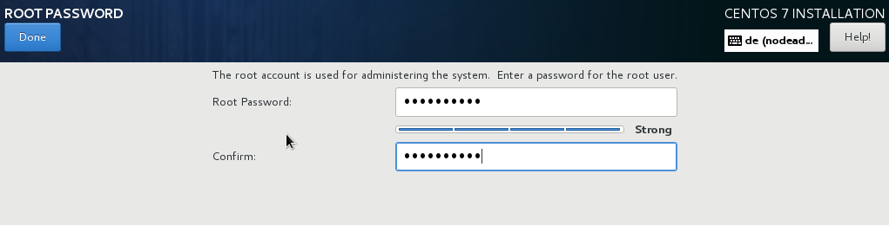

:experimental:
include::entities.adoc[]

[[sect-account-configuration-s390]]
==== Set the Root Password

Setting up a root account and password is an important step during your installation. The root account (also known as the superuser) is used to install packages, upgrade RPM packages, and perform most system maintenance. The root account gives you complete control over your system. For this reason, the root account is best used _only_ to perform system maintenance or administration. See the link:++https://access.redhat.com/site/documentation/en-US/Red_Hat_Enterprise_Linux/7/html/System_Administrators_Guide/index.html++[Red{nbsp}Hat Enterprise{nbsp}Linux{nbsp}7 System Administrator's Guide] for more information about becoming root.

.Root Password Screen

[NOTE]
====

You must always set up at least one way to gain root privileges to the installed system: either using a `root` account, or by creating a user account with administrative privileges (member of the `wheel` group), or both.

====

Click the `Root Password` menu item and enter your new password into the `Root Password` field. {PRODUCT} displays the characters as asterisks for security. Type the same password into the `Confirm` field to ensure it is set correctly. After you set the root password, click btn:[Done] to return to the User Settings screen.

The following are the requirements and recommendations for creating a strong root password:

* _must_ be at least eight characters long

* may contain numbers, letters (upper and lower case) and symbols

* is case-sensitive and should contain a mix of cases

* something you can remember but that is not easily guessed

* should not be a word, abbreviation, or number associated with you, your organization, or found in a dictionary (including foreign languages)

* should not be written down; if you must write it down keep it secure

[NOTE]
====

To change your root password after you have completed the installation, run the [command]`passwd` command as `root`. If you forget the root password, see <<sect-rescue-mode-reset-root-password>> for instructions on how to use the rescue mode to set a new one.

====