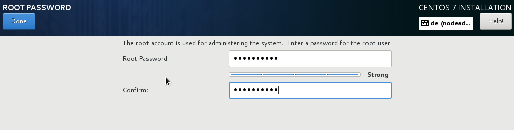

:experimental:
include::entities.adoc[]

[[chap-simple-install]]
== Quick Installation Guide

[[sect-simple-install]]
=== Interactive Installation

This section describes the simple procedure to install {PRODUCT} after you have created and booted from an installation USB drive.

Prerequisites: Create an installation USB drive and boot it. For details, see:

* <<chap-making-media>>.

* <<chap-booting-installer-x86>>.

After booting the installation USB drive:

[[proc-simple-install]]

. Select `Install {PRODUCT}` in the boot menu and press kbd:[Enter].
+
image::images/boot/boot_screen.png[]

. After [application]*Anaconda*, the {PRODUCT} installer, started, select your language and region, and click `Continue`.
+
image::images/langselection/langselection-GUI.png[]

. The `Installation Summary` is the central screen to set configuration options:
+
image::images/preinstallhub/preinstall_hub.png[]
+
You can display and modify the individual options in any order. If a configuration option was automatically configured correctly, no further action is required. However, if items are marked with an exclamation point icon, you must complete the configuration for these items before you can begin the installation.
+
[NOTE]
====

Nothing will be written to the disk until you click the btn:[Begin Installation] button.

====

. Select `Date & Time`:
+
.. Set your region and the nearest city in your time zone.
+
.. Click btn:[Done] to return to the `Installation Summary`.
+
image::images/timezone/timezone.png[]

. Select btn:[Keyboard Layout]:
+
.. Use the btn:[+] and btn:[-] buttons to add and remove keyboard layouts.
+
.. If you enable multiple keyboard layouts, move your preferred layout to the top of the list using the btn:[&uarr;] button to set it as default.
+
.. Click btn:[Done] to return to the `Installation Summary`.
+
image::images/kbdconfig/keyboard.png[]

. Select `Installation Destination`:
+
.. Select the target disk. A check mark is displayed next to the selected target.
+
The selected disk is partitioned automatically.
+
.. Click btn:[Done] to return to the `Installation Summary`.
+
image::images/diskpartsetup/disk-setup-x86.png[]

. Select `Network and Hostname`:
+
.. Click the `Ethernet` sliding switch in the top right corner to enable the network configuration.
+
.. Optional, select the device and click btn:[Configure] to update the network interface configuration.
+
.. Click btn:[Done] to return to the `Installation Summary`.
+
image::images/netconfig/networkconfig.png[]
+
[NOTE]
====

[application]*Anaconda* applies the network settings immediately. They are used during the setup and after the installation.

====

. On the `Installation Summary` screen, click btn:[Begin Installation].
+
image::images/diskpartitioning/write_changes.png[]

. The installation starts and the `Configuration` screen is displayed:
+
image::images/pkgselection/installing-packages.png[]
+
During the installation:
+
.. Select `Root Password`:
+
... Enter the password for the `root` user and confirm it.
+
... Click btn:[Done] to return to the `Configuration` screen.
+

+
.. Select `User Creation`:
+
... Enter the user's full name.
+
... Optionally, update the automatically generated user name.
+
... Set the password and confirm it.
+
... Optionally, check the `Make this user administrator` check box. This will add the user to the `wheel` group and allow this account to use [command]`sudo` without any further configuration.
+
... Click btn:[Done] to return to the `Configuration` screen.
+
image::images/accountconfig/createuser.png[]
+
.. Wait until the installation completes and click btn:[Reboot].

. After the installed system has been started:
+
** If you installed the server using the `Server with GUI` base environment, the [application]*Initial Setup* application is started automatically. Review and accept the license agreement to exit Initial Setup and start using your system. For details, see <<chap-initial-setup>>.

[[sect-simple-install-kickstart]]
=== Automatic Installation

This section describes a simple procedure on how to add a Kickstart file to the installation USB drive, which automatically installs {PRODUCT}. You can use this procedure to deploy {PRODUCT} on multiple machines.

[[bridgehead.gen-usb-media]]
[discrete]
==== Generating the USB Boot Media

[[proc-simple-gen-kickstart-iso]]

. Record an installation in a Kickstart file:
+
.. Manually install {PRODUCT} once. For details see <<sect-simple-install>>.
+
.. Boot the installed system. During the installation, [application]*Anaconda* created a Kickstart file with the settings in the `/root/anaconda-ks.cfg` file.

. Download the {PRODUCT} installation DVD ISO file to the `/tmp/` directory.

. Mount the installation ISO file to the `/mnt/` directory. For example:
+
[literal,subs="+quotes,attributes,verbatim"]
....
# mount -o loop /tmp/{PRODUCT}-server-{PRODVER}-x86_64-dvd.iso /mnt/
....

. Create a working directory and copy the DVD content to it. For example:
+
[literal,subs="+quotes,attributes,verbatim"]
....
# mkdir /root/{PRODUCT}-install/
# shopt -s dotglob
# cp -avRf /mnt/* /root/{PRODUCT}-install/
....

. Unmount the ISO file:
+
[literal,subs="+quotes,verbatim"]
....
# umount /mnt/
....

. Copy the Kickstart file generated during the installation to the working directory:
+
[literal,subs="+quotes,attributes,verbatim"]
....
# cp /root/anaconda-ks.cfg /root/{PRODUCT}-install/
....

. Display the installation DVD volume name:
+
[literal,subs="+quotes,attributes,verbatim,macros"]
....
`#` `isoinfo -d -i {PRODUCT}-server-{PRODVER}-x86_64-dvd.iso | grep "Volume id" | \
sed -e 's/Volume id: //' -e 's/ /\\x20/g'
{PRODUCT}-{PRODVER}\x20Server.x86_64`
....

. Add a new menu entry to the boot `/root/{PRODUCT}-install/isolinux/isolinux.cfg` file that uses the Kickstart file. For example:
+
[literal,subs="+quotes,attributes,verbatim"]
....
#######################################
label kickstart
menu label ^Kickstart Installation of {PRODUCT} {PRODVER}
kernel vmlinuz
append initrd=initrd.img inst.stage2=hd:LABEL={PRODUCT}-{PRODVER}\x20Server.x86_64 inst.ks=cdrom:/anaconda-ks.cfg
#######################################
....
+
[NOTE]
====

Set the [option]`inst.stage2=hd:LABEL=` option to the DVD volume name retrieved in the previous step.

====

. Create the `/root/{PRODUCT}-ks.iso` file from the working directory:
+
[literal,subs="+quotes,attributes,verbatim"]
....
# mkisofs -J -T -o /root/{PRODUCT}-ks.iso -b isolinux/isolinux.bin \
-c isolinux/boot.cat -no-emul-boot -boot-load-size 4 -boot-info-table \
-R -m TRANS.TBL -graft-points -V "{PRODUCT}-{PRODVER} Server.x86_64" \
/root/{PRODUCT}-install/
....
+
[NOTE]
====

Set the [option]`-V` option to the DVD volume name retrieved in an earlier step and replace `\x20` in the string with a space.

====

. Create an installation USB drive. For details, see <<sect-making-usb-media-linux>>.

[discrete]
==== Install {PRODUCT} Using the Kickstart File

. Boot the installation USB drive. See <<chap-booting-installer-x86>>.

. Select the entry, that contains the Kickstart configuration, you created in <<bridgehead.gen-usb-media>>.
