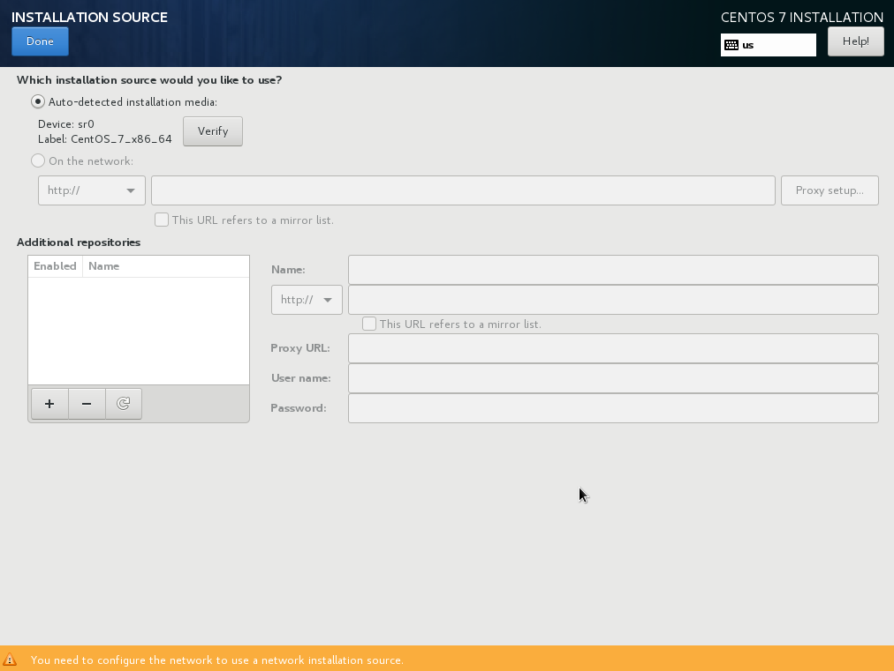

:experimental:
include::entities.adoc[]

[[sect-installation-source-s390]]
=== Installation Source

To specify a file or a location to install {PRODUCT} from, select `Installation Source` from the `Installation Summary` screen. On this screen, you can choose between locally available installation media such an ISO file, or a network location.

.Installation Source Screen

Select one of the following options:

ISO file::
+
This option will appear if the installation program detected a partitioned hard drive with mountable file systems. Select this option, click the btn:[Choose an ISO] button, and browse to the installation ISO file's location on your system. Then click btn:[Verify] to ensure that the file is suitable for installation.

On the network::
+
To specify a network location, select this option and choose from the following options in the drop-down menu:
+
** `http://`
+
** `https://`
+
** `ftp://`
+
** `nfs`
+
Using your selection as the start of the location URL, type the rest into the address box. If you choose NFS, another box will appear for you to specify any NFS mount options.
+
[IMPORTANT]
====

When selecting an NFS-based installation source, you must specify the address with a colon (`:`) character separating the host name from the path. For example:

[literal,subs="+quotes,verbatim,macros"]
....
`pass:attributes[{blank}]_server.example.com_:pass:attributes[{blank}]_/path/to/directory_pass:attributes[{blank}]`
....

====
+
To configure a proxy for an HTTP or HTTPS source, click the btn:[Proxy setup] button. Check `Enable HTTP proxy` and type the URL into the `Proxy URL` box. If your proxy requires authentication, check `Use Authentication` and enter a user name and password. Click btn:[Add].
+
If your HTTP or HTTP URL refers to a repository mirror list, mark the check box under the input field.

You can also specify additional repositories to gain access to more installation environments and software add-ons. See <<sect-package-selection-s390>> for more information.

To add a repository, click the btn:[+] button. To delete a repository, click the btn:[-] button. Click the arrow icon to revert to the previous list of repositories, that is, to replace current entries with those that were present at the time you entered the `Installation Source` screen. To activate or deactivate a repository, click the check box in the `Enabled` column at each entry in the list.

In the right part of the form, you can name your additional repository and configure it the same way as the primary repository on the network.

Once you have selected your installation source, click btn:[Done] to return to the `Installation Summary` screen.