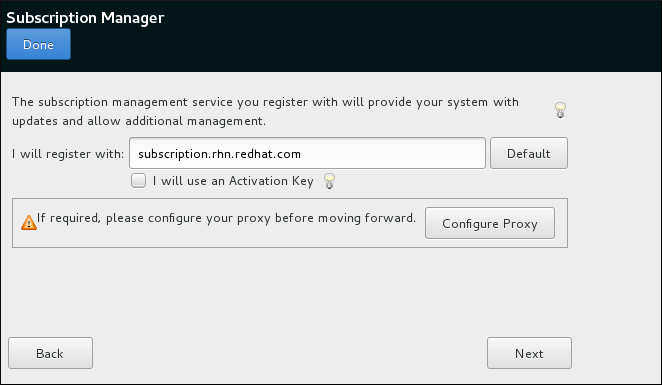

:experimental:
include::entities.adoc[]

[[sect-initial-setup-subsciption-manager]]
==== Subscription Manager

The `Subscription Manager` screen allows you to register your system with Red{nbsp}Hat in order to receive updates and access to package repositories.

[NOTE]
====

The `Subscription Manager` screen in [application]*Initial Setup* replaces the [application]*Firstboot* tool, which was used to register systems in Red{nbsp}Hat Enterprise{nbsp}Linux{nbsp}7.1 and earlier.

====

.Subscription Manager Screen

The products installed on a system (including the operating system itself) are covered by _subscriptions_. A subscription service is used to track registered systems, the products installed on those systems, and the subscriptions _attached_ to the system to cover those products. Red{nbsp}Hat provides several different subscription services which a system can registered with:

* Customer Portal Subscription Management, hosted services from Red{nbsp}Hat (the default)

* Subscription Asset Manager, an on-premise subscription server which proxies content delivery back to the Customer Portal's services

* CloudForms System Engine, an on-premise service which handles both subscription services and content delivery

The `Subscription Manager` screen provides a basic interface which is suitable for most use cases. In some scenarios, you require options which are not present in [application]*Initial Setup*pass:attributes[{blank}]; in that case, you can skip the post-installation registration process and use [application]*Subscription Manager* from the command line or using the [package]*subscription-manager-gui* package which provides a graphical interface.

Also note that some registration scenarios, such as registering using CloudForms System Engine, require additional setup steps - you must have a registration server ready before registering your system.

To register your system, follow on-screen instructions, providing your credentials when prompted. Note that if you want to leave the `Subscription Manager` screen and return to the main [application]*Initial Setup* screen, you must use the `Done` button in the top left corner of the screen, not the `Back` or `Next` buttons in the main window.

For full documentation concerning various tools for system registration and management, see the link:++https://access.redhat.com/documentation/en/red-hat-subscription-management/++[Red{nbsp}Hat Subscription Management] section of the Red{nbsp}Hat Customer Portal. Additionally, you can use the link:++https://access.redhat.com/labs/registrationassistant/++[Registration Assistant] for an interactive guide through the registration process.