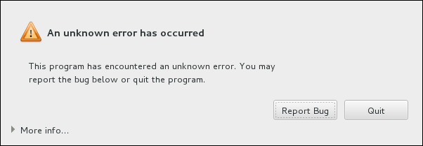
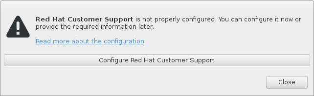
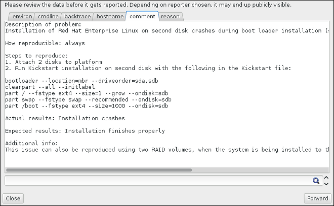

:experimental:
include::entities.adoc[]

[[chap-troubleshooting-s390]]
== Troubleshooting Installation on IBM System{nbsp}z

This chapter discusses some common installation problems and their solutions.

For debugging purposes, [application]*Anaconda* logs installation actions into files in the `/tmp` directory. These files are listed in the following table.

[[tabl-installation-log-files-s390]]
.Log Files Generated During the Installation

[options="header"]
|===
|Log file|Contents
|`/tmp/anaconda.log`|general [application]*Anaconda* messages
|`/tmp/program.log`|all external programs run during the installation
|`/tmp/storage.log`|extensive storage module information
|`/tmp/packaging.log`|[application]*yum* and [application]*rpm* package installation messages
|`/tmp/syslog`|hardware-related system messages
|===

If the installation fails, the messages from these files are consolidated into `/tmp/anaconda-tb-_identifier_pass:attributes[{blank}]`, where _identifier_ is a random string.

After successful installation, by default, these files will be copied to the installed system under the directory `/var/log/anaconda/`. However, if installation is unsuccessful, or if the [option]`inst.nosave=all` or [option]`inst.nosave=logs` options are used when booting the installation system, these logs will only exist in the installation program's RAM disk. This means they are not saved permanently and will be lost once the system is powered down. To store them permanently, copy those files to another system on the network by using [command]`scp` on the system running the installation program, or copy them to a mounted storage device (such as an USB flash drive). Details on how to transfer the log files over the network are below.

[NOTE]
====

The following procedure requires the installation system to be able to access the network and the target system to be able to receive files over the `ssh` protocol.

====

.Transferring Log Files Over the Network
. Access the shell prompt on the installation system. This can be done in the following ways:
+
** In a running `tmux` session on the installation system, press kbd:[Ctrl + b] kbd:[p] and kbd:[Ctrl + b] kbd:[n] to switch to the previous or next terminal, respectively, and find the terminal with a root shell.
+
** Connect to the installation system over `ssh`.
+
In both cases, you will be able to use the installation system's shell as `root`.

. Switch to the `/tmp` directory where the log files are located:
+
[literal,subs="+quotes,verbatim,macros"]
....
pass:quotes[`#`] cd /tmp
....

. Copy the log files onto another system on the network using the [command]`scp` command:
+
[literal,subs="+quotes,verbatim,macros"]
....
pass:quotes[`#`] scp *log user@address:path
....
+
Replace _user_ with a valid user name on the target system, _address_ with the target system's address or host name, and _path_ with the path to the directory you want to save the log files into. For example, if you want to log in as `john` to a system with an IP address of `192.168.0.122` and place the log files into the `/home/john/logs/` directory on that system, the command will have the following form:
+
[literal,subs="+quotes,verbatim,macros"]
....
pass:quotes[`#`] scp *log john@192.168.0.122:/home/john/logs/
....
+
When connecting to the target system for the first time, the SSH client asks you to confirm that the fingerprint of the remote system is correct and that you want to continue:
+
[literal,subs="+quotes,verbatim,macros"]
....

`The authenticity of host '192.168.0.122 (192.168.0.122)' can't be established.`
`ECDSA key fingerprint is a4:60:76:eb:b2:d0:aa:23:af:3d:59:5c:de:bb:c4:42.`
`Are you sure you want to continue connecting (yes/no)?`

....
+
Type `yes` and press kbd:[Enter] to continue. Then, provide a valid password when prompted. The files will start transferring to the specified directory on the target system.

The log files from the installation are now permanently saved on the target system and available for review.

[[sect-trouble-during-installation-s390]]
=== Trouble During the Installation

[[sect-trouble-during-no-target-s390]]
==== No Disks Detected

In the `Installation Destination` screen, the following error message can appear at the bottom: `No disks detected. Please shut down the computer, connect at least one disk, and restart to complete installation`.

This message usually indicates that there is an issue with your DASD (_Direct Access Storage Device_) devices. If you encounter this error, add the [command]`DASD=<pass:attributes[{blank}]_disks_pass:attributes[{blank}]>` parameter to your parameter file or CMS configuration file (where _disks_ is the DASD range reserved for installation) and start the installation again.

Additionally, make sure you format the DASDs using the [command]`dasdfmt` command within a Linux root shell, instead of formatting the DASDs using CMS. [application]*Anaconda* automatically detects any DASD devices that are not yet formatted and asks you whether to format the devices.

If you are installing into one or more iSCSI devices and there is no local storage present on the system, make sure that all required LUNs (_Logical Unit Numbers_) are being presented to the appropriate HBA (_Host Bus Adapter_). For additional information about iSCSI, see <<appe-iscsi-disks>>.

[[sect-trouble-during-traceback-s390]]
==== Reporting Traceback Messages

If the graphical installation program encounters an error, it presents you with a crash reporting dialog box. You can then choose to send information about the problem you encountered to Red{nbsp}Hat. To send a crash report, you will need to enter your Customer Portal credentials. If you do not have a Customer Portal account, you can register at link:++https://www.redhat.com/wapps/ugc/register.html++[]. Automated crash reporting also requires a working network connection.

.The Crash Reporting Dialog Box

When the dialog appears, select btn:[Report Bug] to report the problem, or btn:[Quit] to exit the installation.

Optionally, click `More Info` to display detailed output that can help determine the cause of the error. If you are familiar with debugging, click btn:[Debug]. This will take you to virtual terminal `tty1`, where you can request more precise information that will enhance the bug report. To return to the graphical interface from `tty1`, use the [command]`continue` command.

.The Expanded Crash Reporting Dialog Box

image::images/crashreporting/crashreporting_details.png[Details of the crash, showing the Python traceback]

If you want to report the bug to the customer portal, follow the procedure below.

.Reporting Errors to Red{nbsp}Hat Customer Support
. In the menu that appears, select `Report a bug to Red{nbsp}Hat Customer Portal`.

. To report the bug to Red{nbsp}Hat, you first need to provide your Customer Portal credentials. Click btn:[Configure Red{nbsp}Hat Customer Support].
+
.Customer Portal Credentials
+

. A new window is now open, prompting you to enter your Customer Portal user name and password. Enter your Red{nbsp}Hat Customer Portal credentials.
+
.Configure Red{nbsp}Hat Customer Support
+
image::images/crashreporting/crashreporting_configure2.png[A dialog prompting you to enter your Customer Portal account details.]
+
If your network settings require you to use a `HTTP` or `HTTPS` proxy, you can configure it by expanding the `Advanced` menu and entering the address of the proxy server.
+
When you put in all required credentials, click `OK` to proceed.

. A new window appears, containing a text field. Write down any useful information and comments here. Describe how the error can be reproduced by explaining each step you took before the crash reporting dialog appeared. Provide as much relevant detail as possible, including any information you acquired when debugging. Be aware that the information you provide here can become publicly visible on the Customer Portal.
+
If you do not know what caused the error, check the box labeled `I don't know what caused this problem` at the bottom of the dialog.
+
Then, click btn:[Forward].
+
.Describe the Problem
+
image::images/crashreporting/crashreporting_describe.png[A text input field, prompting you to describe the steps you took before you encountered the error you are reporting.]

. Next, review the information that will be sent to the Customer Portal. The explanation you provided is in the `comment` tab. Other tabs include such information as your system's host name and other details about the installation environment. You can remove any items you do not want sent to Red{nbsp}Hat, but be aware that providing less detail can affect the investigation of the issue.
+
Click btn:[Forward] when you finish reviewing the information to be sent.
+
.Review the Data to Be Sent
+

. Review the list of files that will be sent and included in the bug report as individual attachments. These files provide system information that will assist the investigation. If you do not want to send certain files, uncheck the box next to each one. To provide additional files that can help find the problem, click btn:[Attach a file].
+
Once you have reviewed the files to be sent, check the box labeled `I have reviewed the data and agree with submitting it`. Then, click btn:[Forward] to send the report and attachments to the Customer Portal.
+
.Review the Files to Be Sent
+
image::images/crashreporting/crashreporting_checkfiles.png[A dialog window allowing you to review the files to be sent along with the report, unselect files you do not want to send, and add additional files..]

. When the dialog reports that processing has finished, you can click `Show log` to view details of the reporting process or `Close` to return to the initial crash reporting dialog box. There, click `Quit` to exit the installation.

[[creating_pre-installation-logs-s390]]
==== Creating Pre-installation Log Files

To debug installation problems you can set the [option]`inst.debug` option to create log files from the environment before the installation starts. These log files contain, for example, the current storage configuration.

To set the option in the {PRODUCT} installation boot menu:

. Select the `Install {PRODUCT} 7.3` entry.

. Press the kbd:[Tab] key to edit the boot options.

. Append [option]`inst.debug` to the options. For example:
+
[literal,subs="+quotes,verbatim,macros"]
....
> vmlinuz ... `inst.debug`
....
+
For further details, see <<chap-anaconda-boot-options>>.

. Press kbd:[Enter] to start the setup.

The system stores the pre-installation log files in the `/tmp/pre-anaconda-logs/` directory before Anaconda starts. To access the log files:

. Switch to the console. See <<sect-installation-consoles-x86>>.

. Change into the `/tmp/pre-anaconda-logs/` directory:
+
[literal,subs="+quotes,verbatim"]
....
# cd /tmp/pre-anaconda-logs/
....

[[sect-trouble-after-s390]]
=== Problems After Installation

==== Remote Graphical Desktops and XDMCP

If you have installed the [application]*X Window System* and would like to log in to your {PRODUCT} system using a graphical login manager, enable the _X Display Manager Control Protocol_ (XDMCP). This protocol allows users to remotely log in to a desktop environment from any X-compatible client, such as a network-connected workstation or X11 terminal. The procedure below explains how to enable XDMCP.

[[proc-trouble-after-enable-xdmcp-s390]]
.Enabling XDMCP on IBM System{nbsp}z
. Open the `/etc/gdm/custom.conf` configuration file in a plain text editor such as [application]*vi* or [application]*nano*.

. In the `custom.conf` file, locate the section starting with `[xdmcp]`. In this section, add the following line:
+
[literal,subs="+quotes,verbatim,macros"]
....
`Enable=true`
....

. Save the file, and exit the text editor.

. Restart the [application]*X Window System*. To do this, either reboot the whole system, or restart the [application]*GNOME Display Manager* using the following command as `root`:
+
[literal,subs="+quotes,verbatim,macros"]
....
pass:quotes[`#`] systemctl restart gdm.service
....
+
Wait for the login prompt to appear again, and log in using your normal user name and password.

The System{nbsp}z server is now configured for XDMCP. You can connect to it from another workstation (client) by starting a remote [application]*X* session using the [command]`X` command on the client workstation. For example:

[literal,subs="+quotes,verbatim,macros"]
....
`$` [command]`X :1 -query _address_pass:attributes[{blank}]`
....

Replace _address_ with the host name of the remote X11 server. The command connects to the remote X11 server using XDMCP and displays the remote graphical login screen on display `:1` of the X11 server system (usually accessible by pressing kbd:[Ctrl]-kbd:[Alt]-kbd:[F8]).

You can also access remote desktop sessions using a _nested_ X11 server, which opens the remote desktop as a window in your current X11 session. [command]`Xnest` allows users to open a remote desktop nested within their local X11 session. For example, run [command]`Xnest` using the following command, replacing _address_ with the host name of the remote X11 server:

[literal,subs="+quotes,verbatim,macros"]
....
`$` [command]`Xnest :1 -query _address_pass:attributes[{blank}]`
....

For more information about XDMCP, see the [application]*X Window System* documentation at link:++http://www.x.org/releases/X11R7.6/doc/libXdmcp/xdmcp.html++[].

==== Is Your System Displaying Signal 11 Errors?

A signal 11 error, commonly known as a _segmentation fault_, means that a program accessed a memory location that was not assigned to it. A signal 11 error can occur due to a bug in one of the software programs that is installed, or faulty hardware.

If you receive a fatal signal 11 error during the installation, first make sure you are using the most recent installation images, and let [application]*Anaconda* verify them to make sure they are not corrupted. Bad installation media (such as an improperly burned or scratched optical disk) are a common cause of signal 11 errors. Verifying the integrity of the installation media is recommended before every installation.

For information about obtaining the most recent installation media, see <<chap-download-red-hat-enterprise-linux>>. To perform a media check before the installation starts, append the [option]`rd.live.check` boot option at the boot menu. See <<sect-boot-options-mediacheck>> for details.

Other possible causes are beyond this document's scope. Consult your hardware manufacturer's documentation for more information.