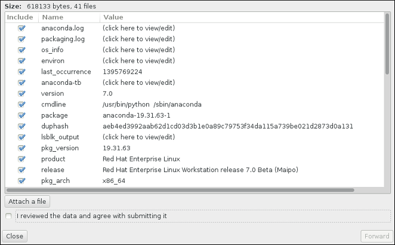

:experimental:
include::entities.adoc[]

[[chap-troubleshooting-x86]]
== Troubleshooting Installation on 64-bit AMD, Intel, and ARM Systems

This chapter discusses some common installation problems and their solutions.

For debugging purposes, [application]*Anaconda* logs installation actions into files in the `/tmp` directory. These files are listed in the following table.

[[tabl-installation-log-files-x86]]
.Log Files Generated During the Installation

[options="header"]
|===
|Log file|Contents
|`/tmp/anaconda.log`|general [application]*Anaconda* messages
|`/tmp/program.log`|all external programs run during the installation
|`/tmp/storage.log`|extensive storage module information
|`/tmp/packaging.log`|[application]*yum* and [application]*rpm* package installation messages
|`/tmp/syslog`|hardware-related system messages
|===

If the installation fails, the messages from these files are consolidated into `/tmp/anaconda-tb-_identifier_pass:attributes[{blank}]`, where _identifier_ is a random string.

After successful installation, by default, these files will be copied to the installed system under the directory `/var/log/anaconda/`. However, if installation is unsuccessful, or if the [option]`inst.nosave=all` or [option]`inst.nosave=logs` options are used when booting the installation system, these logs will only exist in the installation program's RAM disk. This means they are not saved permanently and will be lost once the system is powered down. To store them permanently, copy those files to another system on the network by using [command]`scp` on the system running the installation program, or copy them to a mounted storage device (such as an USB flash drive). Details on how to transfer the log files over the network are below. Note that if you use an USB flash drive or other removable media, you should make sure to back up any data on it before starting the procedure.

.Transferring Log Files Onto a USB Drive
. On the system you are installing, press kbd:[Ctrl + Alt + F2] to access a shell prompt. You will be logged into a root account and you will have access to the installation program's temporary file system.

. Connect a USB flash drive to the system and execute the [command]`dmesg` command. A log detailing all recent events will be displayed. At the bottom of this log, you will see a set of messages caused by the USB flash drive you just connected. It will look like a set of lines similar to the following:
+
[literal,subs="+quotes,verbatim,macros"]
....
`[  170.171135] sd 5:0:0:0: [sdb] Attached SCSI removable disk`
....
+
Note the name of the connected device - in the above example, it is `sdb`.

. Go to the `/mnt` directory and once there, create new directory which will serve as the mount target for the USB drive. The name of the directory does not matter; this example uses the name `usb`.
+
[literal,subs="+quotes,verbatim,macros"]
....
pass:quotes[`#`] mkdir usb
....

. Mount the USB flash drive onto the newly created directory. Note that in most cases, you do not want to mount the whole drive, but a partition on it. Therefore, do not use the name `sdb` - use the name of the partition you want to write the log files to. In this example, the name `sdb1` is used.
+
[literal,subs="+quotes,verbatim,macros"]
....
pass:quotes[`#`] mount /dev/sdb1 /mnt/usb
....
+
You can now verify that you mounted the correct device and partition by accessing it and listing its contents - the list should match what you expect to be on the drive.
+
[literal,subs="+quotes,verbatim,macros"]
....
pass:quotes[`#`] cd /mnt/usb
....
+
[literal,subs="+quotes,verbatim,macros"]
....
pass:quotes[`#`] ls
....

. Copy the log files to the mounted device.
+
[literal,subs="+quotes,verbatim,macros"]
....
pass:quotes[`#`] cp /tmp/*log /mnt/usb
....

. Unmount the USB flash drive. If you get an error message saying that the target is busy, change your working directory to outside the mount (for example, `/`).
+
[literal,subs="+quotes,verbatim,macros"]
....
pass:quotes[`#`] umount /mnt/usb
....

The log files from the installation are now saved on the USB flash drive.

.Transferring Log Files Over the Network
. On the system you are installing, press kbd:[Ctrl + Alt + F2] to access a shell prompt. You will be logged into a root account and you will have access to the installation program's temporary file system.

. Switch to the `/tmp` directory where the log files are located:
+
[literal,subs="+quotes,verbatim,macros"]
....
pass:quotes[`#`] cd /tmp
....

. Copy the log files onto another system on the network using the [command]`scp` command:
+
[literal,subs="+quotes,verbatim,macros"]
....
pass:quotes[`#`] scp *log user@address:path
....
+
Replace _user_ with a valid user name on the target system, _address_ with the target system's address or host name, and _path_ with the path to the directory you want to save the log files into. For example, if you want to log in as `john` to a system with an IP address of `192.168.0.122` and place the log files into the `/home/john/logs/` directory on that system, the command will have the following form:
+
[literal,subs="+quotes,verbatim,macros"]
....
pass:quotes[`#`] scp *log john@192.168.0.122:/home/john/logs/
....
+
When connecting to the target system for the first time, the SSH client asks you to confirm that the fingerprint of the remote system is correct and that you want to continue:
+
[literal,subs="+quotes,verbatim,macros"]
....

`The authenticity of host '192.168.0.122 (192.168.0.122)' can't be established.`
`ECDSA key fingerprint is a4:60:76:eb:b2:d0:aa:23:af:3d:59:5c:de:bb:c4:42.`
`Are you sure you want to continue connecting (yes/no)?`

....
+
Type `yes` and press kbd:[Enter] to continue. Then, provide a valid password when prompted. The files will start transferring to the specified directory on the target system.

The log files from the installation are now permanently saved on the target system and available for review.

[[sect-trouble-beginning-installation-x86]]
=== Trouble Beginning the Installation

==== Problems with Booting into the Graphical Installation

Systems with some video cards have trouble booting into the graphical installation program. If the installation program does not run using its default settings, it attempts to run in a lower resolution mode. If that still fails, the installation program attempts to run in text mode.

There are several possible solutions to display issues, most of which involve specifying custom boot options. For more information, see <<sect-boot-options-installer>>.

Use the basic graphics mode::
+
You can attempt to perform the installation using the basic graphics driver. To do this, either select Troubleshooting > `Install {PRODUCT} in basic graphics mode` in the boot menu, or edit the installation program's boot options and append [option]`inst.xdriver=vesa` at the end of the command line.

Specify the display resolution manually::
+
If the installation program fails to detect your screen resolution, you can override the automatic detection and specify it manually. To do this, append the [option]`inst.resolution=pass:attributes[{blank}]_x_pass:attributes[{blank}]` option at the boot menu, where _x_ is your display's resolution (for example, `1024x768`).

Use an alternate video driver::
+
You can also attempt to specify a custom video driver, overriding the installation program's automatic detection. To specify a driver, use the [option]`inst.xdriver=pass:attributes[{blank}]_x_pass:attributes[{blank}]` option, where _x_ is the device driver you want to use (for example, `nouveau`).
+
[NOTE]
====

If specifying a custom video driver solves your problem, you should report it as a bug at link:++https://bugzilla.redhat.com++[] under the `anaconda` component. [application]*Anaconda* should be able to detect your hardware automatically and use the appropriate driver without your intervention.

====

Perform the installation using VNC::
+
If the above options fail, you can use a separate system to access the graphical installation over the network, using the _Virtual Network Computing_ (VNC) protocol. For details on installing using VNC, see <<chap-vnc-installations>>.

==== Serial Console Not Detected

In some cases, attempting to install in text mode using a serial console will result in no output on the console. This happens on systems which have a graphics card, but no monitor connected. If [application]*Anaconda* detects a graphics card, it will attempt to use it for a display, even if no display is connected.

If you want to perform a text-based installation on a serial console, use the [option]`inst.text` and [option]`console=` boot options. See <<chap-anaconda-boot-options>> for more details.

[[sect-trouble-during-installation-x86]]
=== Trouble During the Installation

[[sect-trouble-during-no-target-x86]]
==== No Disks Detected

In the `Installation Destination` screen, the following error message can appear at the bottom: `No disks detected. Please shut down the computer, connect at least one disk, and restart to complete installation`.

The message indicates that [application]*Anaconda* did not find any writable storage devices to install to. In that case, first make sure that your system does have at least one storage device attached.

If your system uses a hardware RAID controller, verify that the controller is properly configured and working. See your controller's documentation for instructions.

If you are installing into one or more iSCSI devices and there is no local storage present on the system, make sure that all required LUNs (_Logical Unit Numbers_) are being presented to the appropriate HBA (_Host Bus Adapter_). For additional information about iSCSI, see <<appe-iscsi-disks>>.

If you made sure you have a connected and properly configured storage device and the message still appears after you reboot the system and start the installation again, it means that the installation program failed to detect the storage. In most cases this message appears when you attempt to install on an SCSI device which has not been recognized by the installation program.

In that case, you will have to perform a driver update before starting the installation. Check your hardware vendor's website to determine if a driver update is available that fixes your problem. For more general information on driver updates, see <<chap-driver-updates-x86>>.

You can also consult the [citetitle]_Red{nbsp}Hat Hardware Compatibility List_, available online at link:++https://hardware.redhat.com++[].

[[sect-trouble-during-traceback-x86]]
==== Reporting Traceback Messages

If the graphical installation program encounters an error, it presents you with a crash reporting dialog box. You can then choose to send information about the problem you encountered to Red{nbsp}Hat. To send a crash report, you will need to enter your Customer Portal credentials. If you do not have a Customer Portal account, you can register at link:++https://www.redhat.com/wapps/ugc/register.html++[]. Automated crash reporting also requires a working network connection.

.The Crash Reporting Dialog Box

image::images/crashreporting/crashreporting.png[A message saying that an unknown error has occurred.]

When the dialog appears, select btn:[Report Bug] to report the problem, or btn:[Quit] to exit the installation.

Optionally, click `More Info` to display detailed output that can help determine the cause of the error. If you are familiar with debugging, click btn:[Debug]. This will take you to virtual terminal `tty1`, where you can request more precise information that will enhance the bug report. To return to the graphical interface from `tty1`, use the [command]`continue` command.

.The Expanded Crash Reporting Dialog Box

If you want to report the bug to the customer portal, follow the procedure below.

.Reporting Errors to Red{nbsp}Hat Customer Support
. In the menu that appears, select `Report a bug to Red{nbsp}Hat Customer Portal`.

. To report the bug to Red{nbsp}Hat, you first need to provide your Customer Portal credentials. Click btn:[Configure Red{nbsp}Hat Customer Support].
+
.Customer Portal Credentials
+
image::images/crashreporting/crashreporting_configure1.png[A message saying that the Red{nbsp}Hat Customer Support is not properly configured, with a button you can click to configure your credentials.]

. A new window is now open, prompting you to enter your Customer Portal user name and password. Enter your Red{nbsp}Hat Customer Portal credentials.
+
.Configure Red{nbsp}Hat Customer Support
+
image::images/crashreporting/crashreporting_configure2.png[A dialog prompting you to enter your Customer Portal account details.]
+
If your network settings require you to use a `HTTP` or `HTTPS` proxy, you can configure it by expanding the `Advanced` menu and entering the address of the proxy server.
+
When you put in all required credentials, click `OK` to proceed.

. A new window appears, containing a text field. Write down any useful information and comments here. Describe how the error can be reproduced by explaining each step you took before the crash reporting dialog appeared. Provide as much relevant detail as possible, including any information you acquired when debugging. Be aware that the information you provide here can become publicly visible on the Customer Portal.
+
If you do not know what caused the error, check the box labeled `I don't know what caused this problem` at the bottom of the dialog.
+
Then, click btn:[Forward].
+
.Describe the Problem
+
image::images/crashreporting/crashreporting_describe.png[A text input field, prompting you to describe the steps you took before you encountered the error you are reporting.]

. Next, review the information that will be sent to the Customer Portal. The explanation you provided is in the `comment` tab. Other tabs include such information as your system's host name and other details about the installation environment. You can remove any items you do not want sent to Red{nbsp}Hat, but be aware that providing less detail can affect the investigation of the issue.
+
Click btn:[Forward] when you finish reviewing the information to be sent.
+
.Review the Data to Be Sent
+
image::images/crashreporting/crashreporting_review.png[A dialog window with several tabs, allowing you to review all information about your system that will be sent to the Customer Portal as part of the crash report.]

. Review the list of files that will be sent and included in the bug report as individual attachments. These files provide system information that will assist the investigation. If you do not want to send certain files, uncheck the box next to each one. To provide additional files that can help find the problem, click btn:[Attach a file].
+
Once you have reviewed the files to be sent, check the box labeled `I have reviewed the data and agree with submitting it`. Then, click btn:[Forward] to send the report and attachments to the Customer Portal.
+
.Review the Files to Be Sent
+

. When the dialog reports that processing has finished, you can click `Show log` to view details of the reporting process or `Close` to return to the initial crash reporting dialog box. There, click `Quit` to exit the installation.

[[creating_pre-installation-logs-x86]]
==== Creating Pre-installation Log Files

To debug installation problems you can set the [option]`inst.debug` option to create log files from the environment before the installation starts. These log files contain, for example, the current storage configuration.

To set the option in the {PRODUCT} installation boot menu:

. Select the `Install {PRODUCT} 7.3` entry.

. Press the kbd:[Tab] key to edit the boot options.

. Append [option]`inst.debug` to the options. For example:
+
[literal,subs="+quotes,verbatim,macros"]
....
> vmlinuz ... `inst.debug`
....
+
For further details, see <<chap-anaconda-boot-options>>.

. Press kbd:[Enter] to start the setup.

The system stores the pre-installation log files in the `/tmp/pre-anaconda-logs/` directory before Anaconda starts. To access the log files:

. Switch to the console. See <<sect-installation-consoles-x86>>.

. Change into the `/tmp/pre-anaconda-logs/` directory:
+
[literal,subs="+quotes,verbatim"]
....
# cd /tmp/pre-anaconda-logs/
....

[[sect-trouble-after-x86]]
=== Problems After Installation

==== Are You Unable to Boot With Your RAID Card?

If you have performed an installation and cannot boot your system properly, you might need to reinstall and partition your system's storage differently.

Some BIOS types do not support booting from RAID cards. After you finish the installation and reboot the system for the first time, a text-based screen showing the boot loader prompt (for example, `grub>`) and a flashing cursor might be all that appears. If this is the case, you must repartition your system and move your `/boot` partition and the boot loader outside the RAID array. The `/boot` partition and the boot loader must be on the same drive.

Once these changes have been made, you should be able to finish your installation and boot the system properly. For more information about partitioning, see <<sect-disk-partitioning-setup-x86>>.

[[sect-trouble-after-graphical-boot-x86]]
==== Trouble With the Graphical Boot Sequence

After you finish the installation and reboot your system for the first time, it is possible that the system stops responding during the graphical boot sequence, requiring a reset. In this case, the boot loader is displayed successfully, but selecting any entry and attempting to boot the system results in a halt. This usually means a problem with the graphical boot sequence; to solve this issue, you must disable graphical boot. To do this, temporarily alter the setting at boot time before changing it permanently.

.Disabling Graphical Boot Temporarily
. Start your computer and wait until the boot loader menu appears. If you set your boot loader timeout period to 0, hold down the kbd:[Esc] key to access it.

. When the boot loader menu appears, use your cursor keys to highlight the entry you want to boot and press the kbd:[e] key to edit this entry's options.

. In the list of options, find the kernel line - that is, the line beginning with the keyword `linux` (or, in some cases, `linux16` or `linuxefi`). On this line, locate the `rhgb` option and delete it. The option might not be immediately visible; use the cursor keys to scroll up and down.

. Press kbd:[F10] or kbd:[Ctrl + X] to boot your system with the edited options.

If the system started successfully, you can log in normally. Then you will need to disable the graphical boot permanently - otherwise you will have to perform the previous procedure every time the system boots. To permanently change boot options, do the following.

.Disabling Graphical Boot Permanently
. Log in to the `root` account using the [command]`su -` command:
+
[literal,subs="+quotes,verbatim,macros"]
....
`$` [command]`su -`
....

. Use the [application]*grubby* tool to find the default [application]*GRUB2* kernel:
+
[literal,subs="+quotes,verbatim,macros"]
....
pass:quotes[`#`] grubby --default-kernel
/boot/vmlinuz-3.10.0-229.4.2.el7.x86_64
					
....

. Use the [application]*grubby* tool to remove the `rhgb` boot option from the default kernel, identified in the last step, in your [application]*GRUB2* configuration. For example:
+
[literal,subs="+quotes,verbatim,macros"]
....
pass:quotes[`#`] grubby --remove-args="rhgb" --update-kernel pass:quotes[_/boot/vmlinuz-3.10.0-229.4.2.el7.x86_64_]
....

After you finish this procedure, you can reboot your computer. {PRODUCT} will not use the graphical boot sequence any more. If you want to enable graphical boot in the future, follow the same procedure, replacing the `--remove-args="rhgb"` parameter with the `--args="rhgb"` paramter. This will restore the `rhgb` boot option to the default kernel in your [application]*GRUB2* configuration.

See the link:++https://access.redhat.com/site/documentation/en-US/Red_Hat_Enterprise_Linux/7/html/System_Administrators_Guide/index.html++[Red{nbsp}Hat Enterprise{nbsp}Linux{nbsp}7 System Administrator's Guide] for more information about working with the [application]*GRUB2* boot loader.

[[sect-trouble-after-graphical-login-x86]]
==== Booting into a Graphical Environment

If you have installed the [application]*X Window System* but are not seeing a graphical desktop environment once you log into your system, you can start it manually using the [command]`startx` command. Note, however, that this is just a one-time fix and does not change the log in process for future log ins.

To set up your system so that you can log in at a graphical login screen, you must change the default [application]*systemd* target to `graphical.target`. When you are finished, reboot the computer. You will presented with a graphical login prompt after the system restarts.

.Setting Graphical Login as Default
. Open a shell prompt. If you are in your user account, become root by typing the [command]`su -` command.

. Change the default target to `graphical.target`. To do this, execute the following command:
+
[literal,subs="+quotes,verbatim,macros"]
....
pass:quotes[`#`] systemctl set-default graphical.target
....

Graphical login is now enabled by default - you will be presented with a graphical login prompt after the next reboot. If you want to reverse this change and keep using the text-based login prompt, execute the following command as `root`:

[literal,subs="+quotes,verbatim,macros"]
....
pass:quotes[`#`] systemctl set-default multi-user.target
....

For more information about targets in [application]*systemd*, see the link:++https://access.redhat.com/site/documentation/en-US/Red_Hat_Enterprise_Linux/7/html/System_Administrators_Guide/index.html++[Red{nbsp}Hat Enterprise{nbsp}Linux{nbsp}7 System Administrator's Guide].

==== No Graphical User Interface Present

If you are having trouble getting [application]*X* (the [application]*X Window System*) to start, it is possible that it has not been installed. Some of the preset base environments you can select during the installation, such as `Minimal install` or `Web Server`, do not include a graphical interface - it has to be installed manually.

If you want [application]*X*, you can install the necessary packages afterwards. See the Knowledgebase article at link:++https://access.redhat.com/site/solutions/5238++[] for information on installing a graphical desktop environment.

==== X Server Crashing After User Logs In

If you are having trouble with the [application]*X* server crashing when a user logs in, one or more of your file systems can be full or nearly full. To verify that this is the problem you are experiencing, execute the following command:

[literal,subs="+quotes,verbatim,macros"]
....
`$` [command]`df -h`
....

The output will help you diagnose which partition is full - in most cases, the problem will be on the `/home` partition. The following is a sample output of the [command]`df` command:

[literal,subs="+quotes,verbatim"]
....

Filesystem                                  Size  Used Avail Use% Mounted on
/dev/mapper/vg_rhel-root                     20G  6.0G   13G  32% /
devtmpfs                                    1.8G     0  1.8G   0% /dev
tmpfs                                       1.8G  2.7M  1.8G   1% /dev/shm
tmpfs                                       1.8G 1012K  1.8G   1% /run
tmpfs                                       1.8G     0  1.8G   0% /sys/fs/cgroup
tmpfs                                       1.8G  2.6M  1.8G   1% /tmp
/dev/sda1                                   976M  150M  760M  17% /boot
/dev/dm-4                                    90G   90G     0 100% /home

....

In the above example, you can see that the `/home` partition is full, which causes the crash. You can make some room on the partition by removing unneeded files. After you free up some disk space, start [application]*X* using the [command]`startx` command.

For additional information about [command]`df` and an explanation of the options available (such as the [option]`-h` option used in this example), see the `df(1)` man page.

[[sect-trouble-after-ram-x86]]
==== Is Your RAM Not Being Recognized?

In some cases the kernel does not recognize all of your memory (RAM), which causes the system to use less memory than is installed. You can find out how much RAM is being utilized using the [command]`free -m` command. If the displayed total amount of memory does not match your expectations, it is likely that at least one of your memory modules is faulty. On BIOS-based systems, you can use the [application]*Memtest86+* utility to test your system's memory - see <<sect-boot-options-memtest>> for details.

[NOTE]
====

Some hardware configurations have a part of the system's RAM reserved and unavailable to the main system. Notably, laptop computers with integrated graphics cards will reserve some memory for the GPU. For example, a laptop with 4{nbsp}GiB of RAM and an integrated Intel graphics card will show only roughly 3.7{nbsp}GiB of available memory.

Additionally, the [application]*kdump* crash kernel dumping mechanism, which is enabled by default on most {PRODUCT} systems, reserves some memory for the secondary kernel used in case of the primary kernel crashing. This reserved memory will also not be displayed as available when using the [command]`free` command. For details about [application]*kdump* and its memory requirements, see the link:++https://access.redhat.com/site/documentation/en-US/Red_Hat_Enterprise_Linux/7/html/Kernel_Crash_Dump_Guide/index.html++[Red{nbsp}Hat Enterprise{nbsp}Linux{nbsp}7 Kernel Crash Dump Guide].

====

If you made sure that your memory does not have any issues, you can try and set the amount of memory manually using the [option]`mem=` kernel option.

.Configuring the Memory Manually
. Start your computer and wait until the boot loader menu appears. If you set your boot loader timeout period to 0, hold down the kbd:[Esc] key to access it.

. When the boot loader menu appears, use your cursor keys to highlight the entry you want to boot and press the kbd:[e] key to edit this entry's options.

. In the list of options, find the kernel line - that is, the line beginning with the keyword `linux` (or, in some cases, `linux16`). Append the following option to the end of this line:
+
[literal,subs="+quotes,verbatim,macros"]
....
mem=pass:attributes[{blank}]_xx_pass:attributes[{blank}]M
....
+
Replace _xx_ with the amount of RAM you have in MiB.

. Press kbd:[F10] or kbd:[Ctrl + X] to boot your system with the edited options.

. Wait for the system to boot and log in. Then, open a command line and execute the [command]`free -m` command again. If total amount of RAM displayed by the command matches your expectations, append the following to the line beginning with `GRUB_CMDLINE_LINUX` in the `/etc/default/grub` file to make the change permanent:
+
[literal,subs="+quotes,verbatim,macros"]
....
mem=pass:attributes[{blank}]_xx_pass:attributes[{blank}]M
....
+
Replace _xx_ with the amount of RAM you have in MiB.

. After you updated the file and saved it, refresh the boot loader configuration so that the change will take effect. Run the following command with root privileges:
+
[literal,subs="+quotes,verbatim,macros"]
....
pass:quotes[`#`] grub2-mkconfig --output=/boot/grub2/grub.cfg
....

In `/etc/default/grub`, the above example would look similar to the following:

[literal,subs="+quotes,verbatim"]
....

GRUB_TIMEOUT=5
GRUB_DISTRIBUTOR="$(sed 's, release.*$,,g' /etc/system-release)"
GRUB_DEFAULT=saved
GRUB_DISABLE_SUBMENU=true
GRUB_TERMINAL_OUTPUT="console"
GRUB_CMDLINE_LINUX="rd.lvm.lv=rhel/root vconsole.font=latarcyrheb-sun16 rd.lvm.lv=rhel/swap $([ -x /usr/sbin/rhcrashkernel.param ] && /usr/sbin/rhcrashkernel-param || :) vconsole.keymap=us rhgb quiet mem=1024M"
GRUB_DISABLE_RECOVERY="true"

....

See the link:++https://access.redhat.com/site/documentation/en-US/Red_Hat_Enterprise_Linux/7/html/System_Administrators_Guide/index.html++[Red{nbsp}Hat Enterprise{nbsp}Linux{nbsp}7 System Administrator's Guide] for more information about working with the [application]*GRUB2* boot loader.

==== Is Your System Displaying Signal 11 Errors?

A signal 11 error, commonly known as a _segmentation fault_, means that a program accessed a memory location that was not assigned to it. A signal 11 error can occur due to a bug in one of the software programs that is installed, or faulty hardware.

If you receive a fatal signal 11 error during the installation, first make sure you are using the most recent installation images, and let [application]*Anaconda* verify them to make sure they are not corrupted. Bad installation media (such as an improperly burned or scratched optical disk) are a common cause of signal 11 errors. Verifying the integrity of the installation media is recommended before every installation.

For information about obtaining the most recent installation media, see <<chap-download-red-hat-enterprise-linux>>. To perform a media check before the installation starts, append the [option]`rd.live.check` boot option at the boot menu. See <<sect-boot-options-mediacheck>> for details.

If you performed a media check without any errors and you still have issues with segmentation faults, it usually means that your system encountered a hardware error. In this case, the problem is most likely in the system's memory (RAM). This can be a problem even if you previously used a different operating system on the same computer without any errors. On BIOS-based systems, you can use the [application]*Memtest86+* memory testing module included on the installation media to perform a thorough test of your system's memory. See <<sect-boot-options-memtest>> for details.

Other possible causes are beyond this document's scope. Consult your hardware manufacturer's documentation and also see the [citetitle]_Red{nbsp}Hat Hardware Compatibility List_, available online at link:++https://hardware.redhat.com++[].