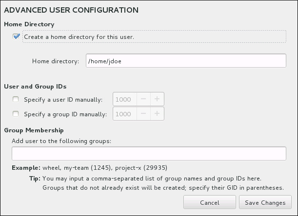

:experimental:

[[sect-account-configuration-user-x86]]
==== Create a User Account

To create a regular (non-root) user account during the installation, click `User Settings` on the progress screen. The `Create User` screen appears, allowing you to set up the regular user account and configure its parameters. Though recommended to do during installation, this step is optional and can be performed after the installation is complete.

[NOTE]
====

You must always set up at least one way to gain root privileges to the installed system: either using a `root` account, or by creating a user account with administrative privileges (member of the `wheel` group), or both.

====

To leave the user creation screen after you have entered it, without creating a user, leave all the fields empty and click btn:[Done].

.User Account Configuration Screen

image::images/accountconfig/createuser.png[User Account Configuration Screen]

Enter the full name and the user name in their respective fields. Note that the system user name must be shorter than 32 characters and cannot contain spaces. It is highly recommended to set up a password for the new account.

When setting up a strong password even for a non-root user, follow the guidelines described in <<sect-account-configuration-x86>>.

Click the btn:[Advanced] button to open a new dialog with additional settings.

.Advanced User Account Configuration

By default, each user gets a home directory corresponding to their user name. In most scenarios, there is no need to change this setting.

You can also manually define a system identification number for the new user and their default group by selecting the check boxes. The range for regular user IDs starts at the number `1000`. At the bottom of the dialog, you can enter the comma-separated list of additional groups, to which the new user shall belong. The new groups will be created in the system. To customize group IDs, specify the numbers in parenthesis.

[NOTE]
====

Consider setting IDs of regular users and their default groups at range starting at `5000` instead of `1000`. That is because the range reserved for system users and groups, `0`-`999`, might increase in the future and thus overlap with IDs of regular users.

For creating users with custom IDs using kickstart, see <<varlist-kickstart-user-options>>.

For changing the minimum UID and GID limits after the installation, which ensures that your chosen UID and GID ranges are applied automatically on user creation, see link:++https://access.redhat.com/documentation/en-us/red_hat_enterprise_linux/7/html/system_administrators_guide/ch-managing_users_and_groups#s1-users-groups-introduction++[the Users and Groups chapter of the System Administrator's Guide].

====

Once you have customized the user account, click btn:[Save Changes] to return to the `User Settings` screen.