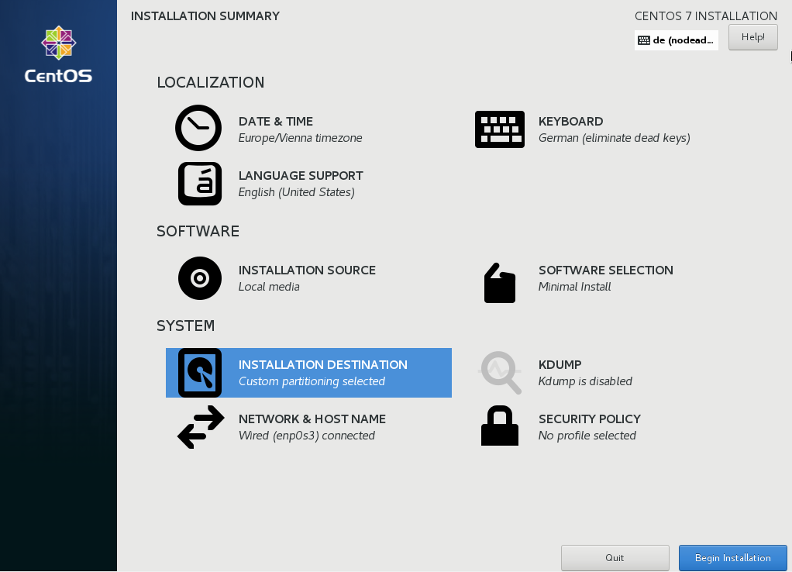

:experimental:
include::entities.adoc[]

[[sect-write-changes-to-disk-ppc]]
=== Begin Installation

When all required sections of the `Installation Summary` screen have been completed, the admonition at the bottom of the menu screen disappears and the btn:[Begin Installation] button becomes available.

.Ready to Install

[WARNING]
====

Up to this point in the installation process, no lasting changes have been made on your computer. When you click btn:[Begin Installation], the installation program will allocate space on your hard drive and start to transfer {PRODUCT} into this space. Depending on the partitioning option that you chose, this process might include erasing data that already exists on your computer.

====

To revise any of the choices that you made up to this point, return to the relevant section of the `Installation Summary` screen. To cancel installation completely, click btn:[Quit] or switch off your computer. To switch off most computers at this stage, press the power button and hold it down for a few seconds.

If you have finished customizing your installation and are certain that you want to proceed, click btn:[Begin Installation].

After you click btn:[Begin Installation], allow the installation process to complete. If the process is interrupted, for example, by you switching off or resetting the computer, or by a power outage, you will probably not be able to use your computer until you restart and complete the {PRODUCT} installation process, or install a different operating system.
