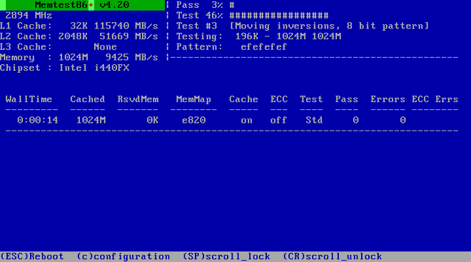

:experimental:
include::entities.adoc[]

[[chap-anaconda-boot-options]]
== Boot Options

The {PRODUCT} installation system includes a range of boot options for administrators, which modify the default behavior of the installation program by enabling (or disabling) certain functions. To use boot options, append them to the boot command line, as described in <<sect-boot-options-installer>>. Multiple options added to the boot line need to be separated by a single space.

There are two basic types of options described in this chapter:

* Options presented as ending with an "equals" sign (`=`) require a value to be specified - they cannot be used on their own. For example, the [option]`inst.vncpassword=` option must also contain a value (in this case, a password). The correct form is therefore [option]`inst.vncpassword=pass:attributes[{blank}]_password_pass:attributes[{blank}]`. On its own, without a password specified, the option is invalid.

* Options presented without the "pass:attributes[{blank}]`=`pass:attributes[{blank}]" sign do not accept any values or parameters. For example, the [option]`rd.live.check` option forces [application]*Anaconda* to verify the installation media before starting the installation; if this option is present, the check will be performed, and if it is not present, the check will be skipped.

[[sect-boot-options-installer]]
=== Configuring the Installation System at the Boot Menu

[NOTE]
====

The exact way to specify custom boot options is different on every system architecture. For architecture-specific instructions about editing boot options, see:

* <<sect-boot-menu-x86>> for 64-bit AMD, Intel and ARM systems

* <<sect-boot-menu-ppc>> for IBM Power{nbsp}Systems servers

====

There are several different ways to edit boot options at the boot menu (that is, the menu which appears after you boot the installation media):

* The `boot:` prompt, accessed by pressing the kbd:[Esc] key anywhere in the boot menu. When using this prompt, the first option must always specify the installation program image file to be loaded. In most cases, the image can be specified using the `linux` keyword. After that, additional options can be specified as needed.
+
Pressing the kbd:[Tab] key at this prompt will display help in the form of usable commands where applicable. To start the installation with your options, press the kbd:[Enter] key. To return from the `boot:` prompt to the boot menu, restart the computer and boot from the installation media again.

* The `>` prompt on BIOS-based AMD64 and Intel{nbsp}64 systems, accessed by highlighting an entry in the boot menu and pressing the kbd:[Tab] key. Unlike the `boot:` prompt, this prompt allows you to edit a predefined set of boot options. For example, if you highlight the entry labeled `Test this media & install {PRODUCT}{nbsp}7.5`, a full set of options used by this menu entry will be displayed on the prompt, allowing you to add your own options.
+
Pressing kbd:[Enter] will start the installation using the options you specified. To cancel editing and return to the boot menu, press the kbd:[Esc] key at any time.

* The [application]*GRUB2* menu on UEFI-based 64-bit AMD, Intel and ARM systems. If your system uses UEFI, you can edit boot options by highlighting an entry and pressing the kbd:[e] key. When you finish editing, press kbd:[F10] or kbd:[Ctrl + X] to start the installation using the options you specified.

In addition to the options described in this chapter, the boot prompt also accepts [application]*dracut* kernel options. A list of these options is available as the `dracut.cmdline(7)` man page.

[NOTE]
====

Boot options specific to the installation program always start with `inst.` in this guide. Currently, this prefix is optional, for example, [option]`resolution=1024x768` will work exactly the same as [option]`inst.resolution=1024x768`. However, it is expected that the `inst.` prefix will be mandatory in future releases.

====

[[list-boot-options-sources]]
.Specifying the Installation Source

[option]`inst.repo=`::
+
Specifies the installation source - that is, a location where the installation program can find the images and packages it requires. For example:
+
[literal,subs="+quotes,verbatim,macros"]
....
[option]`inst.repo=cdrom`
....
+
The target must be either:
+
** an installable tree, which is a directory structure containing the installation program's images, packages and repodata as well as a valid `.treeinfo` file
+
** a DVD (a physical disk present in the system's DVD drive)
+
** an ISO image of the full {PRODUCT} installation DVD, placed on a hard drive or a network location accessible from the installation system
+
This option allows for the configuration of different installation methods using different formats. The syntax is described in the table below.
+
[[tabl-boot-options-installation-sources]]
.Installation Sources
+
[options="header"]
|===
|Installation source|Option format
|Any CD/DVD drive|[option]`inst.repo=cdrom`
|Specific CD/DVD drive|[option]`inst.repo=cdrom:pass:attributes[{blank}]_device_pass:attributes[{blank}]`
|Hard Drive|[option]`inst.repo=hd:pass:attributes[{blank}]_device_:/pass:attributes[{blank}]_path_pass:attributes[{blank}]`
|HTTP Server|[option]`inst.repo=http://pass:attributes[{blank}]_host_pass:attributes[{blank}]/pass:attributes[{blank}]_path_pass:attributes[{blank}]`
|HTTPS Server|[option]`inst.repo=https://pass:attributes[{blank}]_host_pass:attributes[{blank}]/pass:attributes[{blank}]_path_pass:attributes[{blank}]`
|FTP Server|[option]`inst.repo=ftp://pass:attributes[{blank}]_username_:pass:attributes[{blank}]_password_pass:attributes[{blank}]@pass:attributes[{blank}]_host_pass:attributes[{blank}]/pass:attributes[{blank}]_path_pass:attributes[{blank}]`
|NFS Server|[option]`inst.repo=nfs:[pass:attributes[{blank}]_options_:]pass:attributes[{blank}]_server_:/pass:attributes[{blank}]_path_pass:attributes[{blank}]`
										footnote:[This option uses NFS protocol version 3 by default. To use a different version, add [option]`+nfsvers=pass:attributes[{blank}]_X_pass:attributes[{blank}]` to _options_.]
|===
+
[NOTE]
====

In previous releases of {PRODUCT}, there were separate options for an installable tree accessible by NFS (the [option]`nfs` option) and an ISO image located on an NFS source (the [option]`nfsiso` option). In {PRODUCT}{nbsp}7, the installation program can automatically detect whether the source is an installable tree or a directory containing an ISO image, and the [option]`nfsiso` option is deprecated.

====
+
Disk device names can be set using the following formats:
+
** Kernel device name, for example `/dev/sda1` or `sdb2`
+
** File system label, for example `LABEL=Flash` or `LABEL={PRODUCT}{PRODVER}`
+
** File system UUID, for example `UUID=8176c7bf-04ff-403a-a832-9557f94e61db`
+
Non-alphanumeric characters must be represented as `\xpass:attributes[{blank}]_NN_pass:attributes[{blank}]`, where _NN_ is the hexadecimal representation of the character. For example, `\x20` is a white space ("").

[option]`inst.stage2=`::
+
Specifies the location of the installation program runtime image to be loaded. The syntax is the same as in <<list-boot-options-sources>>. This option expects a path to a directory containing a valid `.treeinfo` file; the location of the runtime image will be read from this file if found. If a `.treeinfo` file is not available, [application]*Anaconda* will try to load the image from `LiveOS/squashfs.img`.
+
Use the option multiple times to specify multiple HTTP, HTTPS or FTP sources.
+
[literal,subs="+quotes,verbatim"]
....
inst.stage2=host1/install.img inst.stage2=host2/install.img	inst.stage2=host3/install.img
....
+
[NOTE]
====

By default, the [option]`inst.stage2=` boot option is used on the installation media and set to a specific label (for example, [option]`inst.stage2=hd:LABEL={PRODUCT}\x20Server.x86_64`). If you modify the default label of the file system containing the runtime image, or if you use a customized procedure to boot the installation system, you must ensure this option is set to the correct value.

====

[option]`inst.dd=`::
+
If you need to perform a driver update during the installation, use the [option]`inst.dd=` option. It can be used multiple times. The location of a driver RPM package can be specified using any of the formats detailed in <<list-boot-options-sources>>. With the exception of the [option]`inst.dd=cdrom` option, the device name must always be specified. For example:
+
[literal,subs="+quotes,verbatim,macros"]
....
[option]`inst.dd=/dev/sdb1`
....
+
Using this option without any parameters (only as [option]`inst.dd`) will prompt the installation program to ask you for a driver update disk with an interactive menu.
+
Driver disks can also be loaded from a hard disk drive or a similar device instead of being loaded over the network or from `initrd`. Follow this procedure:
+
[[loading-driver-disk-from-HDD-Boot-option]]
+
.. Load the driver disk on a hard disk drive, a USB or any similar device.
+
.. Set the label, for example, _DD_, to this device.
+
.. Start the installation with:
+
[literal,subs="+quotes,verbatim,macros"]
....
inst.dd=hd:pass:attributes[{blank}]_LABEL_pass:attributes[{blank}]=pass:attributes[{blank}]_DD_:/dd.rpm
....
+
as the boot argument.
+
Replace _DD_ with a specific label and replace _dd.rpm_ with a specific name. Use anything supported by the [command]`inst.repo` command instead of _LABEL_ to specify your hard disk drive.
+
For more information about driver updates during the installation, see <<chap-driver-updates-x86>> for AMD64 and Intel{nbsp}64 systems and <<chap-driver-updates-ppc>> for IBM Power{nbsp}Systems servers.

[[list-boot-options-kickstart]]
.Kickstart Boot Options

[option]`inst.ks=`::
+
Gives the location of a Kickstart file to be used to automate the installation. Locations can be specified using any of the formats valid for [option]`inst.repo`. See <<list-boot-options-sources>> for details.
+
Use the option multiple times to specify multiple HTTP, HTTPS and FTP sources. If multiple HTTP, HTTPS and FTP locations are specified, the locations are tried sequentially until one succeeds:
+
[literal,subs="+quotes,verbatim,macros"]
....
inst.ks=host1/pass:attributes[{blank}]_directory_pass:attributes[{blank}]/ks.cfg inst.ks=host2/pass:attributes[{blank}]_directory_pass:attributes[{blank}]/ks.cfg inst.ks=host3/pass:attributes[{blank}]_directory_pass:attributes[{blank}]/ks.cfg
....
+
If you only specify a device and not a path, the installation program will look for the Kickstart file in `/ks.cfg` on the specified device. If you use this option without specifying a device, the installation program will use the following:
+
[literal,subs="+quotes,verbatim,macros"]
....
[option]`inst.ks=nfs:pass:attributes[{blank}]_next-server_:/pass:attributes[{blank}]_filename_pass:attributes[{blank}]`
....
+
In the above example, _next-server_ is the DHCP `next-server` option or the IP address of the DHCP server itself, and _filename_ is the DHCP `filename` option, or `/kickstart/`. If the given file name ends with the `/` character, `pass:attributes[{blank}]_ip_-kickstart` is appended. For example:
+
[[tabl-default-kickstart-location]]
.Default Kickstart File Location
+
[options="header"]
|===
|DHCP server address|Client address|Kickstart file location
|`192.168.122.1`|`192.168.122.100`|`192.168.122.1`:pass:attributes[{blank}]`/kickstart/192.168.122.100-kickstart`
|===
+
Additionally, starting with {PRODUCT}{nbsp}7.2, the installer will attempt to load a Kickstart file named `ks.cfg` from a volume with a label of `OEMDRV` if present. If your Kickstart file is in this location, you do not need to use the [option]`inst.ks=` boot option at all.

[option]`inst.ks.sendmac`::
+
Adds headers to outgoing `HTTP` requests with the MAC addresses of all network interfaces. For example:
+
[literal,subs="+quotes,verbatim,macros"]
....
`X-RHN-Provisioning-MAC-0: eth0 01:23:45:67:89:ab`
....
+
This can be useful when using [option]`inst.ks=http` to provision systems.

[option]`inst.ks.sendsn`::
+
Adds a header to outgoing `HTTP` requests. This header will contain the system's serial number, read from `/sys/class/dmi/id/product_serial`. The header has the following syntax:
+
[literal,subs="+quotes,verbatim,macros"]
....
`X-System-Serial-Number: _R8VA23D_pass:attributes[{blank}]`
....

[[list-boot-options-display]]
.Console, Environment and Display Options

[option]`console=`::
+
This kernel option specifies a device to be used as the primary console. For example, to use a console on the first serial port, use [option]`console=ttyS0`. This option should be used along with the [option]`inst.text` option.
+
You can use this option multiple times. In that case, the boot message will be displayed on all specified consoles, but only the last one will be used by the installation program afterwards. For example, if you specify [option]`console=ttyS0 console=ttyS1`, the installation program will use `ttyS1`.

[option]`noshell`::
+
Disables access to the root shell during the installation. This is useful with automated (Kickstart) installations - if you use this option, a user can watch the installation progress, but they cannot interfere with it by accessing the root shell by pressing kbd:[Ctrl + Alt + F2].

[option]`inst.lang=`::
+
Sets the language to be used during the installation. Language codes are the same as the ones used in the [command]`lang` Kickstart command as described in <<sect-kickstart-commands>>. On systems where the [package]*system-config-language* package is installed, a list of valid values can also be found in `/usr/share/system-config-language/locale-list`.

[option]`inst.geoloc=`::
+
Configures geolocation usage in the installation program. Geolocation is used to preset the language and time zone, and uses the following syntax: [option]`inst.geoloc=pass:attributes[{blank}]_value_pass:attributes[{blank}]`
+
The _value_ parameter can be any of the following:
+
[[tabl-boot-options-geoloc]]
.Valid Values for the inst.geoloc Option
+
|===
|Disable geolocation|[option]`inst.geoloc=0`
|Use the Fedora GeoIP API|[option]`inst.geoloc=provider_fedora_geoip`
|Use the Hostip.info GeoIP API|[option]`inst.geoloc=provider_hostip`
|===
+
If this option is not specified, [application]*Anaconda* will use `provider_fedora_geoip`.

[option]`inst.keymap=`::
+
Specifies the keyboard layout to be used by the installation program. Layout codes are the same as the ones used in the [command]`keyboard` Kickstart command as described in <<sect-kickstart-commands>>.

[option]`inst.text`::
+
Forces the installation program to run in text mode instead of graphical mode. The text user interface is limited, for example, it does not allow you to modify the partition layout or set up LVM. When installing a system on a machine with a limited graphical capabilities, it is recommended to use VNC as described in <<list-boot-options-vnc>>.

[option]`inst.cmdline`::
+
Forces the installation program to run in command line mode. This mode does not allow any interaction, all options must be specified in a Kickstart file or on the command line.

[option]`inst.graphical`::
+
Forces the installation program to run in graphical mode. This mode is the default.

[option]`inst.resolution=`::
+
Specifies the screen resolution in graphical mode. The format is _N_pass:attributes[{blank}]xpass:attributes[{blank}]_M_, where _N_ is the screen width and _M_ is the screen height (in pixels). The lowest supported resolution is `800x600`.

[option]`inst.headless`::
+
Specifies that the machine being installed onto does not have any display hardware. In other words, this option prevents the installation program from trying to detect a screen.

[option]`inst.xdriver=`::
+
Specifies the name of the `X` driver to be used both during the installation and on the installed system.

[option]`inst.usefbx`::
+
Tells the installation program to use the frame buffer `X` driver instead of a hardware-specific driver. This option is equivalent to [option]`inst.xdriver=fbdev`.

[option]`modprobe.blacklist=`::
+
Blacklists (completely disables) one or more drivers. Drivers (mods) disabled using this option will be prevented from loading when the installation starts, and after the installation finishes, the installed system will keep these settings. The blacklisted drivers can then be found in the `/etc/modprobe.d/` directory.
+
Use a comma-separated list to disable multiple drivers. For example:
+
[literal,subs="+quotes,verbatim"]
....
modprobe.blacklist=ahci,firewire_ohci
....

[option]`inst.sshd`::
+
Starts the `sshd` service during the installation, which allows you to connect to the system during the installation using `SSH` and monitor its progress. For more information on SSH, see the `ssh(1)` man page and the corresponding chapter in the link:++https://access.redhat.com/site/documentation/en-US/Red_Hat_Enterprise_Linux/7/html/System_Administrators_Guide/index.html++[Red{nbsp}Hat Enterprise{nbsp}Linux{nbsp}7 System Administrator's Guide].
+
[NOTE]
====

During the installation, the `root` account has no password by default. You can set a root password to be used during the installation with the [command]`sshpw` Kickstart command as described in <<sect-kickstart-commands>>.

====

[option]`inst.kdump_addon=`::
+
Enables or disables the [application]*Kdump* configuration screen (add-on) in the installer. This screen is enabled by default; use [option]`inst.kdump_addon=off` to disable it. Note that disabling the add-on will disable the `Kdump` screens in both the graphical and text-based interface as well as the [command]`%addon com_redhat_kdump` Kickstart command.

[[list-boot-options-network]]
.Network Boot Options

Initial network initialization is handled by [application]*dracut*. This section only lists some of the more commonly used options; for a complete list, see the `dracut.cmdline(7)` man page. Additional information on networking is also available in link:++https://access.redhat.com/site/documentation/en-US/Red_Hat_Enterprise_Linux/7/html/Networking_Guide/index.html++[Red{nbsp}Hat Enterprise{nbsp}Linux{nbsp}7 Networking Guide].

[option]`ip=`::
+
Configures one or more network interfaces. To configure multiple interfaces, you can use the `ip` option multiple times - once for each interface. If multiple interfaces are configured, you must also use the option [option]`rd.neednet=1`, and you must specify a primary boot interface using the [option]`bootdev` option, described below. Alternatively, you can use the `ip` option once, and then use Kickstart to set up further interfaces.
+
This option accepts several different formats. The most common are described in <<tabl-boot-options-network-formats>>.
+
[[tabl-boot-options-network-formats]]
.Network Interface Configuration Formats
+
[options="header"]
|===
|Configuration Method|Option format
|Automatic configuration of any interface|[option]`ip=pass:attributes[{blank}]_method_pass:attributes[{blank}]`
|Automatic configuration of a specific interface|[option]`ip=pass:attributes[{blank}]_interface_:pass:attributes[{blank}]_method_pass:attributes[{blank}]`
|Static configuration|[option]`ip=pass:attributes[{blank}]_ip_::pass:attributes[{blank}]_gateway_:pass:attributes[{blank}]_netmask_:pass:attributes[{blank}]_hostname_:pass:attributes[{blank}]_interface_:none`
|Automatic configuration of a specific interface with an override
										footnote:[Brings up the specified interface using the specified method of automatic configuration, such as `dhcp`, but overrides the automatically obtained IP address, gateway, netmask, host name or other specified parameter. All parameters are optional; only specify the ones you want to override and automatically obtained values will be used for the others.]|[option]`ip=pass:attributes[{blank}]_ip_::pass:attributes[{blank}]_gateway_:pass:attributes[{blank}]_netmask_:pass:attributes[{blank}]_hostname_:pass:attributes[{blank}]_interface_:pass:attributes[{blank}]_method_:pass:attributes[{blank}]_mtu_pass:attributes[{blank}]`
|===
+
The [option]`method` parameter can be any the following:
+
[[tabl-boot-options-network-autoconf]]
.Automatic Interface Configuration Methods
+
[options="header"]
|===
|Automatic configuration method|Value
|DHCP|`dhcp`
|IPv6 DHCP|`dhcp6`
|IPv6 automatic configuration|`auto6`
|iBFT (iSCSI Boot Firmware Table)|`ibft`
|===
+
[NOTE]
====

If you use a boot option which requires network access, such as [option]`inst.ks=http://pass:attributes[{blank}]_host_:/pass:attributes[{blank}]_path_pass:attributes[{blank}]`, without specifying the [option]`ip` option, the installation program will use [option]`ip=dhcp`.

====
+
[IMPORTANT]
====

To connect automatically to an iSCSI target, a network device for accessing the target needs to be activated. The recommended way to do so is to use [option]`ip=ibft` boot option.

====
+
In the above tables, the _ip_ parameter specifies the client's IP address. `IPv6` addresses can be specified by putting them in square brackets, for example, `[2001:DB8::1]`.
+
The _gateway_ parameter is the default gateway. IPv6 addresses are accepted here as well.
+
The _netmask_ parameter is the netmask to be used. This can either be a full netmask (for example `255.255.255.0`) or a prefix (for example `64`).
+
The _hostname_ parameter is the host name of the client system. This parameter is optional.

[option]`nameserver=`::
+
Specifies the address of the name server. This option can be used multiple times.

[option]`rd.neednet=`::
+
You must use the option [option]`rd.neednet=1` if you use more than one [option]`ip` option. Alternatively, to set up multiple network interfaces you can use the [option]`ip` once, and then set up further interfaces using Kickstart.

[option]`bootdev=`::
+
Specifies the boot interface. This option is mandatory if you use more than one [option]`ip` option.

[option]`ifname=`::
+
Assigns a given interface name to a network device with a given MAC address. Can be used multiple times. The syntax is [option]`ifname=pass:attributes[{blank}]_interface_:pass:attributes[{blank}]_MAC_pass:attributes[{blank}]`. For example:
+
[literal,subs="+quotes,verbatim,macros"]
....
[option]`ifname=eth0:01:23:45:67:89:ab`
....
+
[NOTE]
====

Using the [option]`ifname=` option is the only supported way to set custom network interface names during installation.

====

[option]`inst.dhcpclass=`::
+
Specifies the DHCP vendor class identifier. The `dhcpd` service will see this value as `vendor-class-identifier`. The default value is `anaconda-$(uname -srm)`.

[option]`inst.waitfornet=`::
+
Using the inst.waitfornet=pass:attributes[{blank}]_SECONDS_ boot option causes the installation system to wait for network connectivity before installation. The value given in the _SECONDS_ argument specifies maximum amount of time to wait for network connectivity before timing out and continuing the installation process even if network connectivity is not present.

[option]`vlan=`::
+
Sets up a Virtual LAN (VLAN) device on a specified interface with a given name. The syntax is [option]`vlan=pass:attributes[{blank}]_name_:pass:attributes[{blank}]_interface_pass:attributes[{blank}]`. For example:
+
[literal,subs="+quotes,verbatim,macros"]
....
[option]`vlan=vlan5:em1`
....
+
The above will set up a VLAN device named `vlan5` on the `em1` interface. The _name_ can take the following forms:
+
[[tabl-boot-options-network-vlan-names]]
.VLAN Device Naming Conventions
+
[options="header"]
|===
|Naming scheme|Example
|VLAN_PLUS_VID|`vlan0005`
|VLAN_PLUS_VID_NO_PAD|`vlan5`
|DEV_PLUS_VID|`em1.0005`.
|DEV_PLUS_VID_NO_PAD|`em1.5`.
|===

[option]`bond=`::
+
Set up a bonding device with the following syntax: [option]`bond=pass:attributes[{blank}]_name_pass:attributes[{blank}][:pass:attributes[{blank}]_slaves_pass:attributes[{blank}]][:pass:attributes[{blank}]_options_pass:attributes[{blank}]]`. Replace _name_ with the bonding device name, _slaves_ with a comma-separated list of physical (ethernet) interfaces, and _options_ with a comma-separated list of bonding options. For example:
+
[literal,subs="+quotes,verbatim"]
....
bond=bond0:em1,em2:mode=active-backup,tx_queues=32,downdelay=5000
....
+
For a list of available options, execute the [command]`modinfo bonding` command.
+
Using this option without any parameters will assume [option]`bond=bond0:eth0,eth1:mode=balance-rr`.

[option]`team=`::
+
Set up a team device with the following syntax: [option]`team=pass:attributes[{blank}]_master_:pass:attributes[{blank}]_slaves_pass:attributes[{blank}]`. Replace _master_ with the name of the master team device and _slaves_ with a comma-separated list of physical (ethernet) devices to be used as slaves in the team device. For example:
+
[literal,subs="+quotes,verbatim,macros"]
....
[option]`team=team0:em1,em2`
....

[[list-boot-options-advanced]]
.Advanced Installation Options

[option]`inst.kexec`::
+
If this option is specified, the installer will use the [application]*kexec* system call at the end of the installation, instead of performing a reboot. This loads the new system immediately, and bypasses the hardware initialization normally performed by the BIOS or firmware.
+
[IMPORTANT]
====

Due to the complexities involved with booting systems using [application]*kexec*, it cannot be explicitly tested and guaranteed to function in every situation.

When [application]*kexec* is used, device registers (which would normally be cleared during a full system reboot) might stay filled with data, which could potentially create issues for some device drivers.

====

[option]`inst.gpt`::
+
Force the installation program to install partition information into a GUID Partition Table (GPT) instead of a Master Boot Record (MBR). This option is meaningless on UEFI-based systems, unless they are in BIOS compatibility mode.
+
Normally, BIOS-based systems and UEFI-based systems in BIOS compatibility mode will attempt to use the MBR schema for storing partitioning information, unless the disk is 2pass:attributes[{blank}]^32^ sectors in size or larger. Most commonly, disk sectors are 512 bytes in size, meaning that this is usually equivalent to 2 TiB. Using this option will change this behavior, allowing a GPT to be written to disks smaller than this.
+
See <<sect-bootloader-mbr-gpt-x86>> for more information about GPT and MBR, and <<sect-disk-partitioning-guid-partition-table>> for more general information about GPT, MBR and disk partitioning in general.

[option]`inst.multilib`::
+
Configure the system for multilib packages (that is, to allow installing 32-bit packages on a 64-bit AMD64 or Intel{nbsp}64 system) and install packages specified in this section as such.
+
Normally, on an AMD64 or Intel{nbsp}64 system, only packages for this architecture (marked as `x86_64`) and packages for all architectures (marked as `noarch` would be installed. When you use this option, packages for 32-bit AMD or Intel systems (marked as `i686`) will be automatically installed as well if available.
+
This only applies to packages directly specified in the `%packages` section. If a package is only installed as a dependency, only the exact specified dependency will be installed. For example, if you are installing package [package]*bash* which depends on package [package]*glibc*, the former will be installed in multiple variants, while the latter will only be installed in variants specifically required.

[option]`selinux=0`::
+
By default, SELinux operates in `permissive` mode in the installer, and in `enforcing` mode in the installed system. This option disables the use of SELinux in the installer and the installed system entirely.
+
[NOTE]
====

The [option]`selinux=0` and [option]`inst.selinux=0` options are not the same. The [option]`selinux=0` option disables the use of SELinux in the installer and the installed system, whereas [option]`inst.selinux=0` disables SELinux only in the installer. By default, SELinux is set to operate in `permissive` mode in the installer, so disabling it has little effect.

====

[option]`inst.nosave=`::
+
This option, introduced in {PRODUCT} 7.3, controls which Kickstart files and installation logs are saved to the installed system. It can be especially useful to disable saving such data when performing OEM operating system installations, or when generating images using sensitive resources (such as internal repository URLs), as these resources might otherwise be mentioned in kickstart files, or in logs on the image, or both. Possible values for this option are:
+
`input_ks` - disables saving of the input Kickstart file (if any).
+
`output_ks` - disables saving of the output Kickstart file generated by Anaconda.
+
`all_ks` - disables saving of both input and output Kickstart files.
+
`logs` - disables saving of all installation logs.
+
`all` - disables saving of all Kickstart files and all installation logs.
+
Multiple values can be combined as a comma separated list, for example: `input_ks,logs`

[option]`inst.zram`::
+
This option controls the usage of _zRAM_ swap during the installation. It creates a compressed block device inside the system RAM and uses it for swap space instead of the hard drive. This allows the installer to essentially increase the amount of memory available, which makes the installation faster on systems with low memory.
+
By default, swap on zRAM is enabled on systems with 2 GiB or less RAM, and disabled on systems with more than 2 GiB of memory. You can use this option to change this behavior - on a system with more than 2 GiB RAM, use [option]`inst.zram=1` to enable it, and on systems with 2 GiB or less memory, use [option]`inst.zram=0` to disable this feature.

[[list-boot-options-vnc]]
.Enabling Remote Access

The following options are necessary to configure [application]*Anaconda* for remote graphical installation. See <<chap-vnc-installations>> for more details.

[option]`inst.vnc`::
+
Specifies that the installation program's graphical interface should be run in a `VNC` session. If you specify this option, you will need to connect to the system using a VNC client application to be able to interact with the installation program. VNC sharing is enabled, so multiple clients can connect to the system at the same time.
+
[NOTE]
====

A system installed using VNC will start in text mode by default.

====

[option]`inst.vncpassword=`::
+
Sets a password on the VNC server used by the installation program. Any VNC client attempting to connecting to the system will have to provide the correct password to gain access. For example, [option]`inst.vncpassword=pass:attributes[{blank}]_testpwd_pass:attributes[{blank}]` will set the password to `testpwd`. The VNC password must be between 6 and 8 characters long.
+
[NOTE]
====

If you specify an invalid password (one that is too short or too long), you will be prompted to specify a new one by a message from the installation program:

[literal,subs="+quotes,verbatim"]
....

VNC password must be six to eight characters long.
Please enter a new one, or leave blank for no password.

Password:

....

====

[option]`inst.vncconnect=`::
+
Connect to a listening VNC client at a specified host and port once the installation starts. The correct syntax is [option]`inst.vncconnect=pass:attributes[{blank}]_host_:pass:attributes[{blank}]_port_pass:attributes[{blank}]`, where _host_ is the address to the VNC client's host, and _port_ specifies which port to use. The _port_ parameter is optional, if you do not specify one, the installation program will use `5900`.

[[list-boot-options-debug]]
.Debugging and Troubleshooting

[option]`inst.updates=`::
+
Specifies the location of the `updates.img` file to be applied to the installation program runtime. The syntax is the same as in the [option]`inst.repo` option - see <<tabl-boot-options-installation-sources>> for details. In all formats, if you do not specify a file name but only a directory, the installation program will look for a file named `updates.img`.

[option]`inst.loglevel=`::
+
Specifies the minimum level for messages to be logged on a terminal. This only concerns terminal logging; log files will always contain messages of all levels.
+
Possible values for this option from the lowest to highest level are: `debug`, `info`, `warning`, `error` and `critical`. The default value is `info`, which means that by default, the logging terminal will display messages ranging from `info` to `critical`.

[option]`inst.syslog=`::
+
Once the installation starts, this option sends log messages to the syslog process on the specified host. The remote syslog process must be configured to accept incoming connections. For information on how to configure a syslog service to accept incoming connections, see the link:++https://access.redhat.com/site/documentation/en-US/Red_Hat_Enterprise_Linux/7/html/System_Administrators_Guide/index.html++[Red{nbsp}Hat Enterprise{nbsp}Linux{nbsp}7 System Administrator's Guide].

[option]`inst.virtiolog=`::
+
Specifies a `virtio` port (a character device at `/dev/virtio-ports/pass:attributes[{blank}]_name_pass:attributes[{blank}]`) to be used for forwarding logs. The default value is `org.fedoraproject.anaconda.log.0`pass:attributes[{blank}]; if this port is present, it will be used.

[option]`rd.live.ram`::
+
If this option is specified, the stage 2 image will be copied into RAM. When the stage2 image on NFS repository is used, this option may make the installation proceed smoothly, since the installation is sometimes affected by reconfiguring network in an environment built upon the stage 2 image on NFS.
+
Note that using this option when the stage 2 image is on an NFS server will increase the minimum required memory by the size of the image - roughly 500 MiB.

[option]`inst.nokill`::
+
A debugging option that prevents anaconda from and rebooting when a fatal error occurs or at the end of the installation process. This allows you to capture installation logs which would be lost upon reboot.

[[sect-boot-options-deprecated-removed]]
==== Deprecated and Removed Boot Options

[[list-boot-options-deprecated]]
.Deprecated Boot Options

Options in this list are _deprecated_. They will still work, but there are other options which offer the same functionality. Using deprecated options is not recommended and they are expected to be removed in future releases.

[NOTE]
====

Note that as <<sect-boot-options-installer>> describes, options specific to the installation program now use the `inst.` prefix. For example, the [option]`vnc=` option is considered deprecated and replaced by the [option]`inst.vnc=` option. These changes are not listed here.

====

[option]`method=`::
+
Configured the installation method. Use the [option]`inst.repo=` option instead.

[option]`repo=nfsiso:pass:attributes[{blank}]_server_:/pass:attributes[{blank}]_path_pass:attributes[{blank}]`::
+
In NFS installations, specified that the target is an ISO image located on an NFS server instead of an installable tree. The difference is now detected automatically, which means this option is the same as [option]`inst.repo=nfs:pass:attributes[{blank}]_server_:/pass:attributes[{blank}]_path_pass:attributes[{blank}]`.

[option]`dns=`::
+
Configured the Domain Name Server (DNS). Use the [option]`nameserver=` option instead.

[option]`netmask=`, [option]`gateway=`, [option]`hostname=`, [option]`ip=`, [option]`ipv6=`::
+
These options have been consolidated under the [option]`ip=` option.

[option]`ksdevice=`::
+
Select network device to be used at early stage of installation. Different values have been replaced with different options; see the table below.
+
[[tabl-boot-options-ksdevice]]
.Automatic Interface Configuration Methods
+
[options="header"]
|===
|Value|Current behavior
|Not present|Activation of all devices is attempted using `dhcp`, unless the desired device and configuration is specified by the [option]`ip=` option or the [option]`BOOTIF` option.
|[option]`ksdevice=link`|Similar to the above, with the difference that network will always be activated in the initramfs, whether it is needed or not. The supported [option]`rd.neednet` [application]*dracut* option should be used to achieve the same result.
|[option]`ksdevice=bootif`|Ignored (the BOOTID= option is used by default when specified)
|[option]`ksdevice=ibft`|Replaced with the [option]`ip=ibft` [application]*dracut* option
|[option]`ksdevice=pass:attributes[{blank}]_MAC_pass:attributes[{blank}]`|Replaced with [option]`BOOTIF=pass:attributes[{blank}]_MAC_pass:attributes[{blank}]`
|[option]`ksdevice=pass:attributes[{blank}]_device_pass:attributes[{blank}]`|Replaced by specifying the device name using the [option]`ip=` [application]*dracut* option.
|===
+
[IMPORTANT]
====

When performing a Kickstart installation, booting from local media and having the Kickstart file on local media as well, the network will not be initialized. This means that any other Kickstart options requiring network access, such as pre-installation or post-installation scripts accessing a network location, will cause the installation to fail. This is a known issue; see BZ#link:++https://bugzilla.redhat.com/show_bug.cgi?id=1085310++[1085310] for details.

To work around this issue, either use the [option]`ksdevice=link` boot option, or add the [option]`--device=link` option to the [command]`network` command in your Kickstart file.

====

[option]`blacklist=`::
+
Used to disable specified drivers. This is now handled by the [option]`modprobe.blacklist=` option.

[option]`nofirewire=`::
+
Disabled support for the FireWire interface. You can disable the FireWire driver (`firewire_ohci`) by using the [option]`modprobe.blacklist=` option instead:
+
[literal,subs="+quotes,verbatim"]
....
modprobe.blacklist=firewire_ohci
....

[option]`nicdelay=`::
+
Used to indicate the delay after which the network was considered active; the system waited until either the gateway was successfully pinged, or until the amount of seconds specified in this parameter passed.
In {PRODUCT} {PRODVER}, network devices are configured and activated during the early stage of installation by the [application]*dracut* modules
which ensure that the gateway is accessible before proceeding. For more information about [application]*dracut*, see the `dracut.cmdline(7)` man page.

[option]`linksleep=`::
+
Used to configure how long anaconda should wait for a link on a device before activating it.
This functionality is now available in the [application]*dracut* modules where specific [option]`rd.net.timeout.\*` options can be configured to handle issues caused by slow network device initialization.
For more information about [application]*dracut*, see the `dracut.cmdline(7)` man page.

[[list-boot-options-removed]]
.Removed Boot Options

The following options are removed. They were present in previous releases of {PRODUCT}, but they cannot be used anymore.

[option]`askmethod`, [option]`asknetwork`::
+
The installation program's `initramfs` is now completely non-interactive, which means that these options are not available anymore. Instead, use the [option]`inst.repo=` to specify the installation method and [option]`ip=` to configure network settings.

[option]`serial`::
+
This option forced [application]*Anaconda* to use the `/dev/ttyS0` console as the output. Use the [option]`console=/dev/ttyS0` (or similar) instead.

[option]`updates=`::
+
Specified the location of updates for the installation program. Use the [option]`inst.updates=` option instead.

[option]`essid=`, [option]`wepkey=`, [option]`wpakey=`::
+
Configured wireless network access. Network configuration is now being handled by [application]*dracut*, which does not support wireless networking, rendering these options useless.

[option]`ethtool=`::
+
Used in the past to configure additional low-level network settings. All network settings are now handled by the [option]`ip=` option.

[option]`gdb`::
+
Allowed you to debug the loader. Use [option]`rd.debug` instead.

[option]`mediacheck`::
+
Verified the installation media before starting the installation. Replaced with the [option]`rd.live.check` option.

[option]`ks=floppy`::
+
Specified a 3.5 inch diskette as the Kickstart file source. These drives are not supported anymore.

[option]`display=`::
+
Configured a remote display. Replaced with the [option]`inst.vnc` option.

[option]`utf8`::
+
Added UTF8 support when installing in text mode. UTF8 support now works automatically.

[option]`noipv6`::
+
Used to disable IPv6 support in the installation program. IPv6 is now built into the kernel so the driver cannot be blacklisted; however, it is possible to disable IPv6 using the [option]`ipv6.disable` [application]*dracut* option.

[option]`upgradeany`::
+
Upgrades are done in a different way in {PRODUCT}{nbsp}7.

[option]`vlanid=`::
+
Used to configure Virtual LAN (802.1q tag) devices. Use the [option]`vlan=` [application]*dracut* option instead.

[[sect-boot-options-maintenance]]
=== Using the Maintenance Boot Modes

[[sect-boot-options-memtest]]
==== Loading the Memory (RAM) Testing Mode

Faults in memory (RAM) modules can cause your system to freeze or crash unpredictably. In certain situations, memory faults might only cause errors with particular combinations of software. For this reason, you should test the memory of a computer before you install {PRODUCT} for the first time, even if it has previously run other operating systems.

{PRODUCT} includes the [application]*Memtest86+* memory testing application. To start memory testing mode, choose Troubleshooting > `Memory test` at the boot menu. Testing will begin immediately. By default, [application]*Memtest86+* carries out ten tests in every pass; a different configuration can be specified by accessing the configuration screen using the kbd:[c] key. After the first pass completes, a message will appear at the bottom informing you of the current status, and another pass will start automatically.

[NOTE]
====

[application]*Memtest86+* only works on BIOS systems. Support for UEFI systems is currently unavailable.

====

.Memory Check Using Memtest86+

The main screen displayed while testing is in progress is divided into three main areas:

* The upper left corner shows information about your system's memory configuration - the amount of detected memory and processor cache and their throughputs and processor and chipset information. This information is detected when [application]*Memtest86+* starts.

* The upper right corner displays information about the tests - progress of the current pass and the currently running test in that pass as well as a description of the test.

* The central part of the screen is used to display information about the entire set of tests from the moment when the tool has started, such as the total time, the number of completed passes, number of detected errors and your test selection. On some systems, detailed information about the installed memory (such as the number of installed modules, their manufacturer, frequency and latency) will be also displayed here. After the each pass completes, a short summary will appear in this location. For example:
+
[literal,subs="+quotes,verbatim,macros"]
....
pass:quotes[`** Pass complete, no errors, press Esc to exit **`]
....
+
If [application]*Memtest86+* detects an error, it will also be displayed in this area and highlighted red. The message will include detailed information such as which test detected a problem, the memory location which is failing, and others.

In most cases, a single successful pass (that is, a single run of all 10 tests) is sufficient to verify that your RAM is in good condition. In some rare circumstances, however, errors that went undetected on the first pass might appear on subsequent passes. To perform a thorough test on an important system, leave the tests running overnight or even for a few days in order to complete multiple passes.

[NOTE]
====

The amount of time it takes to complete a single full pass of [application]*Memtest86+* varies depending on your system's configuration (notably the RAM size and speed). For example, on a system with 2{nbsp}GiB of DDR2 memory at 667{nbsp}MHz, a single pass will take roughly 20{nbsp}minutes to complete.

====

To halt the tests and reboot your computer, press the kbd:[Esc] key at any time.

For more information about using [application]*Memtest86+*, see the official website at link:++http://www.memtest.org/++[]. A `README` file is also located in `/usr/share/doc/memtest86+-_version_pass:attributes[{blank}]/` on {PRODUCT} systems with the [package]*memtest86+* package installed.

[[sect-boot-options-mediacheck]]
==== Verifying Boot Media

You can test the integrity of an ISO-based installation source before using it to install {PRODUCT}. These sources include DVD, and ISO images stored on a hard drive or NFS server. Verifying that the ISO images are intact before you attempt an installation helps to avoid problems that are often encountered during installation.

To test the checksum integrity of an ISO image, append the [option]`rd.live.check` to the boot loader command line. Note that this option is used automatically if you select the default installation option from the boot menu (`Test this media & install {PRODUCT}{nbsp}7.0`).

[[sect-boot-options-rescue]]
==== Booting Your Computer in Rescue Mode

You can boot a command-line Linux system from an installation disc without actually installing {PRODUCT} on the computer. This enables you to use the utilities and functions of a running Linux system to modify or repair already installed operating systems.

To load the rescue system with the installation disk or USB drive, choose `Rescue a {PRODUCT} system` from the Troubleshooting submenu in the boot menu, or use the [option]`inst.rescue` boot option.

Specify the language, keyboard layout and network settings for the rescue system with the screens that follow. The final setup screen configures access to the existing system on your computer.

By default, rescue mode attaches an existing operating system to the rescue system under the directory `/mnt/sysimage/`.

For additional information about rescue mode and other maintenance modes, see <<chap-basic-system-recovery>>.
