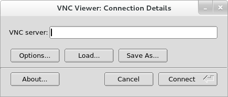
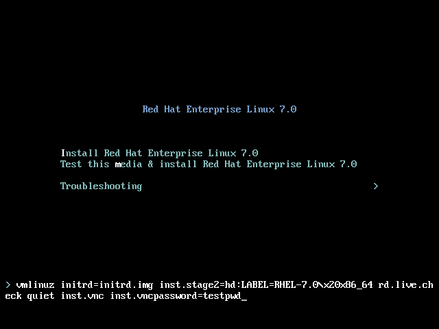

:experimental:
include::entities.adoc[]

[[chap-vnc-installations]]
== Using VNC

The graphical installation interface is the recommended method of installing {PRODUCT}. However, in some cases, accessing the graphical interface directly is difficult or impossible. Many enterprise systems, notably servers (IBM Power{nbsp}Systems and IBM System{nbsp}z), lack the capability to connect a display and a keyboard, making VNC a necessity for manual (non-Kickstart) installations.

To allow manual installations on _headless systems_ (systems without a directly connected display, keyboard and mouse), the [application]*Anaconda* installation program includes a _Virtual Network Computing_ (VNC) installation which allows the graphical mode of the installation program to run locally, but display on a system connected to the network. The VNC installation provides you with the full range of installation options, even in situations where the system lacks a display or input devices.

This chapter provides instructions on activating VNC mode on the installation system and connecting to it using a VNC viewer.

[[sect-vnc-installations-viewer]]
=== Installing a VNC Viewer

Performing a VNC installation requires a VNC viewer running on your workstation or another terminal computer. VNC viewers are available in the repositories of most Linux distributions; free VNC viewers are also available for other operating systems such as Windows. On Linux systems, use your package manager to search for a viewer for your distribution.

The following VNC viewers are available in {PRODUCT}:

* [application]*TigerVNC* - A basic viewer independent of your desktop environment. Installed as the [package]*tigervnc* package.

* [application]*Vinagre* - A viewer for the [application]*GNOME* desktop environment. Installed as the [package]*vinagre* package.

* [application]*KRDC* - A viewer integrated with the [application]*KDE* desktop environment. Installed as the [package]*kdenetwork-krdc* package.

To install any of the viewers listed above, execute the following command as `root`:

[literal,subs="+quotes,verbatim,macros"]
....
pass:quotes[`#`] yum install package
....

Replace _package_ with the package name of the viewer you want to use (for example, [package]*tigervnc*).

[NOTE]
====

Procedures in this chapter assume you are using [application]*TigerVNC* as your VNC viewer. Specific instructions for other viewers can differ, but the general principles still apply.

====

[[sect-vnc-installations-anaconda-modes]]
=== Performing a VNC Installation

The [application]*Anaconda* installation program offers two modes for VNC installation. The modes are _Direct Mode_ and _Connect Mode_. Direct Mode requires the VNC viewer to initiate the connection to the system being installed. Connect Mode requires the system being installed to initiate the connection to the VNC viewer. Once the connection is established, the two modes do not differ. The mode you select depends on the configuration in your environment.

Direct Mode::
+
In this mode, [application]*Anaconda* is configured to start the installation and wait for a VNC viewer before proceeding. The IP address and port are displayed on the system being installed. Using this information, you can connect to the installation system from a different computer. For this reason you must have visual and interactive access to the system being installed.

Connect Mode::
+
In this mode, the VNC viewer is started on the remote system in _listening mode_. The VNC viewer waits for an incoming connection on a specified port. Then, [application]*Anaconda* is started and the host name and port number are provided using a boot option or a Kickstart command. When the installation begins, the installation program establishes a connection with the listening VNC viewer using the specified host name and port number. For this reason, your remote system must be able to accept incoming network connections.

.Considerations for choosing a VNC installation mode

* Visual and Interactive access to the system
+
** If visual and interactive access to the system being installed is not available, then you must use Connect Mode.

* Network Connection Rules and Firewalls
+
** If the system being installed is not allowed inbound connections by a firewall, then you must use Connect Mode or disable the firewall. Disabling a firewall can have security implications.
+
** If the remote system running the VNC viewer is not allowed incoming connections by a firewall, then you must use Direct Mode, or disable the firewall. Disabling a firewall can have security implications. See the [citetitle]_link:++https://access.redhat.com/documentation/en-US/Red_Hat_Enterprise_Linux/7/html/Security_Guide/sec-Using_Firewalls.html#sec-Configuring_the_Firewall++[Red{nbsp}Hat Enterprise{nbsp}Linux{nbsp}7 Security{nbsp}Guide]_ for information about configuring the firewall.

[NOTE]
====

You must specify custom boot options to start a VNC installation. The exact way to do this differs depending on the system architecture. For architecture-specific instructions about editing boot options, see:

* <<sect-boot-menu-x86>> for 64-bit AMD, Intel, and ARM systems

* <<sect-boot-menu-ppc>> for IBM Power{nbsp}Systems servers

* <<chap-parameter-configuration-files-s390>> for IBM System{nbsp}z

====

[[sect-vnc-installations-direct-mode]]
==== Installing in VNC Direct Mode

The Direct Mode expects the VNC viewer to initiate a connection to the system being installed. [application]*Anaconda* asks you to initiate this connection.

[[proc-vnc-installations-direct-mode]]
.Starting VNC in Direct Mode
. Run the VNC viewer of your choice on the workstation you are using to connect to the system being installed. For example, if you use [application]*TigerVNC*:
+
[[figu-vnc-installations-connection-details]]
.TigerVNC Connection Details
+

. Boot the installation system and wait for the boot menu to appear. In the menu, press the kbd:[Tab] key to edit boot options. Append the [option]`inst.vnc` option to the end of the command line.
+
Optionally, if you want to restrict VNC access to the installation system, add the [option]`inst.vncpassword=pass:attributes[{blank}]_PASSWORD_pass:attributes[{blank}]` boot option as well. Replace _PASSWORD_ with the password you want to use for the installation. The VNC password must be between 6 and 8 characters long.
+
[IMPORTANT]
====

Use a temporary password for the [option]`inst.vncpassword=` option. It should not be a real or root password you use on any system.

====
+
[[figu-vnc-installations-boot-options]]
.Adding VNC Boot Options on AMD, Intel, and ARM Systems
+

. Press kbd:[Enter] to start the installation. The system initializes the installation program and starts the necessary services. When the system is ready, you get a message on the screen similar to the following:
+
[literal,subs="+quotes,verbatim,macros"]
....
`13:14:47 Please manually connect your VNC viewer to 192.168.100.131:1 to begin the install.`
....
+
Note the IP address and port number (in the above example, `192.168.100.131:1`).

. On the system running the VNC Viewer, enter the IP address and port number obtained in the previous step into the `Connection Details` dialog in the same format as it was displayed on the screen by Anaconda. Then, click `Connect`. The VNC viewer connects to the installation system. If you set up a VNC password, enter it when prompted and click `OK`.
+
For further details about using a VNC client, see the corresponding section in the [citetitle]_link:++https://access.redhat.com/documentation/en-US/Red_Hat_Enterprise_Linux/7/html/System_Administrators_Guide/sec-vnc-viewer.html++[Red{nbsp}Hat Enterprise{nbsp}Linux{nbsp}7 System Administrator's Guide]_.

After you finish the procedure, a new window opens with the VNC connection established, displaying the installation menu. In this window, you can use the [application]*Anaconda* graphical interface the same way you would use it when installing directly on the system.

You can proceed with:

* <<chap-installing-using-anaconda-x86>> for 64-bit AMD, Intel, and ARM systems

* <<chap-installing-using-anaconda-ppc>> for IBM Power{nbsp}Systems servers

* <<chap-installing-using-anaconda-s390>> for IBM System{nbsp}z

[[sect-vnc-installations-connect-mode]]
==== Installing in VNC Connect Mode

In Connect Mode, the system being installed initiates a connection to the VNC viewer running on a remote system. Before you start, make sure the remote system is configured to accept an incoming connection on the port you want to use for VNC. The exact way to make sure the connection is not blocked depends on your network and on your workstation's configuration. Information about configuring the firewall is available in the [citetitle]_link:++https://access.redhat.com/documentation/en-US/Red_Hat_Enterprise_Linux/7/html/Security_Guide/sec-Using_Firewalls.html#sec-Configuring_the_Firewall++[Red{nbsp}Hat Enterprise{nbsp}Linux{nbsp}7 Security{nbsp}Guide]_.

[[proc-vnc-installations-connect-mode]]
.Starting VNC in Connect Mode
. Start the VNC viewer on the client system in listening mode. For example, on {PRODUCT} using [application]*TigerVNC*, execute the following command:
+
[literal,subs="+quotes,verbatim,macros"]
....
`$` [command]`vncviewer -listen _PORT_pass:attributes[{blank}]`
....
+
Replace _PORT_ with the port number you want to use for the connection.
+
The terminal displays a message similar to the following example:
+
[[exam-vnc-connect-mode-listening]]
.TigerVNC Viewer Listening
====

[literal,subs="+quotes,verbatim"]
....

TigerVNC Viewer 64-bit v1.3.0 (20130924)
Built on Sep 24 2013 at 16:32:56
Copyright (C) 1999-2011 TigerVNC Team and many others (see README.txt)
See http://www.tigervnc.org for information on TigerVNC.

Thu Feb 20 15:23:54 2014
main:        Listening on port 5901

....

====
+
The VNC viewer is now ready and waiting for an incoming connection from the installation system.

. Boot the system being installed and wait for the boot menu to appear. In the menu, press the kbd:[Tab] key to edit boot options. Append the following options to the command line:
+
[literal,subs="+quotes,verbatim,macros"]
....
[option]`inst.vnc inst.vncconnect=pass:attributes[{blank}]_HOST_:pass:attributes[{blank}]_PORT_pass:attributes[{blank}]`
....
+
Replace _HOST_ with the IP address of the system running the listening VNC viewer, and _PORT_ with the port number that the VNC viewer is listening on.

. Press kbd:[Enter] to start the installation. The system initializes the installation program and starts the necessary services. Once the initialization is finished, [application]*Anaconda* attempts to connect to the IP address and port you provided in the previous step.
+
When the connection is successfully established, a new window opens on the system running the VNC viewer, displaying the installation menu. In this window, you can use the [application]*Anaconda* graphical interface the same way you would use it when installing directly on the system.

Afer you finish the procedure, you can proceed with:

* <<chap-installing-using-anaconda-x86>> for 64-bit AMD, Intel, and ARM systems

* <<chap-installing-using-anaconda-ppc>> for IBM Power{nbsp}Systems servers

* <<chap-installing-using-anaconda-s390>> for IBM System{nbsp}z

[[sect-vnc-kickstart-considerations]]
=== Kickstart Considerations

Commands for using VNC are also available in Kickstart installations. Using only the [command]`vnc` command results in an installation using Direct Mode. Additional options are available to set up an installation using Connect Mode. For more information about the [command]`vnc` command and options used in Kickstart files, see <<sect-kickstart-commands>>.